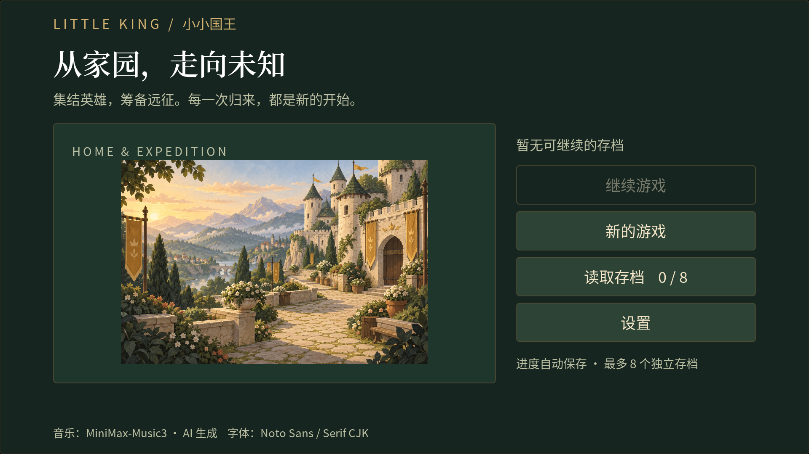
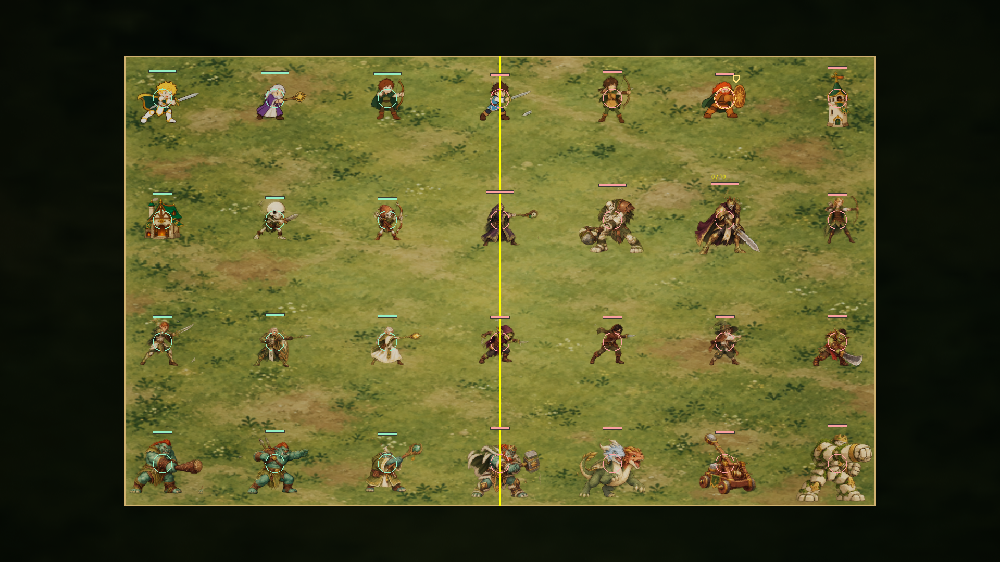

# Little King · 小小国王

[简体中文](README.md) | [English](README.en.md)

A single-player PvE auto-battler prototype built with **Unreal Engine 5.8, C++, Paper2D, GAS, and UMG**.

Prepare your heroes and deck at home, set out through the gate, and explore a fixed world map with randomized routes. Deploy three heroes before each battle, command them through their camps, and cycle cards to support your army. Bring expedition gold home to upgrade your settlement.

The current version is **v0.8** (`ProjectVersion=0.8.0`). The game UI and most detailed design documents are currently in Simplified Chinese.



## What's new in v0.8

This release integrates all four art and audio batches, adding **775 Unreal assets** together with source files, import scripts, provenance records, and generation prompts.

| Batch | Delivered content | Unreal assets |
| --- | --- | ---: |
| A | Main-menu illustration, seven home buildings, shared storybook UI styling, nine audio clips | 27 |
| B | Twenty additional battle sprites and seventeen card illustrations; card layout and sprite-scale fixes | 57 |
| C | Five regional grounds, three hero camps, five node emblems, effect components, twenty-eight dedicated sound effects, combat/UI event integration | 52 |
| D | Animation for all 28 entities: 448 frames and 140 clips; seven building upgrades; four music loops; Chinese fonts; scene transitions and UI entrance motion | 639 |

All **28 built-in units/buildings and 24 cards** now have artwork. Characters use idle, movement, attack, hit, and incapacitation/defeat poses. Existing custom sprite overrides remain supported. Camps, health bars, spell feedback, node screens, and upgrade effects retain their gameplay behavior.

Four background tracks were generated using the existing local **MiniMax-Music3** installation for home/menu, expedition, battle, and boss scenes. Music transitions use crossfades with at most two active voices. Noto Sans/Serif CJK fonts provide consistent body and heading text. Source images, original audio, exact prompts, and license files are included; normal play does not require a generation model or manual asset downloads.

See the [v0.8 release notes](docs/44-v0.8ReleaseNotes.md), [asset inventory](docs/12-AssetRequest.md), [sources and licenses](docs/36-ArtAudioSources.md), and [animation/music integration guide](docs/42-PolishArtIntegration.md).

## Current gameplay

### Home and expeditions

- Seven home buildings: Saint Maria Statue, Library, Gate, Hero House, Treasury, Barracks, and War Room. The library, hero house, and barracks currently provide collection views; further progression features are planned.
- The statue raises post-battle hero recovery from 40% to 60%, 80%, and 100% of maximum health across its four levels. The treasury improves silver generation and capacity, and limits the gold carried into a new expedition.
- The War Room configures three heroes and a deck. The Gate shows the departure summary and lets you choose carried gold before leaving from the fixed starting point.
- The world contains five fixed regions. Each expedition generates approximately 10–20 nodes per region, connected as directed acyclic routes with multiple entrances/exits and connections between adjacent regions.
- Nodes include ordinary encounters, elite encounters, boss battles, markets, and rests. Market merchandise remains a future extension; rests currently recover 30% health.
- Victory rewards offer three choices, including card upgrades and temporary recruits, with an option to skip. Gold remaining in the expedition wallet returns home on success, defeat, or voluntarily ending the expedition.
- Reward, route, and service screens allow a safe return home while retaining the expedition. The Gate can resume it or confirm abandoning it.

### Battle and cards

- Deploy all three heroes—Knight, Mage, and Ranger—before starting. Deployment has no time limit.
- Each hero has a solid, untargetable camp. Select a friendly camp, then a reachable location to issue a movement order. The hero interrupts combat while moving, then resumes automatic combat on arrival or after the stuck timeout. Right-click cancels camp selection.
- The battle hand always contains **four distinct cards**. A successful play draws the next card into the same slot and returns the played card to the queue's end. The deck starts shuffled; cycling thereafter follows the queue.
- Deck capacity is **eight weighted slots**, with at least five distinct cards. Troll cards cost two capacity slots, the Colossus costs three, and other cards cost one. Each drawn card still occupies only one hand slot. Heroes are selected separately.
- When a reward would exceed capacity, select one or more existing cards to replace, then confirm the change. Temporary expedition cards are not permanently unlocked at home.
- Character quality progresses through Common, Uncommon, Rare, Epic, and Legendary. Spells have fourteen tiers across four ranks. Quality, cost, capacity, race, and abilities appear in card details.
- The Mage's trait permits spells anywhere on the battlefield. Without it, spells remain available in the friendly half. The Knight grants taunt to nearby friendly melee mercenaries; taunt takes priority over focus-fire orders. The Ranger has no additional trait yet.
- Combat entities have overhead health bars; camps do not. Attack-building placement previews show their ranges. A yellow center line separates battlefield halves. Only fireball casts currently produce a small camera shake.
- Player heroes become incapacitated at zero health. At battle settlement, they recover the configured fraction of maximum health, capped at full; incapacitated heroes recover to that fraction. Ordinary healing cannot revive them during combat.
- The roster includes undead summoners and bosses, self-healing elves, thieves, apprentice casters, goblins, four trolls, a two-headed dragon, a building-only siege catapult, and the Colossus. Empowerment, stun, freeze, and stacking burn are implemented.
- Treasury silver capacities are currently 5/7/9/11/13. Initial balance remains subject to playtesting.

Rules and current values are documented in the [game design](docs/01-GDD.md), [content catalog](docs/19-ContentCatalog.md), [quality and balance guide](docs/32-CharacterQualityAndBalance.md), and [troll/siege card guide](docs/35-TrollAndSiegeCards.md).



## Build and play

The verified development target is **Unreal Engine 5.8.1 / Windows / Development Editor**. Install UE 5.8 and its supported Visual Studio C++ toolchain. Paper2D and GameplayAbilities are enabled in the project.

1. Clone the repository and close any running editor instance for this project.
2. In PowerShell, from the repository root, build the editor target. Adjust the engine path for your installation:

   ```powershell
   $ueRoot = 'E:\epic\UE_5.8'
   $projectPath = (Resolve-Path '.\little_king.uproject').Path
   & "$ueRoot\Engine\Build\BatchFiles\Build.bat" little_kingEditor Win64 Development $projectPath -WaitMutex -NoHotReloadFromIDE -MaxParallelActions=4
   ```

3. After `Result: Succeeded`, open `little_king.uproject` and click Play. The default map is `Content/Maps/L_StartMenu`. Starting Play directly from the home or battle map also routes through save selection when needed.
4. Choose New Game, Continue, or Load Game. The start menu supports up to eight independent saves and deleting saves; Settings is currently a placeholder.
5. Save your team and deck at the War Room, then use the Gate to depart. Choose a reachable node, deploy all three heroes, and start combat. Select a card and click a valid battlefield location to play it.
6. Claim or skip rewards, follow the route, and return home after finishing or losing the expedition.

Use the console command `show me the money` to add 100 home gold, or `show me the money 500` to specify an amount. This debug command is described in the [start-menu guide](docs/30-StartMenuTutorial.md).

All runtime artwork, audio, fonts, maps, and UI integration are already included. Python, image generation, and Music3 are optional authoring tools. Follow the [asset guide](docs/13_Asset_Solutions.md) and [D-batch guide](docs/42-PolishArtIntegration.md) only when changing or reimporting source assets; font import requires a normal editor session with Slate.

## Validation and saves

The final D-batch build succeeded on UE 5.8.1. The full `LittleKing` automation suite passed **83/83 tests**: 39 without warnings and 44 with warnings from synthetic test worlds, existing engine fallbacks, or deliberately rejected input/save cases. There were no failed or unexecuted tests.

Real-engine captures cover 720p and 1080p: 76 screenshots were produced, representative layouts and animation states were inspected, and 28 images were archived for D. Travel checks completed menu → home → battle map → home without leaving a transition curtain or extra music voices. See the [D validation record](docs/validation/PolishArt-Validation.json) and [v0.8 release validation](docs/validation/v0.8-Release.json).

The five existing player-save files remained byte-identical during D validation. Save slot 01 retains the legacy `LittleKing_Profile_A/B` and `LittleKing_Run` names; slots 02–08 use numbered prefixes. Expedition Schema 8 preserves compatible older routes and wallets. Older oversized decks require an explicit player-selected reduction rather than silently deleting cards. Automation uses isolated test slots.

Packaging and hardware acceptance testing remain deferred, and Sprint 6 remains skipped. Generated animation is an initial visual pass. Audio format, peaks, loop seams, and playback lifetimes have been checked; final subjective listening and mix approval remain separate work.

## Project layout and collaboration

| Path | Purpose |
| --- | --- |
| `Source/little_king` | Gameplay, content registration, run/profile subsystems, native UI, and presentation |
| `Source/little_king/Tests` | Unreal automation tests |
| `Content` | Maps, Blueprints, data assets, and imported runtime resources |
| `Content/Art/StorybookV1` | The 775 assets added by art/audio batches A–D |
| `ArtSource/StorybookV1` | Original images/audio/fonts, manifests, generation receipts, prompts, and licenses |
| `Scripts` | Import, audio preparation, frame metadata, and asset-audit tools |
| `docs` | Design, implementation records, tutorials, shared screenshots, and validation summaries |
| `Saved` | Local logs, caches, screenshots, and player saves; excluded from Git |

Built-in unit identities and behaviors have native C++ defaults. Data tables tune values and presentation without replacing required unit rules; custom unit IDs remain supported. See [card development interfaces](docs/34-CardDevelopmentInterfaces.md) before adding content.

Coordinate changes to shared Unreal assets. A/C/D did not resave existing battle assets; B only corrected the old Barracks sprite's vertical scale in `DT_Units`. Existing `DT_Traits`, hero ability assets, `DA_GameData`, `L_BattleTest`, and `WBP_BattleHUD` were retained. Unity compilation is disabled because some translation units contain helpers with the same file-local names.

## Documentation

Detailed linked documents are currently in Chinese. Older tutorials are historical; the current design and latest change records take precedence.

| Topic | Entry points |
| --- | --- |
| Design and architecture | [Game design](docs/01-GDD.md), [technical design](docs/02-BattlePrototypeDesign.md), [task list](docs/03-TaskList.md), [bug log](docs/05-BugLog.md) |
| Dungeon D0–D5 | [Plan](docs/17-DungeonDevelopmentPlan.md), [change log](docs/18-DungeonChangeLog.md), [content catalog](docs/19-ContentCatalog.md), [save/recovery tutorial](docs/25-D5SaveTutorial.md) |
| Home H0–H5 | [Plan](docs/26-HomeDevelopmentPlan.md), [change log](docs/27-HomeChangeLog.md), [tutorial](docs/28-HomeTutorial.md) |
| Menus and world map | [Optimization change log](docs/29-OptimizationChangeLog.md), [start-menu tutorial](docs/30-StartMenuTutorial.md), [five-region expedition tutorial](docs/31-WorldMapExpeditionTutorial.md) |
| Cards and balance | [Quality and balance](docs/32-CharacterQualityAndBalance.md), [character tutorial](docs/33-Stage3CharactersTutorial.md), [development interfaces](docs/34-CardDevelopmentInterfaces.md), [troll/siege cards](docs/35-TrollAndSiegeCards.md) |
| Art direction and authoring | [Style guide](docs/07-ArtStyleGuide.md), [inventory](docs/12-AssetRequest.md), [integration tutorial](docs/13_Asset_Solutions.md), [sources and licenses](docs/36-ArtAudioSources.md) |
| Art/audio implementation | [A: home and UI](docs/37-ArtAudioIntegration.md), [B: battle art](docs/38-BattleArtIntegration.md), [C: world and effects](docs/40-WorldSkillsArtIntegration.md), [D: animation and music](docs/42-PolishArtIntegration.md) |
| Exact generation prompts | [Battle](docs/39-BattleArtPrompts.md), [world/effects](docs/41-WorldArtPrompts.md), [animation/buildings/music](docs/43-PolishArtPrompts.md) |
| Releases | [v0.8 notes](docs/44-v0.8ReleaseNotes.md), [v0.8 validation](docs/validation/v0.8-Release.json), [historical v0.7 validation](docs/validation/v0.7-Release.json) |

## Asset credits

Third-party assets retain their respective licenses. Noto fonts include their SIL Open Font License files; adopted audio sources and generated artwork/music have separate provenance records. MiniMax-Music3 is covered by its archived Community License, and the menu includes the music attribution. Do not assume that all project assets share a CC0 license. Exact sources, authors, processing steps, applicable license files, and AI generation prompts are recorded in the [asset source document](docs/36-ArtAudioSources.md) and manifests under `ArtSource/StorybookV1`.
