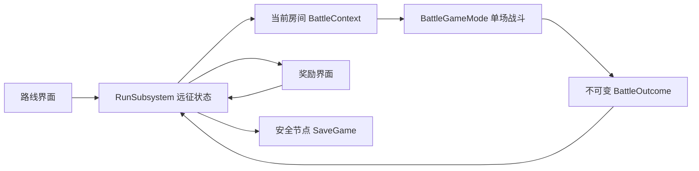

# 阶段 2 · 地牢开发任务规划

版本 1.7 · 2026-09-08 · UE 5.8。状态：**D0~D5 全部完成（32/32 自动化）——阶段 2 地牢局内循环收口；下一批评估阶段 3 家园或内容扩充**。

本次补牌、建筑射程预览、黄线修复仍归 Sprint 5。用户已试玩数次并反馈效果不错，因此取消原 Sprint 6，直接进入地牢开发。音效、表现素材、打包、硬件与性能专项测试后置，不作为本阶段启动或完成条件。保留与改动直接相关的编译、自动化和短流程 PIE 检查。

本文安排实际开发顺序，只有标为完成的内容已交付。当前战斗规则以 [01-GDD](01-GDD.md) 为准，地牢代码交接见 [18](18-DungeonChangeLog.md)，单位资料见 [19](19-ContentCatalog.md)，D0～D5 操作分别见 [20](20-D0UndeadTutorial.md)、[21](21-D1ExpeditionTutorial.md)、[22](22-D2EncounterTutorial.md)、[23](23-D3RewardTutorial.md)、[24](24-D4NodeTutorial.md) 与 [25](25-D5SaveTutorial.md)。15 保留 Sprint 5 历史。

## 1. 先做什么，为什么

建议先做一段 **3～5 场战斗的短远征**，让玩家能走完“选择路线 → 战斗 → 三选一奖励 → 改变打法 → 挑战首领 → 通关/失败”。首先验证奖励与路线是否真的让下一战的选择不同，再增加楼层、事件数量和家园。

单场战斗已经有营地位置、嘲讽、法术覆盖与过牌决策。地牢应围绕这些现有机制提供取舍：选高风险路线换更强奖励，保留便宜卡加快循环，或扩充牌组获得更多应对手段。牌组变大也会让关键牌回手更慢，因此“加牌”不应永远优于“升级现有牌”。

第一版使用现有角色、卡牌、地图和简单 UMG 按钮。先不做实时行走探索、大地图场景、程序化三维地形、商店经济、复杂剧情、永久英雄养成或家园。节点图负责路线选择，房间负责一场战斗或一次明确选择。

首个可交付切片为 **固定三战串联**。这能最早暴露跨关状态丢失、重复结算、旧重开按钮清空远征等问题；随机路线和丰富奖励在这个闭环上扩展。

## 2. 本阶段规则边界

| 项目 | 规划基线 | 实施边界 |
|---|---|---|
| 队伍 | 骑士、法师、游侠三英雄 | 每场仍须全部部署；不限部署时间；营地每场重建 |
| 手牌 | 固定四槽，所有槽都有牌，同 CardId 唯一 | 开局按种子洗牌一次，后续 FIFO；战斗开始前牌组至少五种，当前默认七种 |
| 牌组 | 远征持有卡组，战斗拥有临时手牌/队列 | 进入新战斗重新洗牌，不继承上一场卡槽、抽牌位置和出牌银币 |
| 战斗银币 | 当前生成速度、上限和起始量 | 只属于单场，不能被奖励、远征货币覆盖 |
| 英雄技能/特性 | 沿用现有 GA 与可增删特性 | 永久于本次远征的改变保存为 ID/数值；临时光环和 GE 句柄不跨房间 |
| 佣兵/建筑/营地 | 只存在于当前房间 | 不带入下一房，不保存 Actor；英雄失能时营地仅在当场保留 |
| 英雄生命 | 无永久死亡；战后**玩家英雄**增加最大生命的 40%，封顶 | 失能者从 0 回到 40%；**远征房间敌方不恢复、不跨房继承，每房按遭遇满血重建（BUG-015 规则修订）**；不等于战败后可继续远征 |
| 胜负 | 一方英雄全部失能结束，保留虚弱与同批结算 | 先处理骷髅王复活；战斗结果通知远征，击败终点首领才算远征通关 |
| 奖励 | 每场获胜后展示一次三选一，可跳过 | 奖励不能让手牌重复或删到无法补满；重复点击只结算一次 |
| 失败 | 当前远征结束，展示已走节点与战斗统计 | 不自动赠送胜利奖励，不默认允许原地反复重打刷奖励 |
| 读档 | 第一版只恢复安全节点 | 暂不保存战斗中单位、弹道、冷却和精确帧状态 |

### 英雄跨房间规则（2026-09-07 已定稿）

采用用户确认的 **全员战后增加 40% 最大生命**。公式为 `min(最大生命, 战斗结束生命 + 最大生命 × 0.4)`：20% → 60%，90% → 100%，失能 0% → 40%。英雄永远不被永久移出队伍。战内普通治疗不能救起失能英雄；骷髅王的朽骨再生是明确的战内复活技能。

D0 已实现单场失能、保留英雄实例、战后恢复和恢复前后 Outcome 快照。D1 已直接继承 `RecoveredState` 进入下一战，不再用“每房满血”的临时规则，也不再加一次 40%。新远征第一房满血，随后每房新建英雄 Actor、重建营地并设置继承生命。固定路线无需单独路线界面，由结算按钮推进唯一合法下一房。

**敌方不跨房（BUG-015 规则修订，2026-09-08）**：跨房继承的唯一载体是玩家英雄。远征房间结算只对玩家英雄执行 +40% 恢复；敌方任何单位（英雄/Boss/佣兵/建筑，不限种族）不恢复、不继承，下一房一律按遭遇配置满血重建——敌方快照只进 BattleHistory 展示。独立单场保留旧的双方恢复调试行为。实现边界：`FinalizeHeroRecovery`（远征跳过敌方恢复）、`DeployHero`（继承仅限 Player 分支）、`SubmitBattleOutcome`（EnemyHeroes 永不写 RunState.Heroes；PlayerHeroes 集合必须与队伍一致）。

结算后的恢复不会重开战斗、改胜负或增加战斗治疗统计；战败仍进入远征失败。战内英雄计数记录失能前后的战斗资格，结算后的队伍展示应读 Outcome 的恢复快照。

其他建议默认值：地图节点展示房型与主要敌人；奖励可跳过；第一版不设远征货币；不允许已结算房间回退；路线、遭遇和奖励使用各自的确定性种子。它们在 D0 记录为方案基线，开发时可调整并同步本文。

## 3. 结构和数据所有权

远征状态建议放在 `ULKRunSubsystem : UGameInstanceSubsystem`，跨地图存在。现有 `ALKBattleGameMode` 只管理一场战斗，不能兼任远征存档。UMG 只展示和发出命令，不自己加牌、改生命或判断通关。

| 数据/对象（建议命名） | 拥有者与生命周期 | 内容/约束 |
|---|---|---|
| FLKRunState | RunSubsystem，一次远征 | RunId、版本、总种子、阶段、当前 NodeId、地图、已走路径、队伍、持有卡组、待选奖励、已处理结算 ID |
| FLKRunHeroState | RunState | HeroId、Health、MaxHealth、Traits；无 Actor/ASC/GE 句柄；D1 加载时校验未知 ID |
| FLKRunCardState | RunState | CardId、升级等级/修改记录；相同基础卡的升级是替换，不能奖励一张重复副本 |
| FLKDungeonNode | RunState | 已实现 NodeId、Type、EncounterId、NextNodeIds、bResolved；层列布局留 D4 添加 |
| FLKEncounterRow / DT_Encounters | 只读内容资产 | 敌方英雄阵容、卡组、波次、AI 参数覆盖、奖励档位、首领标记；引用须能解析 |
| FLKRewardRow / DT_Rewards | 只读内容资产 | 加牌/升级/特性/恢复类型、参数、权重、前置条件、互斥规则；无 UI 执行逻辑 |
| ULKDungeonDefinition / DA_Dungeon_Prototype | 只读地牢配置 | 层数、分支数、节点类型约束、遭遇池、奖励池和默认队伍 |
| FLKBattleContext | RunSubsystem 生成，GameMode 消费 | RunId、NodeId、AttemptId、独立战斗种子、双方阵容与牌组、英雄起始状态、规则覆盖 |
| FLKBattleOutcome | GameMode 一次性输出 | 上述身份、胜负、最终统计、英雄生命/特性快照；冻结后读取，不靠 HUD 飘字累计 |
| ULKRunSaveGame | 安全节点持久化 | 可序列化 RunState、存档版本；不序列化 World、Actor、委托或类默认对象 |

`LKRunTypes.h` 已实现 RunState、Hero/CardState、Node、Context、Outcome 与远征阶段枚举，均为反射值类型。SchemaVersion 初始为 1；ProcessedAttemptIds 和 BattleHistory 已由 D1 状态机使用，PendingBattle 保存可安全重入的当前尝试。奖励批次字段与 SaveGame 仍分别留给 D3、D5。

状态流转已放在 `ULKRunSubsystem.h/.cpp`。地图生成复杂后再拆生成器，奖励复杂后再拆奖励服务。

### 与现有代码的接入点

1. `ALKBattleGameMode::EnsureGameData / BeginPlay`：先判断独立战斗或远征上下文。远征使用运行时配置副本，不能直接改 `DA_GameData` 或 C_* 资产；独立 `L_BattleTest` 保留当前默认流程。
2. `AvailableHeroes / EnemyHeroIds / AutoDeployDefaultHeroes / CanStartBattle`：已拆开玩家必部署名单与敌方阵容，亡灵遭遇允许 1～2 名敌方英雄；玩家仍需三英雄。D1 从 Context 提供阵容，不重写部署门槛。
3. `TryInitPlayerState / InitBrain`：从上下文分别初始化牌组、银币和 AI。先校验双方牌组再进入部署，保证“有图标但 CardId 解析失败”不会藏到战斗中。
4. `SpawnUnitForTeam / InitUnit`：基础属性 → 卡牌升级覆盖 → 英雄远征特性 → 起始生命。生命按最终最大生命钳制；不把上一战骑士光环状态保存为永久嘲讽。
5. `EndMatch / GetBattleOutcome`：在最后一击、召唤/复活结算后冻结战斗，输出全部英雄恢复前后快照，并在通知 HUD 前提交给 RunSubsystem。RunId、NodeId、AttemptId 必须匹配，重复结果不会推进房间。
6. `WBP_BattleHUD` 现有 `Btn_Restart`：C++ 在运行时清理旧点击绑定并接管。第一、二房胜利显示“下一关”；失败或第三房结束显示“从头开始”。推进/重建状态成功后才重载当前战斗地图。
7. `ULKDeckState`：仅当场循环状态。奖励先修改 RunState 的持有卡组，再为下一战生成新 Deck；不要将当前四张 Hand 当成完整持有卡组。`GetNextCard` 可供以后做“下一张”预览。

## 4. 状态流转和异常处理

当前实际阶段：`Inactive → EnteringBattle → InBattle → ChoosingReward → ChoosingNode → EnteringBattle`；前两房胜利在有候选时进入 `ChoosingReward`，领取或跳过后才进入等待“下一关”的 `ChoosingNode`。第三房胜利转 `Completed`，任意失败转 `Failed`，放弃转 `Abandoned`。D4 才让 `ChoosingNode` 出现多个路线选择。

| 命令/事件 | 前置条件 | 成功变化 | 重复或异常 |
|---|---|---|---|
| StartRun | 无进行中的远征 | 创建 RunId、生成图、建立初始牌组，显示起点 | 已有远征时显示继续/明确放弃入口，不能自动覆盖 |
| SelectNode | 节点与当前节点相连且未结算 | 记录 NodeId，生成固定 Encounter/AttemptId，进入对应界面 | 非相邻、已走、未知节点拒绝 |
| EnterBattle | 上下文完整，尚未消费 | 新世界读取上下文，进入三英雄部署 | 加载失败回路线并保留错误，不把房间标为已通关 |
| SubmitBattleOutcome | 身份匹配、阶段允许、AttemptId 未处理 | 记录统计；胜利生成奖励，失败结束 | 旧世界回调、重复结果忽略并记录日志 |
| ChooseReward | 存在待选批次，选项有效 | 原子更新队伍/卡组、标记领取、推进节点 | 双击、重进界面、读档后重复领取不生效 |
| SkipReward | 同上 | 消费该批奖励，推进节点 | 不能随后返回补领 |
| ResolveRest/Event | 正在处理该节点 | 应用一次结果并推进 | 先检查适用条件，失败保留选择界面和原因 |
| Finish/Abandon | 可结束状态 | 保存终态摘要、清理上下文、回入口 | 不生成胜利奖励，不把旧队伍带到新远征 |

UI 按钮禁用只提供交互反馈；真正的去重和状态校验必须在 C++ 命令入口。涉及奖励和存档时先生成待提交的新状态，校验成功才替换旧状态；不能先扣除/删牌，再因为其他条件失败而留下半次操作。

## 5. 里程碑与详细任务

依赖主线：**D0 → D1 → D2 → D3 → D4 → D5**。编号是地牢交付批次，不恢复已取消的 Sprint 6。每批都保持原单场地图可运行。

以下为单名程序协作者的粗略工作量估计，不是工期承诺；资产配置与规则反馈由内容/UI 协作者穿插完成。建议每完成一批更新实际工时，再估下一批。

### D0 · 冻结最小方案与接口（已完成，2026-09-07）

| ID | 任务 | 交付/验收 | 依赖 |
|---|---|---|---|
| D0-01 ✓ | 三战切片、战后全员 +40%、奖励可跳过、无货币 | 本文第 2 节；替代旧 50%/满血临时建议 | 无 |
| D0-02 ✓ | RunState、BattleContext、BattleOutcome、阶段枚举 | LKRunTypes.h 已编译；值类型所有权见第 3 节 | D0-01 |
| D0-03 ✓ | 初始化与结算入口清单 | 第 3 节；已提供独立敌方名单、GetBattleOutcome，D1 再接入 Subsystem | D0-02 |
| D0-04 ✓ | 内容 ID 和协作资产归属 | 下表固定；本轮不改任何二进制资产 | D0-02 |

D0 当时额外完成用户指定的五种敌人、被动与特性、彩色占位方框和三个测试遭遇；这些内容是 D2 的地牢内容预备，D2 后续已将它们迁入正式遭遇配置链。

| 稳定 ID / 资产路径 | 状态 / 用途 | 保存责任 |
|---|---|---|
| Encounter_UndeadPatrol、Encounter_UndeadElite、Encounter_SkeletonKing | 已实现三类正式遭遇；Patrol/Elite/Boss 仅为调试别名 | C++ 协作者维护 LKEncounterContent；数值由 DT_Encounters 调整 |
| Node_Start → Node_Battle01 → Node_Battle02 → Node_Boss03 | D1 已实现的固定路线 ID，依次绑定上述三遭遇；起点为已解决入口标记 | C++ 协作者维护 ULKRunSubsystem |
| PendingRewardBatchId + Reward Kind + CardId | D3 实际奖励身份；批次 GUID 防重复，候选当前为 UpgradeCard / AddCard | C++ 维护生成与校验，UI 只读 |
| /Game/Data/DT_Encounters | D2 已创建，三房完整遭遇配置；JSON 源与生成脚本可重复构建 | D2 助手维护；接手时先在 18 留名 |
| /Game/Data/Dungeon/DT_Rewards、DA_Dungeon_Prototype | 预留 D3/D4 内容资产，当前不存在 | 内容/资产协作者独占保存；接手时在 18 留名 |
| /Game/blueprint/Dungeon/WBP_RunRoute、WBP_RunSummary | 分别预留给 D4/D5；D3 奖励已有原生 UI，未来可另建 WBP_RunReward 子类换肤 | UI 协作者独占保存；接手时在 18 留名 |
| /Game/Maps/L_BattleTest | D1 复用战场；不新建地牢三维地图 | 当前资产维护者（用户），先协调再保存 |
| /Game/Data/DA_GameData、DT_Units、DT_Traits；/Game/blueprint/WBP_BattleHUD | 现有资产；用户已保存 DT_Units/DT_Traits，助手只读验证，D1 无需重存 WBP | 当前资产维护者（用户） |

单元 ID 见 [19](19-ContentCatalog.md)。禁止用显示中文名、Actor 实例名或短别名作持久化定义 ID；Outcome.InstanceId 只在单场日志中区分同 ID 的多个单位。RunId/AttemptId/RewardBatchId 使用独立 GUID。计划 ID 以后若改名，必须同步本表并在已持久化后提供迁移。

### D1 · 三战串联切片（已完成，2026-09-08）

| ID | 任务 | 交付/验收 | 依赖 |
|---|---|---|---|
| D1-01 ✓ | 新建 RunSubsystem 与最小状态机 | 可新建、查询、结束、放弃和显式重开；进行中的远征拒绝覆盖 | D0 |
| D1-02 ✓ | 固定 Start → 战斗 A → 战斗 B → 首领 C 路线 | 固定节点接三种亡灵遭遇；前两房仅有一个合法下一站 | D1-01 |
| D1-03 ✓ | 上下文注入与每场重置 | 重载同一战场重建临时对象；三英雄继承恢复后生命/特性，牌组来自 RunState | D1-01 |
| D1-04 ✓ | EndMatch 输出 Outcome 并防重复 | 三层身份和完整英雄快照校验；AttemptId 只提交一次；失败进入 Failed | D1-03 |
| D1-05 ✓ | 最小结算 UMG | 复用现有按钮；前两房胜利为“下一关”，失败/第三房为“从头开始” | D1-02、04 |
| D1-06 ✓ | 切片检查与交接记录 | 20 组自动化、真实 BP GameMode/HUD 集成、十三核心单位规则合并、五蓝图只读编译；见 18/21 | D1-05 |

**D1 结果：** 不依赖随机地图、音效、新卡或美术即可通关、失败并重新开一轮。第一版直接复用 `L_BattleTest`，有已配置 `DA_GameData` 的 GameMode 默认进入远征；没有 authored GameData 的临时测试 GameMode 保留独立单场。操作与日志见 [21](21-D1ExpeditionTutorial.md)。

### D2 · 遭遇配置与英雄状态（已完成，2026-09-08）

| ID | 任务 | 交付/验收 | 依赖 |
|---|---|---|---|
| D2-01 ✓ | 完善双方阵容与初始化参数 | 完整遭遇快照含敌英雄、波次、牌组、银币、AI 和奖励档，进入 BattleContext | D1 |
| D2-02 ✓ | 新建遭遇表、运行时配置副本与校验 | 新增 DT_Encounters；开局复制整表，缺固定行、坏 ID、重复项、非法数值明确拒绝 | D2-01 |
| D2-03 ✓ | 完善英雄生命与永久属性覆盖 | RunHeroState 保存 BaseMaxHealth；新房重算永久特性后钳制生命，支持房间间升级 | D1-04 |
| D2-04 ✓ | 远征特性保存与清理 | 永久 Add/Remove 下一房生效；临时光环、强制目标、预警、攻击与技能冷却清空 | D2-03 |
| D2-05 ✓ | 扩展普通/精英/首领三类遭遇 | 三行奖励档 1/2/3，精英/首领逐级加快集火，三连战波次数量已下调 | D2-02 |

**D2 结果：** 第一场后的合法永久变化影响第二场；改变敌阵容不会少部署玩家英雄；一次远征结束不改下一次默认初始资产。完整自动化 24/24 通过，操作与字段说明见 [22](22-D2EncounterTutorial.md)。

### D3 · 奖励与局内构筑（已完成，2026-09-08）

| ID | 任务 | 交付/验收 | 依赖 |
|---|---|---|---|
| D3-01 ✓ | 奖励状态机（Offer/Choose/Skip 原子入口、同胜利只发一批、防重复领取） | `ULKRunSubsystem`；ChoosingReward 阶段；批次 GUID 消费 | D2 |
| D3-02 ✓ | 候选生成与独立种子 | 升级持有单位/建筑卡（攻击/生命 +10%/级）或未持有骷髅新卡；tier1 至多 1 新卡、tier2 至多 2；种子确定性 | D3-01 |
| D3-03 ✓ | 卡升级运行时应用 | `SpawnUnitForTeam(SourceCardId)` 行副本 ×1.1^Lv；仅远征玩家出牌生效 | D3-02 |
| D3-04 ✓ | 骷髅兵/骷髅射手新卡（1 费文字卡） | 运行时目录注入；未持有时才作为加牌候选 | D3-01 |
| D3-05 ✓ | 奖励界面与队伍/卡组摘要 | 原生 `ULKRunRewardWidget` 自动弹出；三张响应式奖励卡、图标/占位、真实升级前后值、当前牌组和跳过；可用 BP 子类换肤 | D3-02、03、04 |
| D3-06 ✓ | 自动化与实际打法检查 | 状态机、升级/加牌/跳过及真实 HUD 面板开关纳入完整回归；PIE 手工验收脚本见 23 | D3-05 |

**设计提醒：** 当前只有七种基础卡且默认已全部持有，“三张新卡奖励”会无牌可发。首版必须以现有卡升级和少量英雄特性/恢复为主；新卡和更小初始卡组不能被当成未记录的默认前提。升级版本不应作为第二张同类卡并存。删牌功能可后置；如开放，最低五种约束必须在奖励生成和执行两处检查。

**D3 完成标准：** 至少一次选择影响下一战，另一条选择产生不同效果；跳过可继续；奖励重复领取、ID 缺失、全牌已持有和无适用升级都有确定处理。

### D4 · 分支路线与休息节点（已完成，2026-09-08）

| ID | 任务 | 交付/验收 | 依赖 |
|---|---|---|---|
| D4-01 ✓ | 分层节点图生成 | 固定形状：R1 普通战 → R2（普通战/休息）→ R3（精英战/休息）→ Boss；每个节点的 NextNodeIds 即"下一排"——选择界面只显示下一排，看不到后续 | D3 |
| D4-02 ✓ | 随机敌阵容（目录驱动池 + 确定性种子） | 普通房随机 1 英雄、精英随机 2（不同）、首领房 = 首领 1 + 英雄 2；首领判定 = 注册表 Boss 类或 Boss 行首位；同种子复现 | D4-01 |
| D4-03 ✓ | 节点状态与选择界面 | 原生 `ULKRunNodeSelectWidget`（换肤入口 NodeSelectWidgetClass）；结算按钮在奖励/节点选择期间锁定；越级/已结算选择拒绝 | D4-01 |
| D4-04 ✓ | 休息节点回血选项 | 唯一选项"恢复 30% 最大生命"（全体，封顶）；选择后立即生效并继续显示再下一排；效果只执行一次 | D2、D3-02 |
| D4-05 ✓ | 自动化与验证 | `LittleKing` 29/29（新增 D4 三组：图结构/阵容规则/休息全通）；PIE 手工验收脚本见 24 | D4-04 |

**D4 结果：** 玩家可选择"全战斗线"或"休息线"（回血换少打一场）走到首领并通关；无死路/环/重复结算/越级点击；战斗数 3~4 取决于休息选择。敌方阵容以遭遇表为池（往 `DT_Encounters` 加行即自动入池），为后续剧情种族扩编铺路。操作与验证见 [24](24-D4NodeTutorial.md)。

### D5 · 安全节点存档与阶段收口（已完成，2026-09-08）

| ID | 任务 | 交付/验收 | 依赖 |
|---|---|---|---|
| D5-01 ✓ | RunSaveGame 版本与安全节点保存 | `ULKRunSaveGame` + 固定槽；自动保存点：新远征/胜利结算/领取跳过奖励/选择节点；写失败保留内存并提示 | D4 |
| D5-02 ✓ | 继续远征与数据校验 | 结构版本 1~4 与内容校验；未知版本/损坏拒绝载入且保留原档；同胜利窗口批次标记随档保存（重复读档不复制奖励） | D5-01 |
| D5-03 ✓ | 战斗中退出规则 | 恢复到该房开战前（同 Encounter/种子/Attempt）；临时状态不保存；GameMode 冷启动恢复分支 | D5-01 |
| D5-04 ✓ | 放弃、新开与终态摘要 | 原生 `ULKRunResumeWidget` 终态/恢复面板；通关/失败摘要；开始新远征只允许恢复世界动作 | D5-02 |
| D5-05 ✓ | 定向自动化、短流程 PIE、文档交接 | `LittleKing` 32/32（新增 D5 三组）；PIE 脚本见 25 第 3 节 | D5-03、04 |

**D5 结果：** 可在路线/奖励界面与战斗中退出后继续；重复读档不复制奖励；损坏/未知版本档拒绝且保留。教程见 [25](25-D5SaveTutorial.md)。**阶段 2 地牢（D0~D5）收口完成。**

## 6. 验证安排

| 层次 | 核心场景 | 何时执行 |
|---|---|---|
| 状态机自动化 | 非相邻节点拒绝、过期 AttemptId、重复结算/领奖、失败终态不可继续 | D1、D3 修改入口时 |
| 世界集成 | 两次连续战斗、计时银币归零、营地重建、敌阵容不同、最后一击统计保留 | D1～D2 |
| 构筑自动化 | 全牌持有、升级替换、候选不足、不能删到四种、下一战仍满手唯一 | D3 |
| 地图自动化 | 固定种子复现，所有路径可到首领，无环/死路，参数边界合法 | D4 |
| 存档自动化 | 版本错误、读写失败、待选奖励一致、重复加载不重领 | D5 |
| PIE 功能检查 | 一次通关、一次失败、一次跳过奖励、一次分支选择、一次安全节点继续 | 各批新增交互及 D5 收口 |
| 单场回归 | L_BattleTest 的三英雄门槛、营地指挥、满手循环、法术特性与嘲讽 | 修改共同战斗入口后 |

不重复编写只验证字段赋值的测试。先围绕会造成远征数据丢失、重复奖励或无法继续的边界；通过后仅在后续改动涉及该行为时重跑。NullRHI 检查逻辑，PIE 检查按钮和流程；两者都不声称完成视觉或硬件专项验证。

## 7. 协作者分工、提交和交接

| 角色 | 负责内容 | 交接物 |
|---|---|---|
| C++ 协作者 | 状态机、上下文、结算快照、牌组/奖励规则、生成和存档、定向测试 | 每批代码提交、接口说明、实际验证结果 |
| 内容/设计协作者 | 血量方案、遭遇参数、奖励池、路线风险与收益 | 已确认决策、表格行 ID、几次试玩中可复现的问题 |
| UMG/资产协作者 | 路线/奖励/摘要界面、数据资产绑定、旧结算按钮迁移 | 资产路径、UE 5.8 操作步骤、蓝图编译和 PIE 结果 |

同一 `.uasset` 不可文本合并。动 WBP_BattleHUD、DA_GameData 或数据表前，在变更记录写明归属；避免多人同时保存。C++ 提前交付最小接口给 UI，UI 不复制业务逻辑。优先新增地牢资产，减少对已能玩的战斗 HUD 的连锁修改。

每批建议一个可独立回退的提交；提交说明包含行为变化、涉及资产、实际检查。新代码与地牢界面教程沿用 UE 5.8；尚未交付的蓝图步骤不能勾选完成。已建立 [18](18-DungeonChangeLog.md) 记录 D0～D5 实际进度，后续在其内追加资产认领、改动与检查结果。

## 8. 主要风险与处理

| 风险 | 提前处理 |
|---|---|
| 战后恢复重复执行或失能英雄丢失 | 英雄不销毁、Outcome 一次性恢复；D1 只复制 RecoveredState，不再次加 40% |
| 共享 GameData/卡牌资产被远征升级污染 | 所有覆盖作用于运行时副本；两次新远征对比默认值 |
| Outcome 读取不到失能英雄 | 英雄保留到世界结束；切图前消费完整快照，禁止按 IsAlive 过滤队伍 |
| 新关卡 GameMode/Subsystem 初始化时序错误 | 上下文显式 Pending/Consumed 状态，匹配 RunId 和 AttemptId |
| 切图后旧对象回调推进新房间 | 世界上下文和 AttemptId 校验，离场解绑委托，幂等结果入口 |
| 加牌让关键卡很久回不来 | 奖励展示牌组总数/升级差异，允许跳过；先不用大量填充卡 |
| 奖励候选全失效 | 生成前过滤，执行时复核，候选不足允许少于三项并保留跳过 |
| 每房使用全局 RNG 导致读档变内容 | 路线/遭遇/奖励分种子，生成结果存入 RunState，不在 UI 重抽 |
| 开发失控成第二套战斗系统 | 复用当前单位/营地/特性与地图，只改上下文和生命周期边界 |

## 9. 下一次开发直接从这里开始

下一批在阶段 2 收口后评估：**阶段 3 家园局外循环**（家园场景、建筑升级、英雄养成、跨远征进度）或商店/事件内容扩充。D0～D5 的 RunSubsystem、遭遇快照、节点选择、奖励原子入口、原生结算/恢复 UI 与安全节点存档均作为回归基线；存档迁移需保持 SchemaVersion 兼容策略（新字段给默认、只拒绝未来的未知版本）。

阶段 2 完成后再决定扩充商店/事件/楼层或进入家园。音效与表现素材仍在后续美术打磨阶段，打包与硬件测试在准备发布时安排；不重新建立 Sprint 6 验收关卡。
