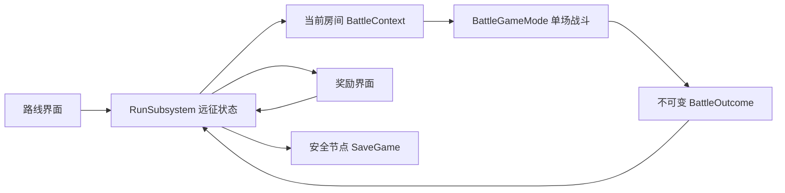

# 阶段 2 · 地牢开发任务规划

版本 1.0 · 2026-09-06 · UE 5.8。状态：**规划完成，地牢代码尚未开工**。

本次补牌、建筑射程预览、黄线修复仍归 Sprint 5。用户已试玩数次并反馈效果不错，因此取消原 Sprint 6，直接进入地牢开发。音效、表现素材、打包、硬件与性能专项测试后置，不作为本阶段启动或完成条件。保留与改动直接相关的编译、自动化和短流程 PIE 检查。

本文安排下一阶段实际开发顺序，不表示表内任务已经实现。当前战斗规则仍以 [01-GDD](01-GDD.md) 为准，当前代码交接见 [15](15-Sprint5ChangeLog.md)。

## 1. 先做什么，为什么

建议先做一段 **3～5 场战斗的短远征**，让玩家能走完“选择路线 → 战斗 → 三选一奖励 → 改变打法 → 挑战首领 → 通关/失败”。首先验证奖励与路线是否真的让下一战的选择不同，再增加楼层、事件数量和家园。

单场战斗已经有营地位置、嘲讽、法术覆盖与过牌决策。地牢应围绕这些现有机制提供取舍：选高风险路线换更强奖励，保留便宜卡加快循环，或扩充牌组获得更多应对手段。牌组变大也会让关键牌回手更慢，因此“加牌”不应永远优于“升级现有牌”。

第一版使用现有角色、卡牌、地图和简单 UMG 按钮。先不做实时行走探索、大地图场景、程序化三维地形、商店经济、复杂剧情、永久英雄养成或家园。节点图负责路线选择，房间负责一场战斗或一次明确选择。

首个可交付切片为 **固定三战串联**。这能最早暴露跨关状态丢失、重复结算、旧重开按钮清空远征等问题；随机路线和丰富奖励在这个闭环上扩展。

## 2. 本阶段规则边界

| 项目 | 规划基线 | 实施边界 |
|---|---|---|
| 队伍 | 骑士、法师、游侠三英雄 | 每场仍须全部部署；不限部署时间；营地每场重建 |
| 手牌 | 固定四槽，所有槽都有牌，同 CardId 唯一 | 开局按种子洗牌一次，后续 FIFO；战斗开始前牌组至少五种，当前默认七种 |
| 牌组 | 远征持有卡组，战斗拥有临时手牌/队列 | 进入新战斗重新洗牌，不继承上一场卡槽、抽牌位置和出牌银币 |
| 战斗银币 | 当前生成速度、上限和起始量 | 只属于单场，不能被奖励、远征货币覆盖 |
| 英雄技能/特性 | 沿用现有 GA 与可增删特性 | 永久于本次远征的改变保存为 ID/数值；临时光环和 GE 句柄不跨房间 |
| 佣兵/建筑/营地 | 只存在于当前房间 | 不带入下一房，不保存 Actor；英雄阵亡营地仅在当场保留 |
| 胜负 | 一方英雄全灭结束，保留虚弱与同批结算 | 战斗结果通知远征；击败终点首领才算远征通关 |
| 奖励 | 每场获胜后展示一次三选一，可跳过 | 奖励不能让手牌重复或删到无法补满；重复点击只结算一次 |
| 失败 | 当前远征结束，展示已走节点与战斗统计 | 不自动赠送胜利奖励，不默认允许原地反复重打刷奖励 |
| 读档 | 第一版只恢复安全节点 | 暂不保存战斗中单位、弹道、冷却和精确帧状态 |

### 必须明确的英雄跨房间规则（D2 前定稿）

“英雄本局不复活”在当前实现中指一场战斗。跨房间若永久移除阵亡英雄，下一场就无法满足三英雄全部部署；不能在代码里静默把门槛改为“两人也能开战”。

推荐分两步：D1 的流程切片每场以三英雄满血重建，继续保持战内不复活。这是隔离流程问题的临时开发基线，不宣称已有生命消耗玩法。D2 再确认正式方案后实现：

| 方案 | 规则建议 | 影响 |
|---|---|---|
| **推荐：战后负伤归队** | 存活英雄继承剩余生命；阵亡英雄在胜利后以 50% 最大生命归队；战斗内不复活；休息可恢复 | 保持三英雄部署，允许一次失误后继续；50% 只是首轮调参起点 |
| 简化方案：房间间全部恢复 | 每次战斗三英雄满血，远征压力由路线、卡组和敌人组成承担 | 开发量较小，休息节点需改为升级/特性选择，不能做无意义回血 |

如果改为远征永久死亡，则必须另做替补招募与补满阵容机制，或重新确认部署门槛，超出本阶段默认方案。本轮文档不提前改变现有 GDD 的战斗死亡规则。

其他建议默认值：地图节点展示房型与主要敌人；奖励可跳过；第一版不设远征货币；不允许已结算房间回退；路线、遭遇和奖励使用各自的确定性种子。它们在 D0 记录为方案基线，开发时可调整并同步本文。

## 3. 结构和数据所有权

远征状态建议放在 `ULKRunSubsystem : UGameInstanceSubsystem`，跨地图存在。现有 `ALKBattleGameMode` 只管理一场战斗，不能兼任远征存档。UMG 只展示和发出命令，不自己加牌、改生命或判断通关。

| 数据/对象（建议命名） | 拥有者与生命周期 | 内容/约束 |
|---|---|---|
| FLKRunState | RunSubsystem，一次远征 | RunId、版本、总种子、阶段、当前 NodeId、地图、已走路径、队伍、持有卡组、待选奖励、已处理结算 ID |
| FLKRunHeroState | RunState | HeroId、生命状态、远征特性 ID；无 Actor/ASC/GE 句柄；未知特性加载时显式报错 |
| FLKRunCardState | RunState | CardId、升级等级/修改记录；相同基础卡的升级是替换，不能奖励一张重复副本 |
| FLKDungeonNode | RunState | 稳定 NodeId、层数、列、类型、EncounterId、可达下一节点 ID、节点状态 |
| FLKEncounterRow / DT_Encounters | 只读内容资产 | 敌方英雄阵容、卡组、波次、AI 参数覆盖、奖励档位、首领标记；引用须能解析 |
| FLKRewardRow / DT_Rewards | 只读内容资产 | 加牌/升级/特性/恢复类型、参数、权重、前置条件、互斥规则；无 UI 执行逻辑 |
| ULKDungeonDefinition / DA_Dungeon_Prototype | 只读地牢配置 | 层数、分支数、节点类型约束、遭遇池、奖励池和默认队伍 |
| FLKBattleContext | RunSubsystem 生成，GameMode 消费 | RunId、NodeId、AttemptId、独立战斗种子、双方阵容与牌组、英雄起始状态、规则覆盖 |
| FLKBattleOutcome | GameMode 一次性输出 | 上述身份、胜负、最终统计、英雄生命/特性快照；冻结后读取，不靠 HUD 飘字累计 |
| ULKRunSaveGame | 安全节点持久化 | 可序列化 RunState、存档版本；不序列化 World、Actor、委托或类默认对象 |

初版可把结构体集中在 `LKRunTypes.h`，把状态流转放在 `ULKRunSubsystem.h/.cpp`。地图生成复杂后拆 `LKDungeonGenerator`；奖励过滤/应用复杂后拆 `LKRunRewardService`，无需第一天就建立大量空类。

### 与现有代码的接入点

1. `ALKBattleGameMode::EnsureGameData / BeginPlay`：先判断独立战斗或远征上下文。远征使用运行时配置副本，不能直接改 `DA_GameData` 或 C_* 资产；独立 `L_BattleTest` 保留当前默认流程。
2. `AvailableHeroes / AutoDeployDefaultHeroes / CanStartBattle`：当前双方共用三英雄数组。做遭遇配置时拆成己方必部署名单与敌方阵容，敌方数量可以变化；不能把首领的一人阵容同步给玩家。
3. `TryInitPlayerState / InitBrain`：从上下文分别初始化牌组、银币和 AI。先校验双方牌组再进入部署，保证“有图标但 CardId 解析失败”不会藏到战斗中。
4. `SpawnUnitForTeam / InitUnit`：基础属性 → 卡牌升级覆盖 → 英雄远征特性 → 起始生命。生命按最终最大生命钳制；不把上一战骑士光环状态保存为永久嘲讽。
5. `EndMatch`：在最后一击计入、战斗冻结之后创建 Outcome，保证 RunId/NodeId/AttemptId 一致；同一次结果重复通知无效。若死亡 Actor 会提前销毁，应在死亡时更新房间级快照，不能等结算再扫描存活 Actor 猜阵亡情况。
6. `WBP_BattleHUD` 结算按钮：独立战斗显示“重新开始”，远征显示“领取奖励/返回路线”；远征失败显示“结束远征”。旧 OpenLevel 重开链不得绕过 Subsystem。
7. `ULKDeckState`：仅当场循环状态。奖励先修改 RunState 的持有卡组，再为下一战生成新 Deck；不要将当前四张 Hand 当成完整持有卡组。`GetNextCard` 可供以后做“下一张”预览。

## 4. 状态流转和异常处理

建议远征阶段：`Inactive → ChoosingNode → EnteringBattle → InBattle → ChoosingReward → ChoosingNode`；首领胜利转 `Completed`，战败转 `Failed`；放弃转 `Abandoned`。非战斗节点走 `ChoosingNode → ResolvingNode → ChoosingNode`。这些是远征状态，独立于当前战斗的 Deployment/Battle/Result。

| 命令/事件 | 前置条件 | 成功变化 | 重复或异常 |
|---|---|---|---|
| StartRun | 无进行中的远征 | 创建 RunId、生成图、建立初始牌组，显示起点 | 已有远征时显示继续/明确放弃入口，不能自动覆盖 |
| SelectNode | 节点与当前节点相连且未结算 | 记录 NodeId，生成固定 Encounter/AttemptId，进入对应界面 | 非相邻、已走、未知节点拒绝 |
| EnterBattle | 上下文完整，尚未消费 | 新世界读取上下文，进入三英雄部署 | 加载失败回路线并保留错误，不把房间标为已通关 |
| SubmitBattleOutcome | 身份匹配、阶段允许、AttemptId 未处理 | 记录统计；胜利生成奖励，失败结束 | 旧世界回调、重复结果忽略并记录日志 |
| ChooseReward | 存在待选批次，选项有效 | 原子更新队伍/卡组、标记领取、推进节点 | 双击、重进界面、读档后重复领取不生效 |
| SkipReward | 同上 | 消费该批奖励，推进节点 | 不能随后返回补领 |
| ResolveRest/Event | 正在处理该节点 | 应用一次结果并推进 | 先检查适用条件，失败保留选择界面和原因 |
| Finish/Abandon | 可结束状态 | 保存终态摘要、清理上下文、回入口 | 不生成胜利奖励，不把旧队伍带到新远征 |

UI 按钮禁用只提供交互反馈；真正的去重和状态校验必须在 C++ 命令入口。涉及奖励和存档时先生成待提交的新状态，校验成功才替换旧状态；不能先扣除/删牌，再因为其他条件失败而留下半次操作。

## 5. 里程碑与详细任务

依赖主线：**D0 → D1 → D2 → D3 → D4 → D5**。编号是地牢交付批次，不恢复已取消的 Sprint 6。每批都保持原单场地图可运行。

以下为单名程序协作者的粗略工作量估计，不是工期承诺；资产配置与规则反馈由内容/UI 协作者穿插完成。建议每完成一批更新实际工时，再估下一批。

### D0 · 冻结最小方案与接口（约半天～1 天）

| ID | 任务 | 交付/验收 | 依赖 |
|---|---|---|---|
| D0-01 | 确认首版三战切片、D2 血量方案、奖励可跳过、无货币 | 在本文记录选用方案与日期，未决项保持明确标记 | 无 |
| D0-02 | 定义 RunState、BattleContext、BattleOutcome、阶段枚举 | 字段能覆盖独立模式、胜/负/放弃和重复结算；明确所有权 | D0-01 |
| D0-03 | 列出需要拆分的 GameMode 初始化与结算入口 | 小范围接口清单，不改现有战斗数值和目标优先级 | D0-02 |
| D0-04 | 固定内容 ID 和协作资产归属 | 遭遇/奖励/地图资产清单，指定同一二进制资产同一时段仅一人保存 | D0-02 |

### D1 · 三战串联切片（约 2～3 天，优先交付）

| ID | 任务 | 交付/验收 | 依赖 |
|---|---|---|---|
| D1-01 | 新建 RunSubsystem 与最小状态机 | 可新建、查询、结束一次远征；重复创建不会覆盖进行中状态 | D0 |
| D1-02 | 固定 Start → 战斗 A → 战斗 B → 首领 C 路线 | 三个稳定 NodeId，每次只有合法下一站可点，暂用现有三英雄镜像作首领占位 | D1-01 |
| D1-03 | 上下文注入与每场重置 | 银币/计时/弹道池/佣兵/建筑/营地重建，三英雄满血；牌组使用远征持有数据 | D1-01 |
| D1-04 | EndMatch 输出 Outcome 并防重复 | 最后一击统计完整；一场结果只推进一次；失败不进下一战 | D1-03 |
| D1-05 | 最小入口/路线/结算 UMG | “开始远征—进战斗—返回路线—下一战”可点击；保留单场重开 | D1-02、04 |
| D1-06 | 切片检查与交接记录 | 连续完成三场；第二场状态不残留；新开远征无旧数据 | D1-05 |

**D1 完成标准：** 不依赖随机地图、音效、新卡或美术，能通关/失败/重新开一轮；仍能单独打开 L_BattleTest。交付一段简短操作说明和状态流转日志。

### D2 · 遭遇配置与英雄状态（约 2～3 天）

| ID | 任务 | 交付/验收 | 依赖 |
|---|---|---|---|
| D2-01 | 拆分双方阵容与初始化参数 | 玩家仍必须三英雄；敌方一名首领或多名守卫不影响玩家门槛 | D1 |
| D2-02 | 新建遭遇表、运行时配置副本与校验 | 配置改变敌牌组/波次/AI，不污染共享 DA_GameData；缺行明确报错 | D2-01 |
| D2-03 | 实施已确认的跨房间生命方案 | 存活/阵亡快照完整；先恢复永久属性再设置生命；战内仍不复活 | D0-01 定稿、D1-04 |
| D2-04 | 远征特性保存与清理 | AddTrait/RemoveTrait 下一房生效；临时光环、强制目标、技能冷却清空 | D2-03 |
| D2-05 | 制作普通/精英/首领三类遭遇 | 用现有兵种、波次、参数形成可辨识差异；先不用新首领美术或复杂 GA | D2-02 |

**D2 完成标准：** 第一场的合法永久变化影响第二场；改变敌阵容不会少部署玩家英雄；一次远征结束不改下一次默认初始资产。

### D3 · 奖励与局内构筑（约 3～4 天）

| ID | 任务 | 交付/验收 | 依赖 |
|---|---|---|---|
| D3-01 | 奖励定义、候选过滤、独立种子 | 三个有效且不同选项；不足三项时显示实际可用数量，不能塞无效/重复卡凑数 | D2 |
| D3-02 | 待选奖励批次与原子领取 | 保存 RewardBatchId/候选；双击和旧回调不能重复领取，跳过也消费该批次 | D3-01 |
| D3-03 | 现有卡升级覆盖 | 起步支持伤害/治疗量/佣兵或建筑生命等少量白名单；按运行时副本应用，显示升级前后数值 | D3-02 |
| D3-04 | 加牌与重复处理 | 未持有卡才作为加牌候选；已持有改为明确升级候选；不生成同 CardId 副本 | D3-01 |
| D3-05 | 奖励界面与队伍/卡组摘要 | 三选一、跳过、当前卡组与升级级别可见；点击不能直接修改 DataAsset | D3-02、03、04 |
| D3-06 | 最小奖励内容及实际打法检查 | 至少两条构筑方向能在下一场看出变化；基础七卡全持有时仍能抽到有效升级/特性/恢复 | D3-05 |

**设计提醒：** 当前只有七种基础卡且默认已全部持有，“三张新卡奖励”会无牌可发。首版必须以现有卡升级和少量英雄特性/恢复为主；新卡和更小初始卡组不能被当成未记录的默认前提。升级版本不应作为第二张同类卡并存。删牌功能可后置；如开放，最低五种约束必须在奖励生成和执行两处检查。

**D3 完成标准：** 至少一次选择影响下一战，另一条选择产生不同效果；跳过可继续；奖励重复领取、ID 缺失、全牌已持有和无适用升级都有确定处理。

### D4 · 分支路线与休息节点（约 2～3 天）

| ID | 任务 | 交付/验收 | 依赖 |
|---|---|---|---|
| D4-01 | 有向无环图生成 | 按配置生成 3～5 场战斗的路径，分支可汇合，所有可见可选节点可达终点 | D3 |
| D4-02 | 路线种子与节点内容绑定 | 同种子生成同图/遭遇；UI 打开次数和相机随机不改变内容 | D4-01 |
| D4-03 | 节点状态与路线界面 | 清晰区分当前位置、可选、已走、不可达；展示普通/精英/休息/首领类型 | D4-01 |
| D4-04 | 休息节点及可选一个事件模板 | 若继承血量则回复；若全恢复则提供升级，不能呈现无作用的回血；效果只执行一次 | D2 血量规则、D3-02 |
| D4-05 | 风险与收益配置 | 精英奖励更强，休息机会有代价；保证至少一条保守路线和一条风险路线 | D4-03、04 |

**D4 完成标准：** 玩家能选择至少两条不同路线并走到终点；无死路、环、重复房间结算或越级点击；节点数/分支数变化仍合法。先做离散节点图，战场继续复用现有地图。

### D5 · 安全节点存档与阶段收口（约 2～3 天）

| ID | 任务 | 交付/验收 | 依赖 |
|---|---|---|---|
| D5-01 | RunSaveGame 版本与安全节点保存 | 路线选择、待领奖励、奖励领取后、远征终态保存；写失败保留内存状态并提示 | D4 |
| D5-02 | 继续远征与数据校验 | 已生成路线/奖励不重抽；未知版本/损坏文件不静默当新档覆盖；不允许重复领取 | D5-01 |
| D5-03 | 战斗中退出规则 | 第一版恢复到该房开战前快照，并说明会重新开战；不保存弹道/技能；沿用同 Encounter 和种子 | D5-01 |
| D5-04 | 放弃、新开与终态摘要 | 明确用户动作才清当前远征；通关/失败摘要可查看；新远征不继承旧临时对象 | D5-02 |
| D5-05 | 定向自动化、短流程 PIE、文档交接 | 按下表覆盖实际改动；记录通过、未测和已知限制；只做开发验证 | D5-03、04 |

**D5 完成标准：** 能走完短远征且在路线/奖励界面退出后继续；重复读档不复制奖励；不要求安装包、真实硬件矩阵、音效资产或正式美术。

## 6. 验证安排

| 层次 | 核心场景 | 何时执行 |
|---|---|---|
| 状态机自动化 | 非相邻节点拒绝、过期 AttemptId、重复结算/领奖、失败终态不可继续 | D1、D3 修改入口时 |
| 世界集成 | 两次连续战斗、计时银币归零、营地重建、敌阵容不同、最后一击统计保留 | D1～D2 |
| 构筑自动化 | 全牌持有、升级替换、候选不足、不能删到四种、下一战仍满手唯一 | D3 |
| 地图自动化 | 固定种子复现，所有路径可到首领，无环/死路，参数边界合法 | D4 |
| 存档自动化 | 版本错误、读写失败、待选奖励一致、重复加载不重领 | D5 |
| PIE 功能检查 | 一次通关、一次失败、一次跳过奖励、一次分支选择、一次安全节点继续 | 各批新增交互及 D5 收口 |
| 单场回归 | L_BattleTest 的三英雄门槛、营地指挥、满手循环、法术特性与嘲讽 | 修改共同战斗入口后 |

不重复编写只验证字段赋值的测试。先围绕会造成远征数据丢失、重复奖励或无法继续的边界；通过后仅在后续改动涉及该行为时重跑。NullRHI 检查逻辑，PIE 检查按钮和流程；两者都不声称完成视觉或硬件专项验证。

## 7. 协作者分工、提交和交接

| 角色 | 负责内容 | 交接物 |
|---|---|---|
| C++ 协作者 | 状态机、上下文、结算快照、牌组/奖励规则、生成和存档、定向测试 | 每批代码提交、接口说明、实际验证结果 |
| 内容/设计协作者 | 血量方案、遭遇参数、奖励池、路线风险与收益 | 已确认决策、表格行 ID、几次试玩中可复现的问题 |
| UMG/资产协作者 | 路线/奖励/摘要界面、数据资产绑定、旧结算按钮迁移 | 资产路径、UE 5.8 操作步骤、蓝图编译和 PIE 结果 |

同一 `.uasset` 不可文本合并。动 WBP_BattleHUD、DA_GameData 或数据表前，在变更记录写明归属；避免多人同时保存。C++ 提前交付最小接口给 UI，UI 不复制业务逻辑。优先新增地牢资产，减少对已能玩的战斗 HUD 的连锁修改。

每批建议一个可独立回退的提交；提交说明包含行为变化、涉及资产、实际检查。新代码与地牢界面教程沿用 UE 5.8，使用当前引擎显示名称；尚未交付的蓝图步骤不能勾选完成。后续建立 `docs/18-DungeonChangeLog.md` 记录 D0～D5 的实际进度，本轮不创建空完成记录。

## 8. 主要风险与处理

| 风险 | 提前处理 |
|---|---|
| 三英雄门槛与永久死亡矛盾 | D2 前明确血量方案；D1 满血基线不偷偷改变战内复活规则 |
| 共享 GameData/卡牌资产被远征升级污染 | 所有覆盖作用于运行时副本；两次新远征对比默认值 |
| Outcome 读取不到已销毁英雄 | 战斗内维护英雄快照；按 HeroId 记录死亡，结算不只遍历存活 Actor |
| 新关卡 GameMode/Subsystem 初始化时序错误 | 上下文显式 Pending/Consumed 状态，匹配 RunId 和 AttemptId |
| 切图后旧对象回调推进新房间 | 世界上下文和 AttemptId 校验，离场解绑委托，幂等结果入口 |
| 加牌让关键卡很久回不来 | 奖励展示牌组总数/升级差异，允许跳过；先不用大量填充卡 |
| 奖励候选全失效 | 生成前过滤，执行时复核，候选不足允许少于三项并保留跳过 |
| 每房使用全局 RNG 导致读档变内容 | 路线/遭遇/奖励分种子，生成结果存入 RunState，不在 UI 重抽 |
| 开发失控成第二套战斗系统 | 复用当前单位/营地/特性与地图，只改上下文和生命周期边界 |

## 9. 下一次开发直接从这里开始

先执行 D0-02/03 的接口设计和 D1-01 状态机，再打通固定三战与 Outcome。D1 使用满血重建的明确基线；D2 正式实现跨房间生命之前再落实本文件的选择。首个演示目标只有一个：**从路线进入第一场，获胜返回路线，进入第二场，并确认第二场是干净的新战斗且远征进度没有丢失。**

阶段 2 完成后再决定扩充商店/事件/楼层或进入家园。音效与表现素材仍在后续美术打磨阶段，打包与硬件测试在准备发布时安排；不重新建立 Sprint 6 验收关卡。
