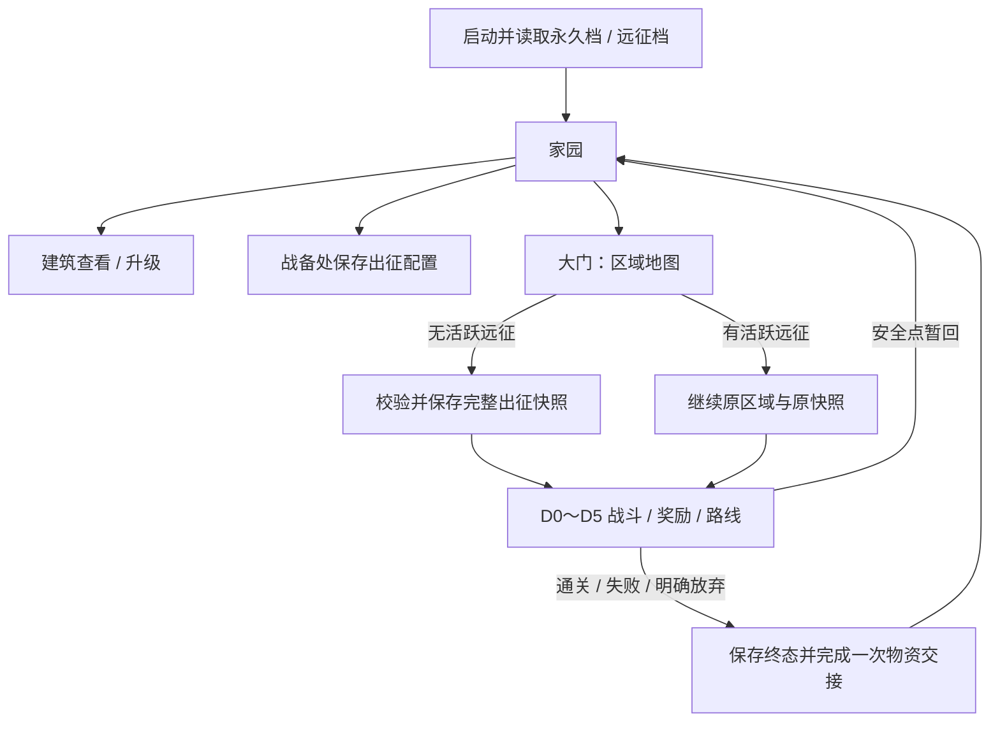

# 阶段 3 · 家园开发规划

版本 1.1 · 更新 2026-09-10 · UE 5.8。**状态：H0～H5 代码、L_Home、原生 UI 和远征接入已交付，见 [27 家园协作记录](27-HomeChangeLog.md) 与 [28 新手教程](28-HomeTutorial.md)。地图、相机、引用和占位素材无需用户补做。** 地牢 D0～D5 已完成，当前发布基线 v0.6。本文保留设计依据；文中标为“建议/暂定”的经济与流程细节是设计起点，实现值以 27 与代码为准。

用户已确定七座建筑及其首版用途，神像等级效果也已确定；**升级货币已由用户定名为"金币"**（本文中的"金币 / HomeSupplies"在实现中统一为 `Gold` / 金币）。当前已实现规则仍见 [01](01-GDD.md)，地牢交接见 [18](18-DungeonChangeLog.md)。

## 1. 本阶段目标与设计判断

完成一条可持续循环：**回到家园 → 查看收藏 → 配置出征队伍和牌组 → 选择远征区域 → 完成或结束远征 → 结算家园资源 → 升级建筑 → 再次出征**。

家园首版采用固定布局的可点击场景。七座建筑从开始就存在，用占位模型/色块、名称和功能面板交付。先把每次回家的决策做完整：升级恢复能力，还是提高战斗经济；带哪些卡出征，前往哪个区域。自由建造、角色行走、生产计时和复杂材料链会增加实现量，但目前没有对应的明确玩法需求，后置。

建议明确三种不同的数据：

- **账号永久进度**：建筑等级、永久解锁、家园资源、保存的出征配置；跨远征、退出游戏后保留。
- **本次远征状态**：出征时冻结的家园加成、当前英雄生命、局内卡牌强化、新获得卡牌、路线和待选奖励；结束后不写回永久收藏。
- **当前战斗状态**：银币余额、四张手牌及队列位置、场上单位、技能冷却；每房重新建立。

局外成长不应让同一轮远征在读档后突然变强，因此**家园加成与出征配置在创建 RunId 时形成快照，本轮全程使用同一份**。回家升级或修改配队，只影响下一轮新远征。

## 2. 首版范围

| 建筑 / 建议稳定 ID | 首版必须交付 | 本阶段不开放 |
|---|---|---|
| 圣玛丽亚神像 `Home_StatueSaintMaria` | 查看等级、战后恢复比例、下级效果和费用；升级，最高 4 级 | 战内复活、英雄最大生命加成、休息节点加成 |
| 图书馆 `Home_Library` | 查看永久解锁的法术及说明 | 解锁购买、研究、强化、升级按钮 |
| 大门 `Home_Gate` | 打开区域地图；选区域出征；已有远征时继续 | 地图内实时行走、大量新区域内容 |
| 英雄之家 `Home_HeroHouse` | 查看永久解锁英雄的属性、技能、特性 | 培养、升星、装备、招募按钮 |
| 金库 `Home_Treasury` | 查看并升级玩家战斗银币产速和上限 | 离线产币、局外银币储蓄、敌方经济强化 |
| 军营 `Home_Barracks` | 分页查看永久解锁佣兵和战斗建筑 | 训练、购买、佣兵/建筑永久升级 |
| 战备处 `Home_WarRoom` | 保存参与远征的三名英雄和初始牌组；紧邻大门 | 战中换人换牌、多套自动推荐阵容 |

建议首版仅神像、金库具有可升级等级。其余建筑的面板只提供本期可用操作，不放无响应的“升级”“解锁”“敬请期待”按钮。家园建筑与战斗中的兵营、箭塔、英雄营地是不同内容类型。

音效、最终美术素材、打包、硬件及性能专项继续后置。编译、相关自动化和短流程 PIE 是本阶段验收条件；不恢复 Sprint 6。

## 3. 建筑规则与面板

### 3.1 圣玛丽亚神像（用户已确定）

“每级加 20%”按**增加 20 个百分点**实现，不按上一级乘 1.2。初始为 1 级。

| 等级 | 每场战后恢复量 / 最大生命 | 失能英雄恢复至 | 下一次升级费用（建议，金币） |
|---|---:|---:|---:|
| 1 | 40% | 40% | 60 |
| 2 | 60% | 60% | 120 |
| 3 | 80% | 80% | 200 |
| 4 | 100% | 100% | 满级 |

公式：`恢复比例 = 0.4 + 0.2 × (等级 - 1)`，合法等级为 1～4；`战后生命 = min(最大生命, 战斗结束生命 + 最大生命 × 恢复比例)`。

- 例如最大生命 500，战后剩余 100：1 级恢复到 300，2 级恢复到 400，3/4 级恢复到 500；失能者按对应比例恢复。
- 沿用当前规则：每场结束对全部玩家英雄结算一次，失败也恢复，但不会改变失败结果、允许继续失败的远征或记为战斗治疗。
- 只影响战后恢复；治疗波、骑士技能、D4 休息节点的 30% 恢复不增加。进入下一房只读取已经恢复的英雄快照，不能再施加一次神像效果。
- 不影响敌人、佣兵、战斗建筑；英雄仍不能被普通治疗在战内救起。
- 新远征开局英雄满血。建议不把上轮伤势保存成家园治疗负担，也不设置恢复等待时间。

面板：建筑名与等级、当前恢复比例、升级前后比较、费用/余额、升级按钮、关闭按钮。资源不足时说明差额；满级显示“已满级”，不再显示费用或可点击升级操作。

**平衡判断：** 4 级会使每场结束的玩家英雄都满血，长线血量损耗及休息节点价值会明显下降。这是用户给定数值的直接结果，按要求保留。后续可扩展休息节点的其他价值或调整区域难度，但不能偷偷削弱神像或自动给敌人同比加成。

### 3.2 金库（效果方向已确定，数值暂定）

建议初始 1 级、最高 5 级，每次升级同时增加：**基础银币产速的 10%**和**1 点银币上限**。产速加成相加，不逐级复利；起始余额保持当前的 0。

以现有 `ULKGameData` 代码默认值每秒 `1/3` 银币、上限 5 为基准：

| 等级 | 相对基础产速 | 每秒银币（约） | 获得 1 银币耗时（约） | 银币上限 | 升到下一级费用（建议） |
|---|---:|---:|---:|---:|---:|
| 1 | 100% | 0.333 | 3.00 秒 | 5 | 50 |
| 2 | 110% | 0.367 | 2.73 秒 | 6 | 100 |
| 3 | 120% | 0.400 | 2.50 秒 | 7 | 160 |
| 4 | 130% | 0.433 | 2.31 秒 | 8 | 240 |
| 5 | 140% | 0.467 | 2.14 秒 | 9 | 满级 |

公式：`产速 = 基础产速 × [1 + 0.1 × (等级 - 1)]`；`上限 = 基础上限 + (等级 - 1)`。

上述是起始调参表，开发时读取并核对 authored `DA_GameData` 的实际基础值；若作者调整过基数，UI 与战斗必须使用同一个解析结果，不能仍显示本表的演示数值。每秒计算保留浮点精度，只在 UI 中舍入。

加成只用于玩家每场战斗的经济初始化，余额与原有计时规则仍在每房重置；不带走剩余银币，也不转换成金币。敌方银币继续由遭遇配置负责。金库不增加卡槽、不改变费用或补牌次序。

面板同时显示两项收益，不拆成两个独立等级。5 级相对 1 级产速提升 40%，作为首轮测试起点，避免战斗出牌节奏出现过大的阶跃。

### 3.3 图书馆（首版只读）

初始永久解锁法术为火球 `Spell_Fireball`、治疗波 `Spell_HealWave`，沿用当前可用内容。法术列表从永久解锁集筛选，不从当前手牌或远征临时牌组反推。

点击法术查看：图标/占位、名称、费用、效果与数值、作用范围、施法落点规则。面板不提供解锁、强化或加入牌组操作；配牌统一在战备处进行。没有可用条目时显示明确空态，缺图标时使用文字占位。

法师在某场战斗失能不会永久锁住法术，也不改变图书馆的解锁状态。后续新增法术研究时扩展永久进度命令和出征快照，不把操作逻辑塞进当前详情页。

### 3.4 英雄之家（首版只读）

初始解锁骑士 `Hero_Knight`、法师 `Hero_Mage`、游侠 `Hero_Ranger`。展示英雄基础属性、普攻类型、技能和特性说明；首版没有永久培养时，显示解析后的基础值，不展示上一轮临时强化后的属性。

敌方死灵法师、骷髅巨人和骷髅王不会因为属于 Hero/Boss 类型就进入玩家可选名单。未来能否招募某单位由显式的玩家解锁资格决定。

英雄之家与战备处共用英雄详情数据，但英雄之家不出现培养、招募或配队按钮。后续解锁第四名英雄时，战备处应能直接进行三选多，无需修改固定三个英雄名的 UI 逻辑。

### 3.5 军营（首版只读）

采用“佣兵 / 战斗建筑”两个页签：初始佣兵为剑士、弓箭手、盾卫；战斗建筑为箭塔、兵营。展示名称、费用、基础战斗属性及特殊行为。

营地不属于可选卡牌，不列为可装备建筑；家园中的金库等七座建筑也不混入本页。战斗兵营详情显示产兵间隔和产物，不把无效的攻击字段显示成普攻能力。

骷髅兵和骷髅射手目前属于 D3 局内奖励：本轮拿到后可以使用，但默认不因此永久解锁，也不自动出现在下一轮战备处。未来增加永久解锁条件时复用同一解锁集，避免“看得到即拥有”的隐式规则。

### 3.6 战备处（首版构筑入口）

位于大门旁，编辑的是**出征队伍 + 完整初始牌组**。它不指定战斗开局恰好抽到哪四张牌；四槽手牌仍由现有洗牌与 FIFO 规则生成。

建议规则：

| 项目 | 首版建议 | 执行位置 |
|---|---|---|
| 英雄 | 必须恰好 3 名，按 HeroId 唯一，全部永久解锁且可供玩家使用 | UI、保存配置、创建远征三处校验 |
| 初始牌组 | 5～7 种不同 CardId，默认现有 7 种全带 | 最小值复用 `HandSize + 1`；起始牌组上限单独配置为 7 |
| 卡牌资格 | 永久解锁的佣兵卡、建筑卡、法术卡；定义必须有效 | 不能仅凭单位存在或 CardLibrary 有定义就允许装备 |
| 卡牌类别 | 不强制必须带法术、建筑或某一兵种 | 提示费用与构成，不额外禁止玩家的合法策略 |
| 局内奖励加牌 | 可使本次 RunState.Cards 超过 7 | 初始牌组上限不能误用于奖励、跨房校验或旧档读取 |
| 配置顺序 | 保存并用于队伍/牌组展示 | 不绕过开局洗牌，不承诺最先抽到排在前面的卡 |
| 生效时点 | 下次新远征 | 活跃远征继续使用出征快照 |

当前仅三名英雄已解锁，因此英雄区能查看、排序并验证完整队伍，尚没有替换阵容的实际选择；卡牌区可以通过 5/6/7 张的取舍立刻改变过牌速度。不要为展示替换功能而临时解锁敌方英雄。

编辑时使用草稿：增删、撤销/恢复已保存、保存、关闭。非法草稿不能保存，离开时可丢弃；已经合法保存的队伍不被半次编辑覆盖。允许临时移除到少于三英雄/五卡以便调整，但清楚标出缺少数量并禁用保存。

UI 提供三英雄槽、卡池分类、已选牌列表、`英雄 3/3`、`牌组 5～7/7`、平均费用和保存状态。出征前再做一次资格与资源定义校验，不依赖按钮曾经处于可点击状态。

### 3.7 大门与区域地图

大门先打开**区域选择地图**，玩家选择区域并点击“出征”。区域地图负责选择整次远征目的地；现有 D4 节点面板负责该区域内部下一排房间，继续保持只显示下一排的规则。

建议首版只开放一个区域，暂名“亡灵边境”，稳定 ID `Region_UndeadFrontier`，复用现有亡灵遭遇和 D4 图生成。区域地图仍提供可点击区域、名称、敌人主题、路线说明、收益概要、出征队伍/牌组摘要和“前往战备处”入口；不用制作多个内容相同的假区域。

当前路线实际为四个推进层：普通 → 普通/休息 → 精英/休息 → 首领，玩家选择休息后实际战斗数可为 2～4 场。区域文案应这样说明，不能承诺一定连打四场。

以后每个 RegionId 关联自己的遭遇目录、路线生成配置、区域解锁条件和收益配置。区域展示名称、地图位置/图标可更换，存档身份不随中文名改变。首版出征不收费，不设体力或门票。

## 4. 升级资源闭环（本文建议，用户尚未指定）

只有升级按钮而没有资源来源，无法验收完整的局外成长。建议本期加入**一种家园货币**，实现中按用户定名统一为**金币**（内部字段 `Gold`）；它与战斗银币完全独立，不新增生产建筑、计时领取、材料背包或货币兑换。

建议初始物资为 0，两座可升级建筑初始 1 级。开发调试通过受控命令增加测试物资，正式新档不默认满级。建议起始收益：

| 来源 | 本轮暂存物资 | 说明 |
|---|---:|---|
| 普通战胜利 | 10 | 仅已接受的本房成功 Outcome 记一次 |
| 精英战胜利 | 20 | 同上 |
| 首领战胜利 | 40 | 同上；不是 D3 三选一奖励 |
| 完整远征通关 | 额外 20 | 终态为 Completed 时加一次 |
| 休息、部署、选择/跳过奖励 | 0 | 不因打开面板或重复进入节点给物资 |

终态结算建议：通关保留全部暂存物资并加通关奖励；失败保留此前已获胜房间物资的 50%，向下取整；主动放弃本轮为 0。退出应用不是放弃，沿用 D5 的安全点恢复。物资仅在远征终态可靠保存后入家园账户，中途回家只显示“本轮待结算”。

完整战斗路线收益为 `10 + 10 + 20 + 40 + 20 = 100`；两次休息路线为 `10 + 40 + 20 = 70`。按本方案一轮通关就能选择神像 2 级或金库 2 级；两座都升满累计需 `380 + 550 = 930`，约十轮完整战斗路线，实际节奏还受失败和路线选择影响。这是供试玩调整的量级，不是要求玩家固定重复十轮。

需要把“建筑升级”和“远征入账”都设计成单次提交：

1. 升级请求携带 BuildingId、预期当前等级和请求 ID，由本地 C++ Subsystem 执行。复核等级、费用、余额后生成新 Profile 副本，把扣费、升级及事务记录一起保存。
2. 写盘成功并校验后才对外发布新等级与余额；失败保留旧状态，允许重试。不采用当前远征自动存档“写失败只记日志”的策略直接处理永久扣费。
3. 远征结束先在 Run 档冻结 `RunId + SettlementId + 金额 + 终态`；Profile 把入账和已处理 SettlementId 在同一次保存中落盘，之后再标记 Run 已交接。
4. 若在第三步中途退出，重启按同一个 SettlementId 重放：未入账则补记，已入账则只补完交接。绝不在显示结算页面、点击返回家园和下次启动时分别发一次。
5. 未完成交接或写盘失败时保留可重试终态，不清除旧 Run、不创建覆盖它的新远征。物资计算口径也进入本轮快照，调奖励表后读档不会重算成另一笔金额。

若后续改变资源体系，可替换费用/收益配置与钱包类型；七座建筑入口和已解锁只读页不需要推倒重做。

## 5. 家园与远征的完整流程



- **首次启动**：初始化三名英雄、七张初始卡、合法默认战备、七座建筑、神像/金库 1 级和首个区域；进入家园。
- **出征**：大门校验已保存战备、区域资格、存档可写与无进行中远征；组装快照并保存成功后切图。新轮英雄满血、局内卡等级从 0 开始，初始手牌每房依种子洗牌。
- **途中**：建议只在奖励/路线安全点提供“暂回家园”，保存待选批次和节点；回家不跳过奖励、不再次回血、不结算物资。战斗中不增加一个可立即修血换人的返回入口；退出应用按现有开战前恢复处理。
- **家园存在活跃远征**：顶部显示“远征进行中”，大门主操作为“继续远征”；无法启动另一个区域覆盖旧轮。仍可查看、升级与保存下轮战备，但提示“下次出征生效”。
- **继续远征**：ChoosingReward 恢复同批候选；ChoosingNode 恢复同一排路线；EnteringBattle/InBattle 回原房部署起点，保留原 AttemptId/种子，不创建新 RunId。
- **通关/失败**：建议主按钮改成“返回家园”，展示实际收益。取代当前直接“从头开始”的正式游戏路径；下一轮从大门启动。
- **明确放弃**：在管理当前远征的入口单独执行并说明未结算物资将丢失；点击建筑、切图或关闭游戏不能隐式触发放弃。
- **地图加载失败**：保留已保存的准备进入状态，允许重试同一轮；不重新扣费、重新结算或重新随机路线。

家园上线前 `L_BattleTest` 继续作为已有回归入口；上线后保留显式的独立战斗调试模式。普通战斗地图在缺少合法出征上下文时应返回家园/显示可恢复错误，不能绕过战备校验自动开一轮默认队伍。

## 6. UI 与场景布局

建议新建 `L_Home`，固定正交相机，鼠标直接点击建筑。玩家不需要操控角色走到建筑门口。家园布局示意（表达相对位置，不是美术定稿）：

```text
               圣玛丽亚神像

       图书馆                    英雄之家

                   中央广场

       金库                        军营

                         战备处   大门 → 区域地图
```

神像位于视觉中心上方，两个查看建筑和两个功能建筑分布两侧；战备处与大门形成相邻的出征操作区。使用名称、轮廓及悬停反馈区分建筑，不能只靠颜色判断。

统一交互约定：

- 顶部显示金币与当前远征状态；场景建筑保持名称标签，升级建筑带等级。
- 点击打开一张主面板；同一建筑重复点击不叠加面板。升级页与只读详情共用标题、关闭和内容排版规则。
- 面板遮罩阻断场景点击；关闭按钮和 Esc 关闭当前面板，编辑战备有未保存草稿时提供保存/丢弃选择。
- 金库、神像显示真实的当前/下级值和费用，不让玩家根据“+10%”自己猜测收益；已满级、余额不足、提交中、存档失败有独立状态。
- 三个只读建筑只有筛选、详情和关闭；不摆放本期不可用的养成控件。
- 区域地图、战备页在窄窗口中允许滚动；首版检查 1280×720 和 1920×1080 下的文字、按钮和遮挡。
- 内容没图标时使用可区分的文字占位；缺定义显示可诊断信息并阻止将坏条目装备出征，不用空白格掩盖问题。

继续采用“原生 UMG 可运行 + 可选 Widget Blueprint 子类换肤”。固定建筑 Actor 仅负责位置、可点击体积和 BuildingId；不要继承战斗单位、添加 ASC、血条、自动攻击或消耗战斗单位数量。

## 7. 代码模块、配置与数据所有权

以下名称均为建议的新接口/类型，实施时可按职责调整，不要求为每个面板创建一套重复业务系统。

| 对象 | 职责 | 不应持有/负责 |
|---|---|---|
| `ULKProfileSubsystem` | 永久进度、解锁查询、战备保存、升级/收益事务、出征快照构造 | 不控制战斗单位、不累计当场银币 |
| `ULKProfileSaveGame` / `FLKProfileState` | ProfileId、结构版本、修订号、物资、建筑等级、解锁集、已保存战备、已处理事务 | 不存 Widget、Actor、World、ASC 或当前手牌 |
| `FLKExpeditionLoadout` | 三个 HeroId、有序且唯一的起始 CardId 列表 | 不保存局内 UpgradeLevel 或受伤血量 |
| `FLKMetaBonusSnapshot` | 本轮实际恢复比例、玩家银币产速/上限、来源等级和规则版本 | 不在下一房重新从当前家园等级计算 |
| `FLKRegionDefinition` | 区域 ID、展示信息、地图引用、遭遇与路线配置、收益规则 | 不包含某个玩家的进度 |
| `LKHomeContent` / 可选配置表 | 七建筑、首期解锁、合法玩家内容、等级效果与费用的默认定义及校验 | 不把玩家建筑等级写回表行 |
| `ALKHomeGameMode` / `ALKHomePlayerController` | 家园地图启动、相机、点击、UI 调度 | 不生成敌人、不启动战斗计时 |
| `ALKHomeBuildingActor` | 静态展示和交互命中，稳定 BuildingId | 不使用 `ALKUnitBase` 作为家园建筑基类 |
| `ULKHomeWidget` 等 UMG | 只读模型、草稿编辑、发送命令、显示失败原因 | 不直接扣物资、改解锁集或写存档 |
| 现有 `ULKRunSubsystem` | 路线、战斗上下文、奖励、防重与远征档 | 不成为永久钱包，也不替代 Profile |

建议 `FLKProfileState` 至少包含：`SchemaVersion`、`ProfileId`、`Revision`、`Gold`、`BuildingLevels`、`UnlockedHeroIds`、`UnlockedCardIds`、`UnlockedRegionIds`、`SavedLoadout`、`LastSelectedRegionId`、`ProcessedSettlementIds`。升级防重记录与金额同时提交；后续再按确定规则归档历史，首版不随意截断尚可能重放的记录。

RunState 新增建议字段：`ProfileId`、`RegionId`、`InitialLoadout`、`MetaBonusSnapshot`、`HomeRewardRulesSnapshot`、终态待交接信息。现有 `Heroes` / `Cards` 继续保存局内变化；快照中的初始配置不随奖励加牌改写。BattleContext 带上当前房需要的有效数值，Outcome 仍是单场冻结结果。

**延续用户认可的配置分工：** C++ 提供稳定 ID、建筑用途、单位资格、合法操作及可用默认内容；配置资产服务于费用、数值、名称和表现调整。神像 1～4 级与 40/60/80/100 是本次已定规则，首版表行必须与之匹配；未来更改时作为规则修订处理。金库曲线和费用可调。新增可选配置表不应成为运行首版的硬前置条件，但明确配置成坏数据时要报错，不能全部吞成默认值。

为图书馆/英雄之家/军营抽出共享的内容查询入口，复用 `LKUnitContent`、`ULKCardDefinition` 与实际技能/特性配置；不要从显示文字解析数值，也不要依赖先生成一个战斗 GameMode 才能读取收藏。现有 GA 中尚未结构化的说明可提供统一展示描述来源，本期不因此重写 GAS 技能。

### 现有接入点与需要调整的假设

| 当前代码/资产 | 家园开发需要做的变化 |
|---|---|
| `BuildInitialRunHeroes / BuildInitialRunCards`（BattleGameMode_Run） | 抽出不依赖战斗世界的构造/查询，正式出征从 Profile 的已保存战备构建；默认名单只服务新档及独立测试 |
| `StartNewRun / RestartRun` | 接受已完整校验的出征输入，在第一次 AutoSave **之前**放入区域、ProfileId 和全部加成；不能先存默认远征、再追加家园字段 |
| `ValidateStartingParty` | 当前只要求英雄非空、牌组至少五种；家园出征补上恰好三英雄、永久资格和起始牌组上限校验 |
| `ApplyExpeditionContext / TryInitPlayerState` | 银币组件 Init 前应用本轮快照，只覆盖玩家值，不污染共享 `DA_GameData` 或敌方遭遇 |
| `FinalizeHeroRecovery` | 远征时读取本轮快照的恢复比例，仍只结算一次；独立调试保留原基数 |
| `ULKRunSubsystem::SelectNode` | 休息 30% 不受神像影响；暂回家园后不能再次消费已解决节点 |
| `InitializeExpeditionContext / RequestResultAction / StartNewRunFromRecovery` | 正式启动/终态返回改由家园入口协调；保留明确的继续与独立测试分支 |
| `GenerateGraphAndEncounters / ValidateEncounterCatalog` | 当前依赖三个固定亡灵模板 ID；首版区域映射它们，未来按区域配置解析，不假定已有通用多区域系统 |
| `ULKRunSaveGame / ValidateStoredRun` | 当前文件 SaveVersion=1、RunState SchemaVersion=4，校验只接受 1～4；新字段落地必须增加迁移分支与快照校验 |
| `WBP_BattleHUD` 部署区 | 检查是否写死英雄 ID；正式绑定本轮三名英雄和顺序，不能只让战备页看上去能调整 |
| `Config/DefaultEngine.ini` | 家园完整接通后将正式 GameDefaultMap 指向 L_Home；各地图明确各自 GameMode，避免家园自动跑战斗 BeginPlay |

## 8. 存档、旧版本与失败恢复

建议永久档使用独立逻辑槽 `LittleKing_Profile`，已有远征槽 `LittleKing_Run` 保留。Profile 存永久进度，Run 存一次远征；两份文件没有天然的跨槽原子事务，使用第 4 节的持久化回执完成交接。

永久档至少要有“候选写入 → 读回校验 → 发布”的流程，可用 A/B 槽与递增 Revision 保留最近有效副本。启动选择最高有效修订；两个都不可读时显示恢复入口并保留原文件，不能静默新建覆盖。已有 Profile 的永久写操作在存档不可用时禁用；浏览界面可继续读取可信的内存状态。

兼容基线：

| 情况 | 建议处理 |
|---|---|
| 完全新玩家 | 创建 Profile v1，神像/金库 1 级、三英雄七卡、首区和默认战备；先成功保存再开始远征 |
| 只有 v0.6 Run 档、没有 Profile | 创建默认 Profile；迁移旧 Run 到拟定 Schema 5，关联 ProfileId/默认区域，不把局内骷髅卡或强化当永久解锁 |
| 旧 Run 缺家园数值快照 | 恢复比例补 0.4；银币从明确的 v0.6 基线解析一次并冻结，不追套当前家园等级。旧档没有记录的历史基数不能宣称可精确还原 |
| 旧 Run 已在奖励/路线/战斗中 | 保留其当前牌组、伤势、候选、种子、身份和恢复阶段；不能因初始牌组建议最多 7 张而拒绝局内更大牌组 |
| 旧 Run 的金币资格 | 建议标记为旧轮不参与金币结算，从新建的 H 阶段远征起计算，避免追算与重复赠送 |
| 新 Run 恢复 | 使用持久化的区域和有效加成，不按当前建筑等级、战备或新数值表重算 |
| 存档引用未知内容/未来版本 | 保留原档、明确诊断，不默认删牌/换英雄/覆盖新轮；新档缺省与已有档损坏要区分 |
| Profile 与 Run 身份不匹配 | 阻止将别的 Profile 的远征收益入当前钱包，保留两档并提供明确恢复说明 |
| 地图载入或永久保存失败 | 保留上个可恢复点和未完成事务；重试同一身份，不重复领取或跳过当前奖励 |

同一外层 SaveGame 格式若可兼容，可保持 SaveVersion=1，仅升级 RunState Schema；若外层格式也变化则另升 SaveVersion。由 H0 明确实际迁移表，不能仅把版本整数加一而不迁移字段。继续保留 D5 的身份特性恢复行为，并验证快照接入没有重新丢失法师全场施法。

## 9. 开发批次与验收

使用 **H0～H5** 编号，属于阶段 3 家园，独立于已完成的地牢 D0～D5。主依赖为 `H0 → H1 → H2 → H3 → H4 → H5`；每批交付可运行的纵向流程。

**实现状态（2026-09-10）：H0～H5 的代码、场景与 UI 已接通，完整自动化 47/47 通过**（含三组家园 UI 检查，见 [27](27-HomeChangeLog.md)）。L_Home、GameData 绑定、两种窗口分辨率渲染检查已由助手完成；用户只需按 [28](28-HomeTutorial.md) 试玩并确认交互手感。

### H0 · 定义契约与初始配置 ✅

| ID | 工作 | 交付与完成标准 |
|---|---|---|
| H0-01 | 冻结首版范围、建议值及稳定 ID | 七建筑、一个区域、三英雄七卡、等级曲线、费用和收益定义无歧义 |
| H0-02 | 定义 Profile、Loadout、区域、加成快照和结算回执 | 值类型、明确数据拥有者；不能混用永久和局内卡等级 |
| H0-03 | 明确新旧档迁移与出征创建顺序 | 覆盖 Schema 1～4、缺 Profile、写盘失败、终态交接 |
| H0-04 | 盘点实际数据和资产归属 | 核对当前银币基数、技能说明来源、部署按钮绑定；在 27 登记资产负责人 |

完成标准：后续可以根据同一份接口分别制作家园 UI、战备和战斗接入，不需要每做一座建筑重新定义一套存档。

### H1 · 家园场景与永久进度基础 ✅

| ID | 工作 | 交付与完成标准 |
|---|---|---|
| H1-01 | ProfileSubsystem 与永久档最小读写 | 新档创建、合法默认值、重启保留；错误档不覆盖 |
| H1-02 | L_Home、家园 GameMode/Controller、固定相机 | 进入独立家园世界，战斗 AI/计时/单位不生成 |
| H1-03 | 七座可点击占位建筑 | 名称清楚、战备处紧邻大门、点击 ID 正确 |
| H1-04 | 原生家园 HUD 与通用建筑面板 | 唯一面板、遮罩、关闭/返回、物资与远征状态展示；缺美术可运行 |

完成标准：打开家园、查看七座建筑、退出再开不会丢失 Profile；此时尚未完成的功能不宣称可操作。

### H2 · 收藏查看与战备配置 ✅

| ID | 工作 | 交付与完成标准 |
|---|---|---|
| H2-01 | 统一玩家内容/解锁查询 | 区分存在的内容、永久解锁与本轮临时持有；敌方不自动可选 |
| H2-02 | 图书馆、英雄之家、军营 | 三个只读入口和有效详情；军营两页签；无未实现操作 |
| H2-03 | 战备草稿、保存、恢复 | 三英雄、5～7 唯一卡牌校验；重复项、未知/未解锁 ID 被拒绝 |
| H2-04 | 配置跨重启与界面刷新 | 保存成功后重开一致；未保存草稿不覆盖；未来新增已解锁英雄可展示 |

完成标准：玩家可以保存三英雄 + 五卡或七卡两种合法配置，非法配置有明确原因；当前只有三英雄也不靠伪造新英雄演示。

### H3 · 大门、区域与远征往返 ✅

| ID | 工作 | 交付与完成标准 |
|---|---|---|
| H3-01 | 单一区域地图与出征校验 | 首区可选，区域摘要真实，重复点击只创建一个 Run |
| H3-02 | 出征快照与初始状态构造 | 三英雄、选定牌组、区域及有效加成在首次存档前完整写入 |
| H3-03 | 新房上下文应用 | 部署区跟随队伍，四槽满手、FIFO、起始银币和回血链路正常 |
| H3-04 | 继续远征与安全点暂回家园 | 保留原 RunId/AttemptId、待选奖励/路线；不重新回血或领卡 |
| H3-05 | 终态返回与正式启动入口 | 完整走通家园→区域→地牢→家园；活跃轮不能被新区域覆盖，独立战斗仍可测试 |

完成标准：以 1 级家园基准走完通关、失败、退出继续；在家园改战备不会影响已经创建的那一轮。

### H4 · 金币与建筑升级 ✅

| ID | 工作 | 交付与完成标准 |
|---|---|---|
| H4-01 | 远征物资暂存、终态冻结与回执 | 通关/失败/放弃收益符合配置，同一轮只入账一次 |
| H4-02 | 通用单级升级命令 | 余额/预期等级/满级校验；扣费和等级同次提交；双击与失败重试可靠 |
| H4-03 | 神像 1～4 级与升级 UI | 40/60/80/100 全部可验证；失能恢复、封顶、敌我隔离和休息不加成 |
| H4-04 | 金库 1～5 级与升级 UI | 产速和上限来自同一配置；玩家生效、敌方不变、每房余额重置 |
| H4-05 | 加成预览与新轮生效 | 当前/下级/费用/已满级状态正确；旧轮继续旧快照、新轮使用新值 |

完成标准：玩家通过真实远征得到物资、升级任一建筑、再次出征观察到对应收益，重启后永久变化仍在。

### H5 · 迁移、异常与交付收口 ✅（教程与 PIE 目视验收见 28）

| ID | 工作 | 交付与完成标准 |
|---|---|---|
| H5-01 | v0.6 档迁移与坏档处理 | 奖励/路线/战斗/终态覆盖；无永久解锁污染；未支持版本不覆盖 |
| H5-02 | 永久事务故障回归 | 升级写失败、入账中途退出、Run/Profile 写入先后中断、重复回家都不重复扣发 |
| H5-03 | 家园/战备/区域实际 UI 检查 | 两种目标窗口大小、长文本、空态、满级、余额不足、点击穿透、失效引用 |
| H5-04 | 战斗与地牢回归 | 沿用现有 LittleKing 测试，补家园相关检查，不以历史通过数冒充本轮结果 |
| H5-05 | 文档与协作交付 | 更新 GDD/技术设计/任务状态/27/验证摘要；提供 UE 5.8 新手操作教程 |

完成标准：正常循环和可预期的中断均可恢复；没有只能靠控制台才能完成的正式家园操作。新手教程需要记录实际资源路径、点击步骤和成功现象，不能只列待办。

## 10. 关键验收用例

| 用例组 | 必须覆盖 |
|---|---|
| 新档 | 七建筑可点；三英雄七卡已解锁；神像/金库 1 级；零物资；默认战备可免费出征 |
| 神像数学 | 四级比例；0/20/90/100% 战后生命；不同最大生命；封顶；重复结算不叠加 |
| 神像范围 | 失败仍按现有规则恢复但保持失败；敌人无加成；普通治疗不能救起；休息仍 30% |
| 金库 | 五级产速/上限；连续累积精度；达到上限；花费后继续增长；每房起始 0；敌方配置不受影响 |
| 只读收藏 | 仅永久解锁；两个法术、三英雄、三佣兵两建筑；无购买/强化操作；营地和敌方英雄不混入 |
| 战备 | 三英雄且唯一；5/6/7 卡；少于 5、超过起始上限、重复、未知/未解锁 ID 均拒绝；草稿撤销与保存重启 |
| 战斗应用 | 配置中的英雄和 CardId 真正进入战场；四槽始终补满、无重复卡；奖励加牌后超过 7 仍合法 |
| 生效时点 | 老轮快照不变；家园升级/改牌后下一轮才生效；奖励卡/临时强化不会成为永久资产 |
| 区域/继续 | 一个真实首区；有活跃远征不能覆盖；奖励/节点/战斗恢复语义与 D5 一致 |
| 永久经济 | 两种典型路线分别 100/70；失败取已获胜物资的一半向下取整；放弃 0；结算幂等 |
| 事务失败 | 写盘失败不显示升级成功；重复请求不扣两次；Profile 已入账而 Run 未确认时重启只补确认 |
| 兼容 | 无 Profile 的旧 Run、旧奖励牌组多于 7、旧终态、非法/未来版本、身份不匹配；原档保留 |
| 交互 | 遮罩挡住建筑；重复开面板只有一份；Esc/关闭；按钮提交期间禁用；短/长文字均可读 |

历史基线为地牢 37 项、家园 C++ 44 项通过；2026-09-10 的 UI 收尾后为 47 项通过。实际构建、蓝图编译和渲染记录见 [HomeUI-Validation](validation/HomeUI-Validation.json)，不以历史通过数代替本轮结果。

## 11. 文件与资产交接建议

| 路径/范围 | 责任与说明 |
|---|---|
| `Source/little_king/LKHomeTypes.h`、`LKHomeContent.*`、`ULKProfileSubsystem.*`、`ULKProfileSaveGame.*` | 代码协作者维护永久契约、默认配置和事务 |
| `Source/little_king/ALKHomeGameMode.*`、`ALKHomePlayerController.*`、`ALKHomeBuildingActor.*`、家园 UMG 类 | 场景交互/原生界面；UI 不重复实现升级规则 |
| 现有 `LKRunTypes`、`ULKRunSubsystem`、`ALKBattleGameMode_Run`、`ULKBattleHUDWidget` | 一位集成负责人处理存档版本、出征、终态和部署入口；同步地牢回归 |
| `/Game/Maps/L_Home`、`/Game/blueprint/Home/` | 新增家园地图及可选 Widget Blueprint；保存前在 27 登记操作者 |
| `/Game/Data/Home/` | 可选家园数值/区域资产；先有代码回退，不为一次玩家升级改写资产 |
| 现有 `DA_GameData`、`DT_Units`、`DT_Traits`、三个 GA、`WBP_BattleHUD`、`L_BattleTest` | 保持既有资产归属；确需编辑时明确路径和目的，不多人同时保存 |
| `docs/27-HomeChangeLog.md` | 记录实际完成的 H 编号、文件、资产归属、规则变化、验证及接手项 |
| `docs/28-HomeTutorial.md`、`docs/validation/HomeUI-Validation.json` | 已按 UE 5.8 实际资产和检查结果更新；旧 Home-Validation 保留 C++ 批次历史 |

家园二进制资产已交付；`Scripts/CreateHomeAssets.py` 提供 UE 5.8 可重复创建方式，`Scripts/InspectHomeAssets.py` 只读检查。首次试玩直接打开 L_Home。后续手工更换美术时再按 28 的路径和稳定 ID 维护。

## 12. 暂定项与后续边界

| 决策 | 本文采用的起点 | 状态 |
|---|---|---|
| 神像等级/恢复比例 | 1～4 级，40/60/80/100%，每升一级 +20 个百分点 | 用户确定 |
| 七建筑用途及三类查看页 | 按第 2～3 节；战备处靠大门 | 用户确定 |
| 金库 | 1～5 级，每级基础产速 +10%、上限 +1 | 用户授权暂定数值 |
| 升级费用/资源来源 | 单一货币"金币"，远征终态入账；第 3～4 节表格（实现值见 27） | 用户定名 + 建议数值 |
| 家园呈现 | 固定场景、鼠标点建筑、占位美术 | 建议 |
| 起始队伍/牌组 | 三英雄，初始牌组 5～7；不限制本轮奖励扩牌 | 建议，三英雄沿用当前规模 |
| 首区 | 亡灵边境，一个真实区域，复用 D4 | 建议；区域名可改 |
| 家园升级时点 | 创建新远征时冻结；活跃轮不追套新值 | 建议的存档与平衡边界 |
| 永久解锁 | 保留已有三英雄七卡；局内骷髅奖励不转永久 | 建议；新解锁玩法后置 |
| 回家与终态 | 安全点可暂回；通关/失败主按钮返回家园 | 建议，实施时替换正式入口 |

建议先从 H0/H1 开始；完成 H3 后得到可玩的家园往返，再用 H4 做永久成长闭环。英雄培养、法术研究、新佣兵解锁条件、多区域内容、自由建造和最终美术放在这一闭环稳定后的独立规划中。
