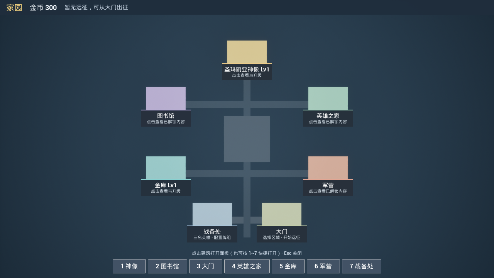
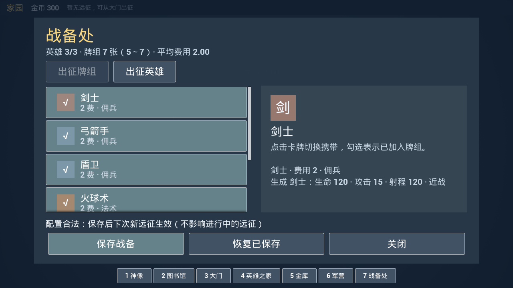

# 家园 · UE 5.8 新手操作教程

更新：2026-09-15。适用 UE 5.8.1。家园地图、相机、占位材质、GameMode 绑定和原生 UI 均已交付，**无需再手工创建地图、接蓝图或制作 Widget**。优化阶段一新增开始菜单，先选档再进入家园，详见 [30](30-StartMenuTutorial.md)。

本教程说明如何试玩、验证操作及以后更换素材。规则见 [01](01-GDD.md)，协作记录见 [27](27-HomeChangeLog.md)，本轮验证见 [HomeUI-Validation](validation/HomeUI-Validation.json)。

## 1. 打开已经做好的家园

1. 先关闭正在运行的 Unreal Editor，避免旧 DLL 或 Live Coding 残留。
2. 在 Visual Studio 打开工程，选择 **Development Editor / Win64**，生成 `little_king`。也可以在项目根目录的 PowerShell 执行：

   ```powershell
   & 'E:\epic\UE_5.8\Engine\Build\BatchFiles\Build.bat' little_kingEditor Win64 Development '-Project=E:\little_hero\little_king\little_king.uproject' -WaitMutex -NoHotReloadFromIDE
   ```

3. 双击 `little_king.uproject`。默认会打开 **L_StartMenu**。即使编辑器恢复到家园或战斗地图，开始 Play 时也会先显示菜单。
4. 点击上方 **Play**，选择“新的游戏”进入家园；或者继续/读取已有档。建议点击 Play 旁的下拉箭头，选择 **New Editor Window (PIE)**。
5. 进入家园后应看到七座带中文名称的彩色方块建筑、顶部金币与远征状态、底部七个快捷按钮。首次新档是 **金币 0、神像 Lv1、金库 Lv1**；已有存档会显示其实际进度。有未完成远征时，继续/读取会先进入远征恢复流程。

家园建筑在 **Play 后由 GameMode 生成**。编辑状态下只看到地面、路径和相机是正常现象。配图使用隔离的演示档（300 金币），不会给正式玩家预赠金币。



### 已交付资产及绑定

| 路径 | 用途 |
|---|---|
| `/Game/Maps/L_Home` | 正式家园入口：俯视相机、地面和连接路径 |
| `/Game/blueprint/Home/BP_HomeGameMode` | 父类 `LKHomeGameMode`；Game Data 已绑定现有 `DA_GameData` |
| `/Game/Materials/Home/M_HomePlaceholder` | Unlit 材质；真实 `Color` 参数为建筑提供不同颜色 |
| `/Game/Materials/Home/MI_Home*` | 广场和道路的占位材质实例 |
| `ULKHomeHUDWidget` | 运行时原生 UMG：无需额外 WBP 即可使用 |

家园地图的 `World Settings → GameMode Override` 为 **BP_HomeGameMode**。`Project Settings → Maps & Modes` 的 Editor Startup Map / Game Default Map 现为 **L_StartMenu**，其 GameMode 为 **LKStartMenuGameMode**。战斗地图自己的 GameMode 保持不变。

## 2. 七座建筑怎样操作

点击彩色方块或建筑名称牌，也可点底部按钮。**1～7 数字键与底部顺序一致**，具体如下。面板中滚轮可滚动列表或详情，底部操作按钮始终可见。

| 快捷键 | 建筑 | 本期可操作内容 |
|---|---|---|
| 1 | 圣玛丽亚神像 | 查看当前/下级恢复比例、费用并升级，最高 4 级 |
| 2 | 图书馆 | 查看已永久解锁法术及效果 |
| 3 | 大门 | 查看英雄/卡组，设置金币后直接出发；继续远征或确认结束并带回金币 |
| 4 | 英雄之家 | 查看三名英雄的基础属性、技能和特性 |
| 5 | 金库 | 查看当前/下级银币产速、上限、费用并升级，最高 5 级 |
| 6 | 军营 | 在佣兵/战斗建筑两页间切换并查看详情 |
| 7 | 战备处 | 编辑下一轮的三个英雄槽与 5～7 张起始牌组 |

点击 **关闭** 返回场景。游戏处理到 Esc 时也会关闭面板；UE 的 PIE 默认快捷键可能让 Esc 直接停止试玩，遇到这种情况用面板的“关闭”按钮即可。需要把鼠标从 PIE 释放出来时按 **Shift+F1**。

神像初始恢复 **40% 最大生命**，每升一级加 **20 个百分点**，依次为 40/60/80/100%。金库按实际 `DA_GameData` 基数显示；默认基数为约 **0.333 银币/秒、上限 5**，每级产速增加基础值的 10%。阶段三巨魔/攻城扩展将每次升级的上限增量调为 **2**，Lv1～5 默认上限依次为 **5/7/9/11/13**，以支持 12 费擎天巨像。升级对下次新远征生效，正在进行的远征保留出发快照；详见 [35](35-TrollAndSiegeCards.md)。

图书馆、英雄之家和军营本期只有查看功能，不显示未实现的研究、购买或培养按钮。收藏页显示永久基础值；局内奖励产生的临时强化不会被写进这些收藏。

## 3. 战备处：配牌、换位和保存

1. 打开 **战备处**，默认显示 **出征牌组**。顶部摘要显示英雄数、卡牌数和平均费用。
2. 卡牌左侧的 **√** 表示携带，**＋** 表示未携带。点击一次切换。列表可向下滚动查看法术和战斗建筑。
3. 保留 **5～7 种不同卡牌**。少于 5 张时会显示原因并禁用“保存战备”，不会偷偷补牌后保存。
4. 点击 **出征英雄** 页签。先选一个“英雄槽”，再点击候选英雄。若该英雄已经在其他槽内，两名英雄交换位置；未来新增永久解锁英雄也会进入候选列表。当前仍只提供骑士、法师、游侠三名。
5. 点击 **保存战备**。看到保存成功提示后，这份配置才写入永久档；关闭重开仍会保留。
6. **恢复已保存** 会撤销本次草稿。未保存时点击关闭或切换建筑，会出现 **保存并离开 / 丢弃修改并离开 / 继续编辑**。若原先点的是大门，保存或丢弃后会继续打开大门。

战备只影响**下次创建的新远征**。已有远征继续使用自己的队伍、牌组与家园加成快照。起始牌组的 5～7 张限制不限制局内奖励扩牌；战斗手牌仍为四槽、始终补满且没有重复牌。



## 4. 家园 → 远征 → 家园

### 第一次出征

1. 大门查看已保存英雄和初始牌组，在下方设置 **携带金币**（默认 0，金库 Lv1 上限 100，且不超过家园余额）。
2. 点 **出发**，先进入五区域大地图，从西境原野固定起点选择下一站。本轮队伍、牌组、加成和地图在此刻冻结，携带金币从家园转入远征钱包。
3. 选中可达的战斗节点并确认前往后，部署全部三个英雄再开始。部署不限时，战斗操作沿用之前版本。
4. 非最终房胜利后，选择或跳过房间奖励，再沿箭头选择战斗、市场或休息节点。全图、放大和服务节点操作见 [31](31-WorldMapExpeditionTutorial.md)。

### 暂时回家，之后继续

1. 在**奖励选择页**点 **暂回家园**，会保存并保留当前三选一奖励。
2. 在**路线选择页**点 **暂回家园 · 保留远征**，会保存并保留当前待选路线。
3. 回家后大门显示 **继续远征**，不会创建新轮。点击继续可回到原来的待选状态；若出现恢复提示，再点“继续远征”。
4. 此时升级建筑或修改战备，只影响未来的新轮；当前伤势、奖励和路线不会被刷新。本轮金币还未入账。

战斗进行中没有“暂回家园”按钮。若退出游戏，沿用 D5 的存档恢复规则；不要把“暂回家园”当作战斗重置操作。

### 通关、失败或放弃

- 通关首领或本轮失败后，结算按钮是 **返回家园**。家园永久金币会按结算入账，同一轮只入账一次。
- 普通/精英/首领胜利暂存 10/20/40 金币；通关额外 +20；成功、失败和主动结束均全额归还钱包剩余金币（含携带本金）；不同路线的总收益会不同。
- 若要重新开一轮，可以在大门点 **结束本轮并带回金币**，读完确认说明后选 **确认放弃**。这会结束当前路线和临时奖励，**钱包剩余金币全额带回**。选 **保留远征** 或关闭确认框则不改变当前远征。


## 5. 升级与保存的检查方法

正常金币来源是远征终态结算。得到足够金币后，点神像或金库，比较当前/下级数值，再点升级。成功后面板、建筑等级牌和顶部金币应一起更新；金币不足或满级时不能购买。

若只想快速检查 UI，可在**专门的测试进度**中按 `~` 打开控制台，输入 `HomeGold 300`。这会真实增加并保存 300 金币，不是预览。`ListHomeState` 仅打印当前状态。常规试玩无需使用重置进度命令。

神像从 Lv1 升到 Lv2 花费 60；金库从 Lv1 升到 Lv2 花费 50。修改后退出 PIE 再 Play，金币、等级和已保存战备应保留。再次创建**新远征**后，神像 Lv2 应恢复 60% 最大生命；继续旧远征仍使用旧快照。

本项目编辑器存档目录是 **`E:\little_hero\little_king\Saved\SaveGames`**：

- `LittleKing_Profile_A.sav` / `LittleKing_Profile_B.sav`：永久金币、等级、解锁和战备。
- `LittleKing_Run.sav`：一轮远征的安全点。

遇到存档问题先退出游戏并复制这些文件备份。不要通过删除存档来完成普通验收。旧 Run 的升级迁移由代码处理。Schema 5 保留旧图与已冻结金额，尚未结算的余额按钱包新规则带回；更早旧档仍不追赠家园收益。

## 6. 需要你亲自做的部分：确认实际操作手感

地图、引用和 UI 制作已由助手完成。下面属于你对交互和可读性的体验确认，不是遗留开发任务：

1. 在 Play 下拉菜单的 Advanced Settings / Play 设置中，把 **New Viewport Resolution** 依次设为 **1280×720**、**1920×1080**，使用 New Editor Window 开始试玩。
2. 分别点七个建筑名称和底部按钮，确认打开的是同一建筑。打开面板后点背景，不应穿透打开另一建筑。
3. 在战备处取消一张卡、切换大门，分别尝试继续编辑、丢弃和保存，确认状态符合第 3 节。
4. 自己走一次第 4 节：出征 → 奖励页暂回 → 继续并领奖 → 路线页暂回 → 继续 → 终态回家。
5. 记录觉得过小、过挤或不好点的控件，并注明使用的窗口大小。长说明预期通过滚轮阅读。

本轮已经用 UE 实际渲染检查两种分辨率，并用自动化触发真实 UButton 回调验证草稿、升级和放弃确认；这不等同于替你完成鼠标手感判断。音效、最终美术、打包及硬件测试继续后置。

## 7. 常见问题与协作者维护

| 现象 | 处理 |
|---|---|
| 打开后仍是战场 | 在 Content/Maps 双击 L_Home；确认没有打开旧工程副本 |
| 家园没有 UI 或仍运行战斗逻辑 | World Settings 的 GameMode Override 应为 BP_HomeGameMode，重新构建后重开编辑器 |
| 编辑器里看不到七座建筑 | 它们在 Play 时生成；可在 Play 中观察 World Outliner 的 LKHomeBuildingActor |
| 数值和战斗表不一致 | 检查 BP_HomeGameMode → Class Defaults → Game Data 为现有 DA_GameData；家园按同样的代码规则合并 DT_Units 调参 |
| 升级失败 | 先看界面原因：余额不足、满级或永久档写入不可用；不要重复修改资产来绕过存档错误 |
| 暂回家园失败 | 当前界面会保留并显示提示；检查保存目录可写、L_Home 资产存在，然后重试 |
| 继续远征后数值还是旧的 | 本轮快照按设计冻结；新等级和战备下一轮生效 |
| 改 C++ 后界面没变化 | 关闭 UE，重新构建 Development Editor，再打开工程；不要同时运行旧 DLL |
| **继续远征后双方站着不攻击** | 说明这一房没有进入战斗阶段（单位保持冻结）。按 **空格 / 回车** 也能开始战斗（原生兜底，不依赖蓝图按钮）；若仍不行，把日志里 `[Battle] 无法进入战斗阶段…` 那几行发出来，它直接列出被哪条判据挡住（部署数 / 牌库 / 名单）。BUG-019 |

### 仅在家园资产缺失时重新生成

正常使用无需执行。协作者若没有同步到家园二进制资产，可先构建 Editor，再在项目根目录执行：

```powershell
& 'E:\epic\UE_5.8\Engine\Binaries\Win64\UnrealEditor-Cmd.exe' 'E:\little_hero\little_king\little_king.uproject' -run=pythonscript '-script=E:\little_hero\little_king\Scripts\CreateHomeAssets.py' '-EnablePlugins=PythonScriptPlugin,EditorScriptingUtilities' -unattended -nop4 -nosplash -NullRHI
```

脚本只创建/配置家园自有资产，保留已存在地图布局；首次迁移旧生成版本时会修正相机方向、曝光和地面尺寸。它不重存战斗地图、数据表、GA 或 WBP_BattleHUD。已有自定义家园 GameMode 配置时，先阅读脚本，因为它会重新绑定家园的 Game Data。

### 后续更换美术

本期使用方块和文字，已满足试玩。未来可从 `LKHomeBuildingActor` 建蓝图子类替换网格、材质或标签，并在地图里摆放；给每座建筑填写正确 BuildingId，GameMode 只补缺失 ID。UI 调整入口为 `ULKHomeHUDWidget` / `ULKHomeListButtonWidget` / `ULKHomeBuildingLabelWidget`，共用配色在 `LKHomeUIStyle.h`。

| 建筑 | 稳定 BuildingId |
|---|---|
| 神像 | `Home_StatueSaintMaria` |
| 图书馆 | `Home_Library` |
| 大门 | `Home_Gate` |
| 英雄之家 | `Home_HeroHouse` |
| 金库 | `Home_Treasury` |
| 军营 | `Home_Barracks` |
| 战备处 | `Home_WarRoom` |

修改这些稳定 ID 会影响永久进度对应关系；更换图片或摆放位置不需要改 ID。编辑 `.umap/.uasset` 前先在 [27](27-HomeChangeLog.md) 登记资产负责人，避免多人同时保存。
