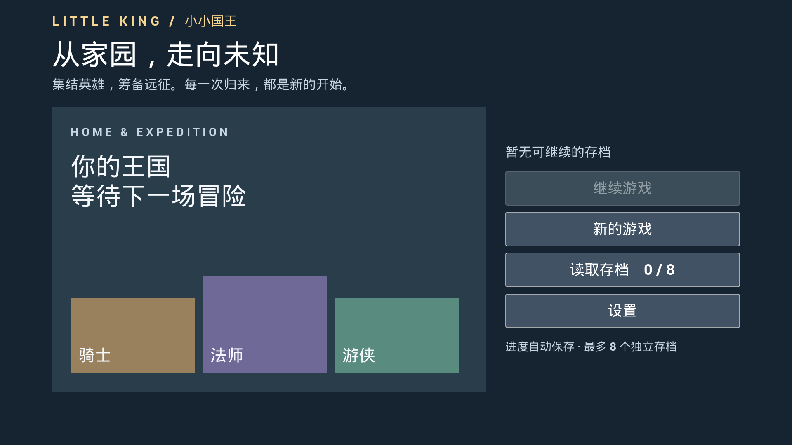
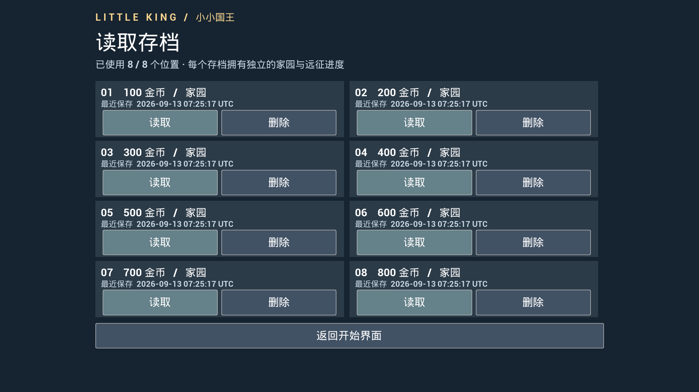

# 优化阶段一 · UE 5.8 开始界面与存档操作

更新：2026-09-13。适用 UE 5.8.1。开始地图、界面、8 档管理和控制台命令已经实现，无需手工搭建 Widget 或接蓝图。协作记录见 [29](29-OptimizationChangeLog.md)。

## 1. 第一次打开这一版

1. 关闭 Unreal Editor。此版新增原生类和 GameViewport 配置，不要只靠 Live Coding 更新。
2. 在 Visual Studio 选择 **Development Editor / Win64**，生成 `little_king`，或者在项目目录的 PowerShell 执行：

   ```powershell
   & 'E:\epic\UE_5.8\Engine\Build\BatchFiles\Build.bat' little_kingEditor Win64 Development '-Project=E:\little_hero\little_king\little_king.uproject' -WaitMutex -NoHotReloadFromIDE
   ```

3. 双击 `little_king.uproject` 打开项目，默认地图为 **L_StartMenu**。
4. 点击上方 Play 右侧下拉菜单，选择 **New Editor Window (PIE)**，再点击 Play。也支持 Selected Viewport 模式。
5. 应看到“继续游戏 / 新的游戏 / 读取存档 / 设置”。开始地图在编辑状态下是空场景，UI 在 Play 后生成，这是正常的。
6. 即使编辑器停留在家园或战斗地图，重新开始一次 Play 也会先出现开始界面。



## 2. 新游戏与继续游戏

点击“新的游戏”会占用一个空位，随后进入家园。新档金币为 0，神像和金库等级为 1。其他存档不受影响。

点击“继续游戏”会加载最近使用或自动保存的有效档。原来只有一份存档时，它会显示为 **存档 01**。若该档有未完成远征，就进入既有远征恢复流程；已结束远征或尚未出征的档进入家园。

远征仍按 D5 安全点保存。战斗途中退出后，恢复的是当前房间的部署/开局状态；已经进入的奖励页、路线选择和结算状态按原有规则恢复，不会从退出时的某一帧继续打斗。

## 3. 选择或删除存档

1. 点击“读取存档”，可看到 **01～08** 共 8 个位置。日期标注为 **UTC**，香港本地时间比它晚 8 小时。
2. 点击目标位置的“读取”，进入该存档。下一次继续游戏会优先进入最近选择/保存的游戏。
3. 点击“删除”会先弹出确认页，核对编号与金币。选择“取消 · 保留存档”可返回。
4. 确认删除会移除该档全部家园及远征进度，不能在游戏中撤销。删除成功后，这个位置可用于新的游戏。
5. 8 个位置都占满时，“新的游戏”不可点击，先删除不需要的档即可。
6. 显示损坏/版本/身份错误的档不能读取，但不会被新游戏覆盖；仍可由你明确删除。若提示删除未完成，检查存档目录可写后再次删除。

目前开始界面在每次启动 Play 时显示；要在开发中切换到另一个档，停止本次 Play，再次 Play 后选择目标档。



## 4. 金币调试命令

先继续、读取或创建一个游戏，进入家园或远征后操作：

1. 点击游戏窗口使它获得焦点；必要时切换到英文输入。
2. 按键盘 **Esc 下方、数字 1 左边的反引号键**（通常与 `~` 共用）打开 UE 控制台。
3. 输入以下任一命令，按 Enter：

   ```text
   show me the money
   show me the money 500
   ```

   第一行给予 **100 金币**，第二行给予 **500 金币**。金币属于当前选择的档，自动保存，不是战斗中花费的银币。

4. 控制台会显示实际增加量、总金币和当前档编号；关闭控制台后可到家园查看。

只接受非负整数。0 不增加；负数、小数、文字、过大数字和多余参数显示用法提示。开始菜单里执行会提示先选择游戏。设置按钮目前没有音量、分辨率等选项，只保留后续接口。

如果仍提示引擎 `show` 命令用法而没有增加金币，请完整退出编辑器、重新编译并打开，确认 **Project Settings → Engine → General Settings → Default Classes → Game Viewport Client Class** 为 `LKGameViewportClient`；也可直接检查 `Config/DefaultEngine.ini` 的 `GameViewportClientClassName`。不要用旧版 DLL 继续测试。

## 5. 只有环境异常时才需要手工处理

正常情况下不需要以下操作。

- **开始地图缺失**：先确认拉取了 `Content/Maps/L_StartMenu.umap`。如果需要重新生成，在 Plugins 中启用 Python Editor Script Plugin 和 Editor Scripting Utilities，重启后，通过 Tools → Execute Python Script 执行 `Scripts/CreateStartMenuAssets.py`。脚本会创建地图并绑定 `LKStartMenuGameMode`。
- **Play 没有显示菜单**：在 `L_StartMenu` 的 World Settings 中查看 GameMode Override 是否为 `LKStartMenuGameMode`；在 Project Settings → Maps & Modes 中，Editor Startup Map / Game Default Map 应为 `L_StartMenu`。
- **存档无法写入**：关闭游戏后检查项目的 `Saved/SaveGames` 文件夹是否可写。排查前可复制整个文件夹作为备份；不要只移动 Profile A 或 B 中的一份，也不要把不同档的 Run 文件混在一起。
- **后续要添加设置 UI**：扩展 `ULKStartMenuWidget::OnSettingsRequested` 接口并在 `ALKStartMenuGameMode` 指定新的界面类即可；本阶段不需要你实现。

## 6. 建议你确认的实际操作

代码、存档与按钮流程由自动化验证，实际排版已用引擎截图检查。请按自己的编辑器布局确认鼠标点击与文字大小；如有差异，记录窗口分辨率和具体按钮即可。无需先安排打包、硬件适配测试、音效或正式美术制作。
