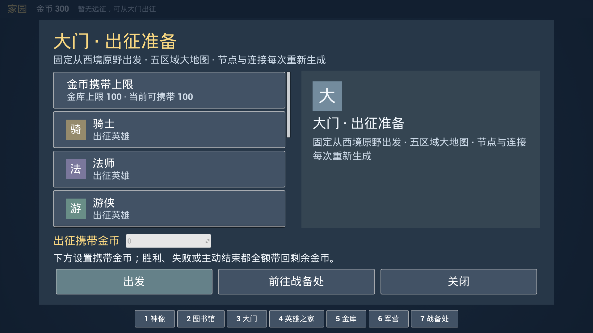
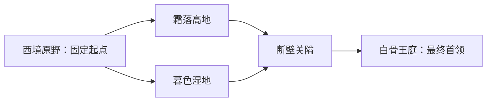
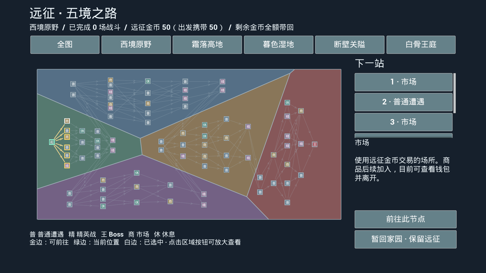
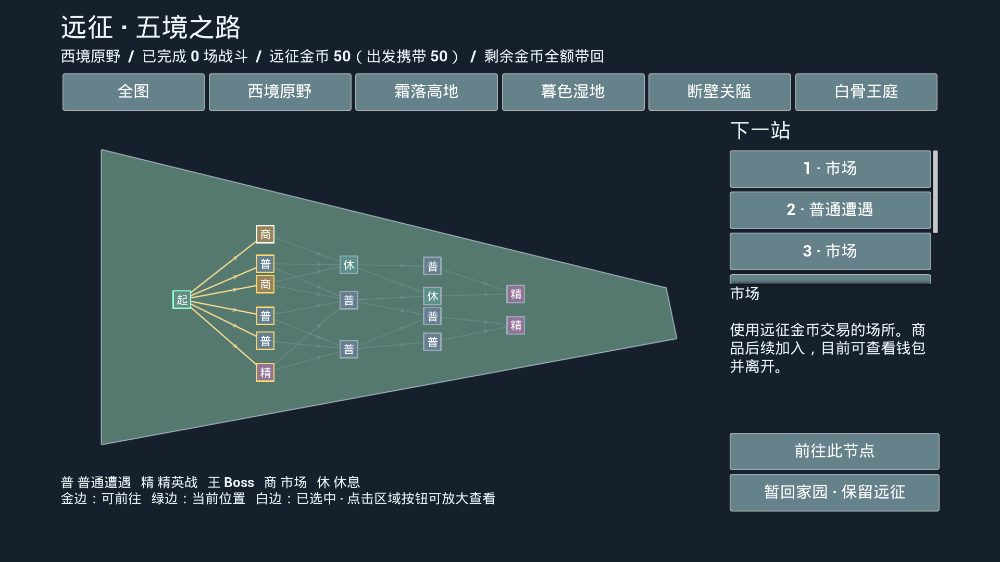
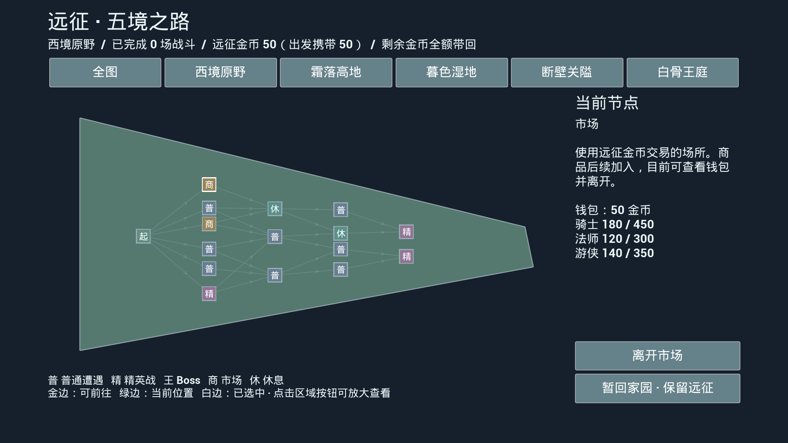
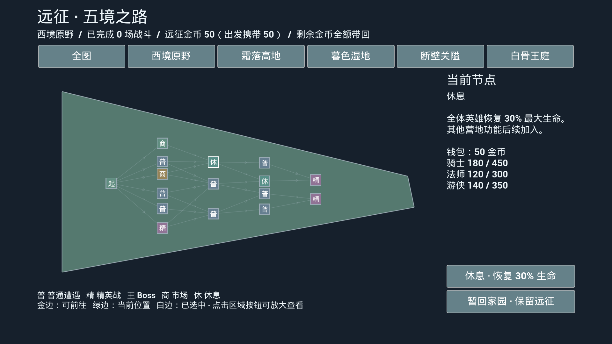

# 优化阶段二 · 五区域远征与金币钱包（UE 5.8）

更新：2026-09-15。适用 UE 5.8.1。地图、节点、原生 UI 和存档接入均由代码完成，不需要手工新建 Widget、地图关卡或补美术。协作者请同时阅读 [29 优化记录](29-OptimizationChangeLog.md)。

## 1. 更新后启动

1. 先关闭正在运行的游戏和 Unreal Editor。
2. 用 Visual Studio 打开项目解决方案，选择 **Development Editor / Win64**，生成 `little_king`；也可在项目根目录的 PowerShell 执行下方命令。
3. 打开 `little_king.uproject`，点击 Play，开始界面选择存档。
4. 进入家园点 **大门**。如果旧档仍有进行中的旧版远征，可以继续完成它；想体验新地图，则先在大门结束该轮，再点出发。读取旧轮不会偷偷换成新图。

```powershell
& 'E:\epic\UE_5.8\Engine\Build\BatchFiles\Build.bat' little_kingEditor Win64 Development '-Project=E:\little_hero\little_king\little_king.uproject' -WaitMutex -NoHotReloadFromIDE
```

本次新增反射结构和 UMG 类，建议完整构建并重启编辑器，不依靠 Live Coding 更新这些结构。正式素材、音效、打包与硬件测试继续后置。

## 2. 大门：检查队伍、卡组和携带金币

大门直接展示当前保存的三名英雄、初始牌组和金币携带上限。点击英雄或卡牌可看详情，配置修改仍在 **战备处** 完成。

面板下方的 **携带金币** 数字框可以拖动或输入整数。默认 0，实际可携带数量为“家园余额”和“金库上限”中较小者：

| 金库等级 | Lv1 | Lv2 | Lv3 | Lv4 | Lv5 |
|---|---:|---:|---:|---:|---:|
| 出发携带上限 | 100 | 150 | 200 | 250 | 300 |

金库原有银币产速和上限升级继续生效。携带上限只限制出发转入的本金，不限制途中赚钱后的钱包余额。当前市场没有商品，不要求带钱才能出发。

点 **出发** 后，系统从家园扣除选定金额，转入这一轮的远征钱包，然后显示大地图。无需选择区域；固定从 **西境原野** 的起点开始。



## 3. 大地图怎样前进

这版地理布局由固定种子选定：五个区域的边界、位置、入口和出口不随远征改变。每次新远征抽取新种子，重新生成各区 10～20 个节点、内部连接和战斗敌阵容；同一轮的读档、暂回家园和继续远征保留整张原图。



全地图共 50～100 个节点，并不需要全部走完。西境之后选择上、下分支之一，通常经过其中四个区域；每个区域内部也会舍弃另一条支路。断壁关隘的入口同时接收来自两个相邻区域出口的连线。



操作顺序：

1. 全图查看路线；点击上方区域名称放大，点击 **全图** 返回。全图用于规划，放大后看清局部连线。
2. 金色边框代表当前位置能直接前往的节点，绿色代表当前位置，白色代表当前查看对象。每条线有方向箭头。
3. 点击地图节点，或右侧 **下一站** 中的选项，查看类型、敌方阵容和效果。候选较多时右侧可以滚动，不再只有两个按钮。
4. 点 **前往此节点** 才会移动。远处未连接节点可以查看，但按钮不可用；不能反向走、回到已结算节点，或跳到其他支路。
5. 进入战斗才加载战场，并要求重新部署全部三名英雄。战斗后原有三选一奖励继续保留，处理后回到地图。



## 4. 五类节点

| 节点 | 当前内容 | 完成后 |
|---|---|---|
| 普通遭遇 | 1 名敌方英雄及佣兵 | 获胜默认 +10 金币，非终点可选原有房间奖励 |
| 精英战 | 2 名敌方英雄及佣兵 | 获胜默认 +20 金币，非终点可选房间奖励 |
| Boss 战 | 1 名骷髅王 Boss、2 名英雄及佣兵；位于最终出口 | 默认 +40 金币，整轮通关额外 +20 |
| 市场 | 独立停留节点，显示远征钱包；商品尚未设计 | 点 **离开市场**，回到选路，不扣钱、不随机赠送商品 |
| 休息 | 显示全体英雄当前生命 | 点 **休息 · 恢复 30% 生命**，全体增加 30% 最大生命，封顶满血 |

战斗金币档仍由遭遇的 `RewardTier` 对应本轮冻结的收益规则，表格是默认值。休息的 30% 与神像战后恢复分别计算，休息不再额外套用神像比例。休息效果每个节点只能领取一次；点击进入节点不会立即治疗，要按下休息按钮。





## 5. 钱包、回家与继续

家园余额、远征金币、战斗银币是三份不同的数值：

- **家园余额**：升级建筑，以及下一轮出发时转入的钱。
- **远征钱包**：出发本金 + 途中收入 − 途中消费；未来市场从这里扣钱。
- **战斗银币**：每场重新获得，用来出牌，不换算成金币。

通关、失败和在家园主动结束远征，都会把**钱包剩余金币全额带回**；通关另加现有的 20 金币完成奖励。已经花掉的钱不会返还。旧的“失败留一半、放弃清零”规则已取消。

例如家园 300，携带 50 出发，家园暂剩 250；途中赚 30，钱包变成 80。失败后这 80 全部归还，家园变成 330。反复读档、重复返回家园不会再次领取同一笔结算。

地图、市场、休息和奖励页面都可以 **暂回家园**。这是暂停这一轮，钱包仍在远征中，不立刻并入家园余额。大门点 **继续远征** 回到原节点，未用的休息不会丢失。点 **结束本轮并带回金币** 并确认后，才清算这一轮；英雄和卡牌的本轮临时强化随轮次结束。

战斗中退出继续沿用 D5：重开已保存的当前房间，不恢复弹道或逐帧战场。市场/休息中退出会停留在同一服务节点，图不会重抽，已经领取的休息不会重复治疗。

## 6. 可以直接照做的体验检查

1. 新建一个专用测试档，按 `~` 打开控制台，输入 `show me the money 300`。当前档会真实获得 300 家园金币。
2. 大门确认三名英雄和卡组，设置携带 50，点出发；钱包应为 50，暂回家园可见余额 250。
3. 在西境原野放大查看节点，选市场、点击前往、离开。市场当前没有商品，也不改变钱或英雄生命。
4. 到一次战斗，部署三名英雄，胜利后领取或跳过奖励，再选可达的休息。按按钮后生命应增加 30% 最大生命并封顶。
5. 在地图或服务节点暂回家园并继续，确认位置、伤势和金币未刷新。也可停止 Play 后重新继续同一档验证读档。
6. 在大门主动结束当前轮，核对金币全额归还；再出发确认边界不变、内部节点与路线已改变。

代码、地图和 UI 已完成。以上是可选的试玩验收，鼠标手感和你希望的路线密度需要你实际判断，不涉及补做缺失资产。

## 7. 给后续协作者的扩展入口

| 要调整的内容 | 入口 |
|---|---|
| 地理布局、区域连接、节点数量/类型概率 | `LKWorldMapContent::Regions / Generate`；地理种子与远征种子分离，改变正式地理版本时同步 `LayoutVersion` 和兼容分支 |
| 英雄/佣兵数值、战斗波次、AI 节奏 | 原有单位表、`DT_Encounters`；代码保留单位规则，出征时冻结遭遇快照 |
| 出发携带上限 | `LKHomeContent::TreasuryDepartureGoldCap` |
| 服务节点进入通知 | `ULKRunSubsystem::OnServiceNodeEntered(NodeId, Type)`，蓝图可监听 |
| 休息的下一种行为、市场离开行为 | `ResolveServiceNode(ActionId)`；当前操作 ID 为 `RestHeal` / `LeaveMarket` |
| 未来交易/事件奖励 | `ChangeWalletGold(Delta, TransactionId)`：非负余额校验、保存、同一交易 ID 防重复。后续商品应将物品授予和扣款整合成同一事务，不要仅从 UI 调加减钱再单独发道具 |
| 节点 UI | `ULKRunNodeSelectWidget` 管理选择与按钮，`ULKWorldMapWidget` 绘制地图及命中 |

新增节点类型时请同步枚举（末尾追加，保留旧值）、生成器、图校验、标题/详情和状态机处理；不要让 UI 自行标记已访问或直接修改金币/生命。当前接口允许后续扩展，未制作商品、道具背包或额外休息功能。

远征结构升级为 Schema 6，完整地理多边形、节点、连线、位置、遭遇和钱包都随安全点保存。Schema 5 的已有路线原样保留，未结算金币迁入钱包；已经冻结的旧结算回执保留原金额，避免已结算数据被二次改价。更早的旧档沿用原先不追赠家园金币的迁移约定。
