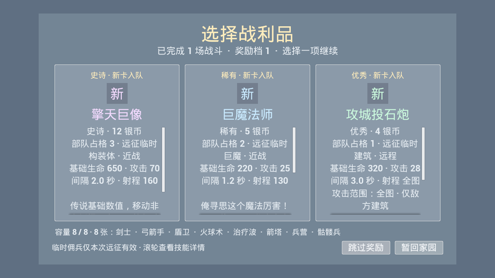
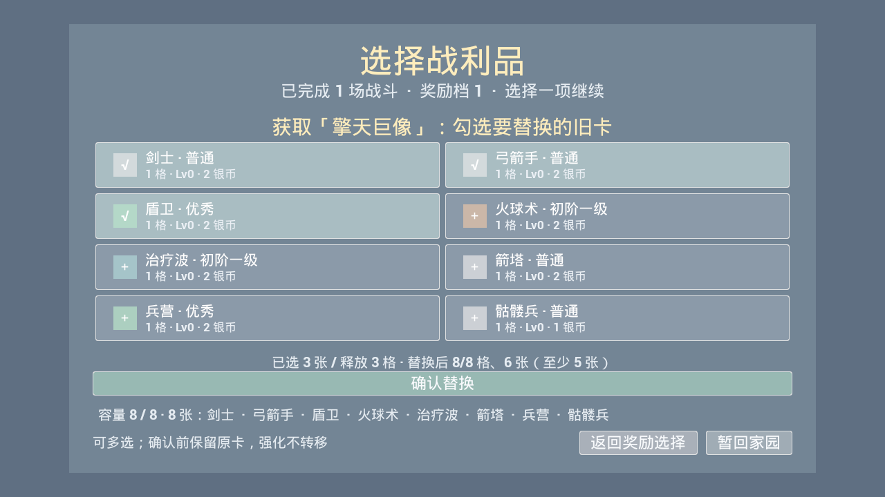
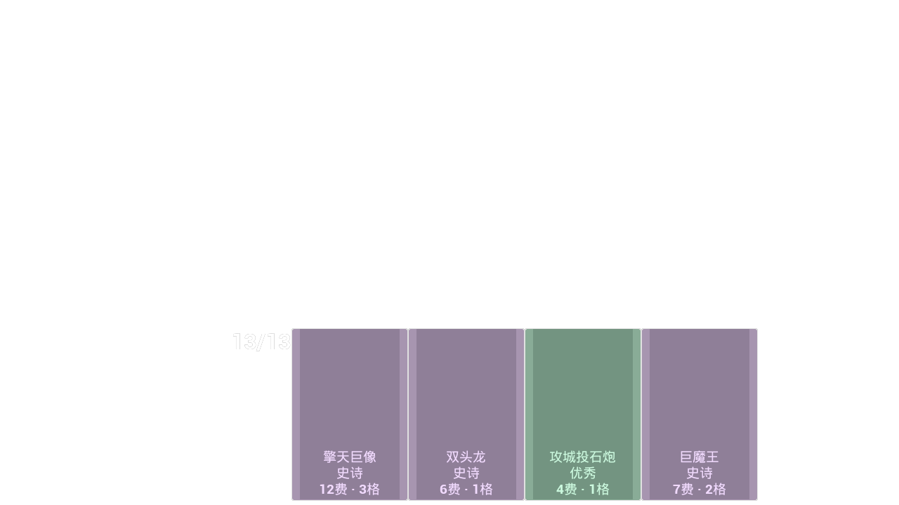

# 阶段三扩展：巨魔、双头龙、攻城炮与巨像

日期：2026-09-16～17。七张卡、战斗机制和 UI 已实现；接入入口见 [34](34-CardDevelopmentInterfaces.md)，修改记录见 [29](29-OptimizationChangeLog.md)。本轮七张卡沿用远征临时卡获取，不加入家园永久解锁。缺资源继续用有色方框与名称，无须手工补建蓝图、数据表或卡牌资产。

## 已确认的容量规则

用户确认：巨魔占 **8 格部队容量中的 2 格**，巨像占 3 格；在四槽战斗手牌中仍只显示一张。其他卡占 1 格。四槽始终补满且不重复；至少保留五种不同卡牌以保证过牌。

超额获取时可以勾选多张旧卡，界面显示已释放多少容量、替换后占格和张数；满足容量不超过 8、卡种不少于 5 后确认。确认前不删除卡牌，返回不消费批次；存盘失败全部回滚。强化不转移。卡组容量与战场单位数量无关。

## 初版数值

| 名称 / ID | 品质 / 基础数值 | 生命 | 攻击 | 间隔秒 | 射程 | 移速 | 银币 | 占格 |
| --- | --- | ---: | ---: | ---: | ---: | ---: | ---: | ---: |
| 巨魔战士 / Unit_TrollWarrior | 优秀 / 稀有，近战 | 220 | 25 | 1.05 | 130 | 270 | 4 | 2 |
| 巨魔投矛手 / Unit_TrollSpearman | 优秀 / 稀有，远程 | 145 | 42 | 2.0 | 600 | 250 | 4 | 2 |
| 巨魔法师 / Unit_TrollMage | 稀有 / 稀有，近战 | 220 | 25 | 1.2 | 130 | 250 | 5 | 2 |
| 巨魔王 / Unit_TrollKing | 史诗 / 略高史诗，近战佣兵 | 380 | 40 | 1.15 | 150 | 250 | 7 | 2 |
| 双头龙 / Unit_TwoHeadedDragon | 史诗 / 史诗，远程 | 225 | 38 | 2.2 | 650 | 260 | 6 | 1 |
| 攻城投石炮 / Building_SiegeCatapult | 优秀 / 优秀，远程建筑 | 320 | 28 | 3.0 | 全图 | 0 | 4 | 1 |
| 擎天巨像 / Unit_Colossus | 史诗 / 传说，近战 | 650 | 70 | 2.0 | 160 | 100 | 12 | 3 |

巨魔王的“王”是角色名称，仍属于佣兵卡，不占三位英雄位置。巨像 12 费高于当前传说费用参考 8～10；金库银币上限曲线本轮暂调为 **5/7/9/11/13**（Lv1～5），确保最高级能部署。产速和升级金币费用不变。费用大于当前上限时显示提示，不静默降价。

## 技能边界

### 巨魔法师：俺寻思这个魔法厉害！

20 秒冷却，强化自身与最近的一位其他友方巨魔；若有存活友方巨魔王，固定优先其中最近的一位。没有其他巨魔时只强化自身。持续 8 秒，初版移速 +30%、攻击间隔 ×0.75、普通战斗伤害 ×0.8；不同法师强化不叠强度，重新施放刷新持续时间。

将眩晕值解释为强化副作用：受强化者每次实际出手为自身增加 25%，满 100% 时自身眩晕 2 秒并立即清零。前摇取消不计次；任何成功施加的眩晕都立即清零。巨魔王免疫眩晕及其积累，仍享有强化。眩晕值在强化结束时清零，不留下跨房状态。超时虚弱和献祭扣血不受减伤。

### 巨魔王：巨魔王！ / 杀吧！

免疫眩晕（冰冻是另一种控制，不包含在该免疫中）。至少一个存活友方巨魔战士在场时最大生命 ×1.2，至少一个存活友方巨魔投矛手在场时攻击 ×1.2；同类数量不叠加。最大生命增减保持当前百分比，例如 80/100 → 96/120，且不产生治疗或伤害事件。

每五次实际普通出手后的第六次替换为【杀吧！】：150% 攻击伤害，目标后退 300 厘米并眩晕 2 秒。不是普通伤害再追加 150%。出手后计数清零；失去目标或取消前摇不计。目标死亡不再施加控制；建筑可受伤和控制但不被推动，营地不可攻击。击退受场地与障碍限制。

### 双头龙：双头吐息

每次出手按战斗随机种子等概率选冰或火。目标保存上一次被双头吐息实际命中的头部类型，所有龙共享；其他伤害不清空。首次无额外效果；冰冰冻结 1 秒，火火点燃，冰火/火冰此次伤害 ×1.2。已有弹丸在发射者死亡后仍能按快照结算。

点燃持续 3 秒，每秒每层扣目标最大生命的 1%；再次点燃新增一层并把全部层数的剩余持续时间刷新至 3 秒，不重置每秒跳伤进度。持续伤害走正常无敌/减伤与击杀管线，不再次触发吐息。冻结禁止移动、攻击、主动技能；重复冻结刷新时间。冰火历史与点燃状态仅属于当前战场 Actor。

### 攻城投石炮

全图索敌且只攻击敌方可攻击建筑；敌军佣兵/英雄不能用嘲讽或集火把它引开，营地不合法。使用专用抛射命中逻辑，只对锁定建筑生效，不会被路上佣兵拦截。没有合法建筑就待机，不自动攻击其他单位。

## UE 5.8 新手试玩

### 启动与获取

1. 停止 Play 并关闭编辑器。本轮增加了反射枚举、结构体字段和状态组件，应完整编译一次；不要只使用 Live Coding。
2. 在 PowerShell 执行以下命令，看到 `Result: Succeeded` 后重新打开项目。工程或引擎路径不同时替换对应路径。`-gather` 用于让构建工具重新收集新增 C++ 文件。

   ```powershell
   & 'E:\epic\UE_5.8\Engine\Build\BatchFiles\Build.bat' little_kingEditor Win64 Development '-Project=E:\little_hero\little_king\little_king.uproject' -WaitMutex -NoHotReloadFromIDE -gather
   ```

3. 点击 Play，选择测试存档，在家园大门出征。非终点战斗后的新卡奖励池会随机包含这些卡；不会每场固定送出指定角色。当前临时目录共 15 张卡（含攻城建筑），另有两张骷髅卡沿用既有候选逻辑。
4. 新卡加入后总容量超过 8 格时，勾选一张或多张旧卡；下方会实时显示“释放多少格 / 替换后多少格 / 剩余张数”。满足不超过 8 格且至少五种卡后，点击“确认替换”。勾选可再次点击取消；“返回奖励选择”不丢卡。
5. 获得 12 费巨像前，可先把金库升到 Lv5 再开始一轮**新远征**。当前默认银币上限为 13；已有远征使用出发时的升级快照，途中回家升级不会改变该轮上限。卡牌详情和手牌提示会说明上限不足。







图为引擎真实控件的受控渲染，黑底手牌图只捕获 HUD，不是战场美术效果。

### 直接生成单位

进入战斗，部署三名英雄并开始，按 `~` 打开控制台（通常在 Esc 下方）。以下命令分批执行；阵营 0 是玩家，1 是敌人，负 Y 是玩家半场，坐标冲突时换空位。

```text
SpawnUnit Unit_TrollWarrior 0 -650 -450
SpawnUnit Unit_TrollSpearman 0 -350 -650
SpawnUnit Unit_TrollMage 0 -50 -450
SpawnUnit Unit_TrollKing 0 250 -450
SpawnUnit Unit_TwoHeadedDragon 0 550 -650
SpawnUnit Building_SiegeCatapult 0 -700 -800
SpawnUnit Unit_Colossus 0 650 -850
SpawnUnit Building_ArrowTower 1 -700 700
ListUnits
```

`SpawnUnit` 只生成战场 Actor，不授予卡牌、扣银币或永久解锁；因此生成巨像不受卡费限制，也不能用它验证奖励替换。`AddSilver 10` 增加银币但仍受上限限制。需要快速升级金库时，可在一个测试存档中执行 `show me the money 1000`，再正常点击金库升级；该命令增加的是家园金币，会保存到当前存档。

### 建议观察顺序

| 功能 | 操作与预期 |
| --- | --- |
| 巨魔王支援 | 放巨魔王和两个友方战士。用 `DamageUnit Unit_TrollKing 0 50` 扣血，再用 `DamageUnit Unit_TrollWarrior 0 9999` 逐个击倒战士；第一只死亡不掉支援，最后一只死亡才回落生命上限，当前百分比保持不变。该命令每次只处理一个符合 ID/阵营的存活单位。 |
| 投矛手支援 | 留一只友方投矛手，王攻击变为基础的 120%；再放一只不继续叠加，最后一只死亡才移除。敌方同类不提供支援。 |
| 法师强化 | 开战后等满 20 秒；王不在场时选最近巨魔，王在场时优先王。头顶出现强化/眩晕值提示，持续 8 秒。受强化者四次出手后自身眩晕；王不会因此停手。 |
| 第六击 | 用有足够生命的敌人观察王连续攻击：前五次普攻，第六次替换为 150% 伤害、最多 3 米击退和 2 秒眩晕。建筑不能被推走；目标已死不追加控制。 |
| 双头吐息 | 同时放两条龙对同一目标。弹丸颜色区分冰/火，命中顺序共同计算；同冰冻结、同火增加点燃层数，异色提高该次伤害。连续出现哪种头是随机的，短时间内不保证触发全部效果。 |
| 全图攻城 | 炮与敌方箭塔置于两端，中间放敌方佣兵：炮只能选塔，弹丸不会被佣兵拦截。敌方建筑全灭后炮待机；部署预览标出全场边界和仅建筑说明。 |
| 多格与临时性 | 奖励多选时确认前不改变牌组，返回可重新选；新卡仍只显示一张手牌，四槽无重复。暂回家园/继续保留临时卡，真正结束远征后不进入永久解锁。 |

受控自动化已检查上述边界，人工试玩主要用于确认节奏与数值是否符合预期。无需你完成资产接线或额外 UI 制作。

## 后续调参与扩展

基础面板和法师 `SkillCooldown`、`EmpowerDuration`、`EmpowerMoveMultiplier`、`EmpowerIntervalMultiplier` 可以通过同名 `DT_Units` 行调整。例如法师首版依次为 20、8、1.3、0.75；修改后停止并重新 Play。新行的其他基础数值按本页表格填写，具体数据表操作见 [33](33-Stage3CharactersTutorial.md)。没有表行时直接使用本页原生默认值。

品质、种族、技能类型、占格和炮的“只打建筑”属于原生身份；更改表内这些字段不能改变内置角色。全图攻击范围根据场地动态计算，不能靠把数据表射程改小取消。卡牌费用和图标仍可用 `LKCardDefinition` 资产覆盖；改费时同步核对金库上限。眩晕比例、王的支援与第六击、吐息规则等固定行为在 `ULKUnitStatusComponent` 和攻击入口中调整，详见 [34](34-CardDevelopmentInterfaces.md)。

Run Schema 升为 **8**，保留 Schema 6/7 的路线、种子、钱包、牌组与强化；若旧牌组按新预算超额，先由玩家裁减，读取时不擅自删除。状态、眩晕值、点燃和吐息历史不跨房保存。

## 实际验证

- UE **5.8.1 / Win64 / Development Editor** 构建成功；全项目自动化 **72/72 通过**，0 失败、0 未执行。其中 30 项无警告、42 项含受控写盘失败或既有测试世界相机/GameplayCue 等警告。
- 完整回归后仅压缩了替换行和奖励详情布局，重新编译并重跑受影响的 UI 测试 **1/1 通过**。已查看 720p/1080p 奖励、替换截图及 720p 四槽手牌，确认八个选项和确认按钮完整可见。
- 覆盖七卡注册、原生身份、加权容量/连续过牌、多卡替换回滚、血量百分比/支援不叠加、眩晕控制/免疫、第六击、共享吐息/点燃/池化清理、全图建筑索敌/弹道及真实按钮。
- 原有五份玩家存档哈希与开始前一致，测试临时档已清理。机器可读摘要见 [TrollCards-Validation](validation/TrollCards-Validation.json)。

数值仍是首版，尚未进行长期平衡试玩；本轮没有增加正式美术、音效、打包或硬件测试任务。
