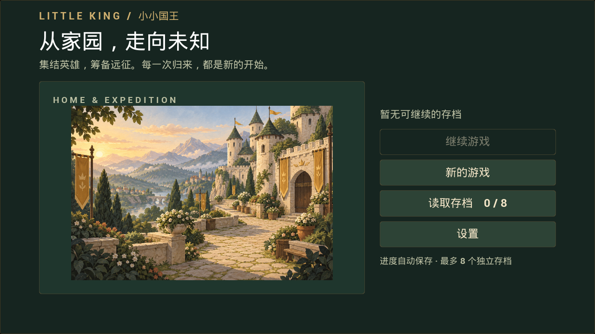
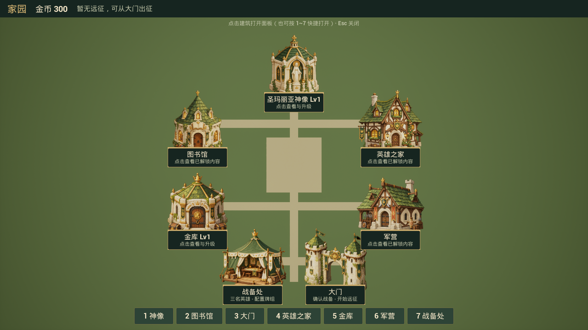

# 素材制作 A 批 · 整合与协作记录

日期：2026-09-19。基线：v0.7 发布后的 `faff76145ebf77e25848cda277cf68a0662e95da`，开始时工作区干净。本批落实“重新盘点素材、统一画风、开始制作并接入、记录来源与提示词”。最新发布仍是 v0.7；本次没有创建提交或发布标签。

需求清单见 [12](12-AssetRequest.md)，风格规范见 [07](07-ArtStyleGuide.md)，来源及完整提示词见 [36](36-ArtAudioSources.md)，UE 5.8 新手操作见 [13](13_Asset_Solutions.md)。本批原文件和引擎资源已在工程内，无须手动下载。

## 本批交付

统一方向为温暖绘本奇幻：松绿、苔绿、奶油石墙、旧金饰边、哑光手绘。画面保留正文、品质色和玩法标记的可读性。不是将所有颜色改成绿色：敌我、品质、危险、选中等已有语义继续保留。

| 范围 | 交付与实际行为 |
| --- | --- |
| 开始界面 | 1 张 1536×1024 王国插画，等比显示；替代三个英雄色块，给主菜单建立明确视觉主题。读取/删除页共用主题。 |
| 家园场景 | 7 张 1254×1254 真透明 RGBA 建筑原图与 7 个 PaperSprite，替换七座建筑的方块外观；缺资源时仍有方块兜底。 |
| 家园操作 | 保留稳定 BuildingId、点击半径 300cm、位置、快捷键与业务；插画组件无碰撞。悬停略放大、暖色提亮；名称牌和顶部提示避免相互遮挡。 |
| 家园地面 | 现有草地/道路材质在运行时调整为苔绿与暖沙色。地面细纹、路径边缘、摆件尚未制作。 |
| 原生 UI | 开始/存档、家园、列表、奖励/替换、路线与恢复页统一配色、圆角细金边和按钮状态。战斗 HUD 蓝图与卡图另列后续批次。 |
| 战斗音效 | 为既有 MeleeHit、RangedShoot、HitTaken、UnitDied、CardPlay、BattleStart、Victory、Defeat 八键补默认声音；复用现有触发事件。 |
| UI 音效 | 常用原生按钮按下播放短点击音；Slate 样式持有声音引用，不在每次点击时读盘。 |
| 来源 | 6 条 Kenney CC0 音效经统一处理；3 条原创程序合成开战/胜负短句。8 张生成图各自保留完整实际提示词，未伪造模型版本或随机种子。 |
| 可复现 | PNG、WAV、采用的原始 OGG、许可证、下载地址/包哈希、文件哈希、音频脚本和引擎导入脚本全部保留。 |

共新增 **27 个引擎资源：8 Texture2D + 7 PaperSprite + 9 SoundWave + 3 SoundConcurrency**，均位于 `Content/Art/StorybookV1`。生成图没有被写成 CC0；三条合成短句不冒充第三方音乐包或 AI 音乐。

## 文件与协作边界

| 文件/目录 | 改动 |
| --- | --- |
| `ArtSource/StorybookV1` | 原图、完整提示词、音频原始/处理文件、许可证、manifest。是本批源文件档案。 |
| `Content/Art/StorybookV1` | 本批导入资源；后续重导入只覆盖此目录内同名资源。 |
| `Scripts/PrepareStorybookAudio.py` | 读取已归档 OGG；转单声道、采样率统一、淡入淡出、峰值处理；按固定音符合成短句，可重现。 |
| `Scripts/ImportStorybookAssets.py` | UE 5.8 Python 导入贴图、设置精灵比例/材质、创建并发配置并绑定声音；支持重复执行。 |
| `LKPresentationStyle.h` | 共用色板、面板/按钮样式和点击音入口。未来换主题优先改此处。 |
| `ALKHomeBuildingActor.h/.cpp` | 新增插画组件、按 BuildingId 绑定和方块回退、悬停反馈、名称牌位置与大门说明。神像 ID 特别映射到 `SP_Home_Statue`。 |
| `ALKHomeGameMode.cpp` | 仅为家园原有占位地面/道路建立运行时动态材质并换色。 |
| `ULKGameData.h/.cpp`、`ALKBattleGameMode.cpp` | 增加默认音效配置与补全入口，在声音预加载前调用。 |
| `ULKStartMenuWidget.cpp` | 插画控件、布局与共用主题。 |
| `ULKHomeHUDWidget.cpp`、`ULKHomeBuildingLabelWidget.cpp`、`ULKHomeListButtonWidget.cpp` | 统一主题、名称牌、提示位置与按钮音。 |
| `ULKRunRewardWidget.cpp`、`ULKRunNodeSelectWidget.cpp`、`ULKRunResumeWidget.cpp` | 原生远征界面采用同一主题。 |
| `Tests/LKPresentationAssetsTests.cpp` | 新增两组资源/音效配置、建筑身份/几何/碰撞/悬停回归。 |
| `README`、`03`、`07`、`12`、`13`、`29`、`36`、本文 | 更新入口、当前素材状态、来源与协作记录；不把历史规划当成完成证明。 |

没有重存用户维护的 `DT_Units`、`DT_Traits`、`DA_GameData`、技能蓝图、`WBP_BattleHUD` 或现有地图。原有卡图/精灵也保留。多人协作时不要为了获得默认音效，给 SoundMap 补一批空值：**已存在的空值表示显式静音**。

## 表现配置约定

- `ULKGameData::EnsurePresentationDefaults` 只补缺少的键；已有声音和显式空值都保留。`bUseDefaultSoundSet=false` 关闭自动补全，不会移除自己配的声音。
- 按钮点击音独立在 `LKPresentationStyle` 中配置。当前“设置”仍是预留接口，本批没有宣称完成音量设置页。
- `SC_Combat`、`SC_UI`、`SC_Signals` 分别最多同时 12、3、2 个声音，同组超额不新播。所有本批 SoundWave 非循环；结算短句不是循环 BGM。
- 八个声音键沿用原有触发位置；本批没有新增死亡震动，也没有改变只有火球产生小震动的规则。
- 精灵完整画布对应 500cm；导入按实际像素宽度计算比例。提示词的 1024 请求与实际 1254 输出已如实登记。
- 插画使用 Paper2D 无光照遮罩材质。当前静态资源适合固定家园相机；动画和不同缩放距离下的细化属于后续工作。

## 验证结果

可共享机器摘要：[StorybookAssets-Validation.json](validation/StorybookAssets-Validation.json)。完整构建/自动化日志保存在本地忽略追踪的 `Saved`，摘要不冒充未执行的打包验收。

| 验证 | 结果 |
| --- | --- |
| UE 5.8.1 C++ | `little_kingEditor / Win64 / Development` 构建成功，最终日志 `Saved/Logs/StorybookBuild05.log`。 |
| 全量回归 | Build04 完整 `LittleKing` **74/74 通过**：32 项无警告、42 项带警告，0 失败、0 未执行。报告 `Saved/Automation/Storybook02/index.json`。 |
| 最终菜单调整 | Build05 仅移除插画旁冗余标语；受影响的 `Optimization1.MenuButtonsAndAssets` 单独 **1/1 通过**，有警告。报告 `Saved/Automation/StorybookMenuFinal/index.json`。 |
| 资源导入 | 最终重复导入成功，`STORYBOOK_IMPORT_OK assets=27`；导入后两项 Presentation 检查 **2/2 通过、无警告**。报告 `Saved/ArtAudioImport.json`、`Saved/Automation/StorybookReimport/index.json`。 |
| 图片 | 8 文件 SHA-256、尺寸、模式与清单吻合；七建筑 alpha 均覆盖 0～255；8 条提示词与 manifest 完全对应。 |
| 音频 | 9 条均为 48kHz/16-bit/mono PCM，非静音、单文件无削波、首尾样本为 0；六条来源文件哈希吻合；重新运行处理脚本，九条 WAV 的 SHA-256 均不变。未进行实际耳机/扬声器混音验收。 |
| 实际画面 | Unreal 游戏模式离屏渲染并检查 1280×720、1920×1080 的开始页与家园，以及 1080p 存档页和神像详情；不是概念示意图。 |
| 玩家数据 | 开始时的 5 个 `.sav` 文件 SHA-256 完全不变；预览使用隔离存档，结束后无额外预览档。 |
| 文档 | 146 个本地文件链接检查通过；`git diff --check` 通过。 |

警告包括测试中故意触发的保存/非法输入保护、测试世界相机提示及已有 GameplayCue 路径提示；不宣称零警告。自动化中曾发现神像正式 ID 与资源短名不一致，已修复并通过完整重跑；家园提示条遮挡名称牌的问题也已调整后重拍。

### 实际画面

高分辨率：[1080p 开始页](images/StorybookMenu1080.png)、[1080p 家园](images/StorybookHome1080.png)、[神像详情](images/StorybookStatue1080.png)、[八档读取页](images/StorybookSaves1080.png)。预览中的金币来自隔离测试档，不是给玩家档发放的金币。

## 下一批与需要用户做的部分

A 批已经落地，但全项目美术没有完成。按 [12](12-AssetRequest.md) 继续：

1. **B：战斗识别（已于 2026-09-20 接入）。** 20 个单帧、17 张卡面、8 个旧精灵尺寸/风格复核与默认绑定，续篇见 [38](38-BattleArtIntegration.md)。本文的“未重存数据表”等说明仅针对 A 批；B 批另修正了旧兵营显示比例。
2. **C：世界/技能。** 五区域地面、节点图标、营地、技能 FX、专用技能/经济/节点声音与战斗 HUD；详情中的文字徽章也可逐步换成小图标。
3. **D：细化。** 多帧动画、循环音乐、等级装饰和转场。市场商品尚未设计，不预制虚构商品图。

没有必须由用户补建的资产或下载步骤。只需按 [13 的直接试玩](13_Asset_Solutions.md#直接试玩本批不需要手动下载) 关闭编辑器后重新构建、打开 Play，确认个人对画风、文字大小、鼠标反馈和声音响度的偏好。音频格式检查不能替代实际听感。Sprint 6 仍跳过，本批不安排打包或硬件测试。
