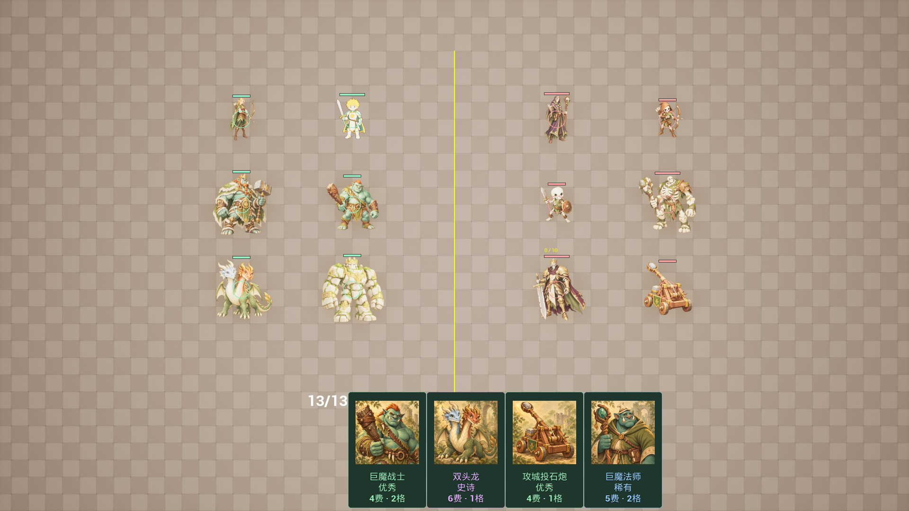
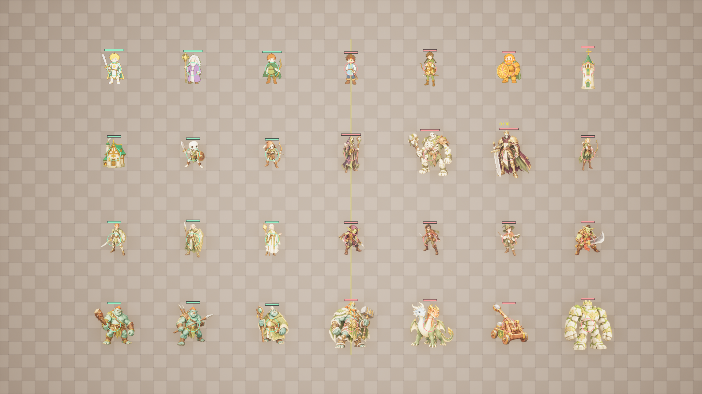

# B 批战斗美术 · 制作、接入与协作记录

日期：2026-09-19～20。承接 [A 批](37-ArtAudioIntegration.md)，范围为战斗识别：补齐 20 个缺图实体、17 张对应卡面，复核 8 个既有精灵。未修改任何单位技能、数值平衡、容量或存档格式。完整需求见 [12](12-AssetRequest.md)，来源见 [36](36-ArtAudioSources.md)。

## 本批交付

- 新生成 20 张真透明单帧，覆盖全部亡灵、精灵、人类/哥布林临时佣兵、巨魔、双头龙、攻城投石炮和巨像。
- 以各自单帧为参考，分别生成 17 张方形卡面；敌方英雄和 Boss 没有虚构成可获取卡牌。
- 导入 57 个 Unreal 资产：20 贴图、20 PaperSprite、17 卡图。加上 A 批为 84 个 StorybookV1 资产。28 种实体均有精灵，24 张实际卡牌均有图；其中仍包含 8 个旧精灵、7 张旧卡图。
- 原生内容注册表补默认图片，仍允许美术人员在数据表/卡牌资产中指定自己的图片。无须逐一补建 DataAsset 或蓝图。
- 奖励三选一插画由 54px 扩大到 128px，4px 内边距，文字继续独立排版，长技能说明保留滚动。
- 战斗手牌在运行时为图片添加 ScaleBox，保留长宽比，将名称/品质/费用/占格放到独立底部；按钮沿用原蓝图点击事件。修复新方图被拉长、文字直接压在插画上的问题。
- 修正旧战斗兵营纵向拉伸：`DT_Units / Building_Barracks / SpriteScale.Y` 从 `1` 改为 `0.5`，与 X 一致。该字段是本批唯一重存的既有数据表字段。
- 实际战场发现遮罩精灵与地面重叠导致不可见，已将精灵组件相对高度设为 8cm。逻辑根节点、碰撞和部署坐标仍在 Z=0。

新图遵循 A 批的水粉笔触、栗棕轮廓、松绿、羊皮纸与旧金色。保留种族识别色：亡灵骨白/幽绿、精灵苔绿、巨魔灰青、龙的冰蓝/陶红。旧八种精灵属于更简洁的卡通画法，本次检查后保留；它们共享暖色与轮廓方向，但没有声称全部重新绘制。后续动画批次可继续统一线条细节。

## 文件与协作边界

| 路径/文件 | 责任与改动 |
| --- | --- |
| `ArtSource/StorybookV1/Battle/Images` | 20 个未修改像素的生成原图 |
| `ArtSource/StorybookV1/Battle/Cards` | 17 个以对应精灵为参考的独立生成卡图 |
| [catalog.json](../ArtSource/StorybookV1/Battle/catalog.json) | 稳定 ID、中文名、世界画布高度、20 条实际完整精灵提示词 |
| [cards.json](../ArtSource/StorybookV1/Battle/Prompts/cards.json) | 17 条实际完整卡面提示词与输入参考路径 |
| [manifest.json](../ArtSource/StorybookV1/Battle/manifest.json) | 每张尺寸、alpha、SHA-256、参考图哈希、生成日期和完整提示词 |
| `Content/Art/StorybookV1/Battle` | 本批贴图、PaperSprite、卡面 |
| `LKBattleArt.h/.cpp` | 20 个稳定 UnitId 与引擎路径的默认映射 |
| `LKUnitContent.cpp` | 缺图才补默认 Sprite，已有自定义图片优先 |
| `ULKGameData.cpp` | 补默认卡图；修改共享卡牌前先复制，避免运行时污染 DataAsset |
| `ULKRunRewardWidget.cpp` | 放大奖励图片，保留功能文案和替换流程 |
| `ULKBattleHUDWidget.cpp` | 手牌图等比显示、底部文字区与统一边框；不重存蓝图 |
| `ALKUnitBase.cpp` | 精灵组件抬高 8cm，避免遮罩材质被战场地面覆盖 |
| `LKBattleArtPreview.h/.cpp`、`ALKBattleGameMode.cpp` | 仅编辑器显式 `-BattleArtPreview` 模式：独立预览进程、禁用永久档、随机隔离远征槽且关闭自动保存，生成固定阵列并自动截图退出 |
| `Content/Data/DT_Units.uasset` | 仅修正旧兵营的显示缩放 Y；其余表字段比较不变 |
| [ImportBattleArt.py](../Scripts/ImportBattleArt.py) | 导入前检查 37 张源图，再生成/重导入 57 资源；仅在精确匹配旧兵营图片和旧缩放时修正比例 |
| [AuditBattleArt.py](../Scripts/AuditBattleArt.py) | 只读像素检查、来源清单生成，不加工图片 |
| `Tests/LKBattleArtTests.cpp` | 默认/覆盖/共享资产保护，以及正式 GameMode 生成 28 种实体、检查几何/比例/碰撞/离地；实际渲染使用上面的游戏视口预览 |

没有重存 `DA_GameData`、技能蓝图、卡牌 DataAsset、战斗 HUD 蓝图、地图或旧图片；协作者需合并本次 `DT_Units` 变化，不能同时覆盖整个表。运行时 C++ 默认映射不会显示为数据表单元格已填值，这是正常现象。填入自定义 Sprite/Icon 后会使用你的资源。

## 导入规格与尺度

实际输出均为 **1254×1254**；提示词请求 1024，但以工具实际输出登记。原图保持不变。20 张精灵 RGBA 的 alpha 范围为 0～255，少量边缘存在 1/255 极低透明像素，遮罩材质会丢弃；清单同时记录原始 alpha 边界与遮罩阈值边界。卡图不透明。

贴图采用 sRGB、UI 组、无 mip、双线性过滤、EditorIcon 压缩，最大构建尺寸 512。PaperSprite 使用完整源像素 UV、中心枢轴与 `MaskedUnlitSpriteMaterial`，每单位像素数按原图高度/世界画布高度计算。新精灵组件等比缩放；不缩 Actor，不改变 50cm 等既有逻辑碰撞半径。血条仍由现有 HUD 根据精灵世界包围盒放在上方。

| 单位 | 稳定 ID | 完整画布高 cm | 新卡图 |
| --- | --- | ---: | --- |
| 骷髅兵 | Unit_Skeleton | 230 | 有 |
| 骷髅射手 | Unit_SkeletonArcher | 230 | 有 |
| 死灵法师 | Hero_Necromancer | 290 | 无，敌方英雄 |
| 骷髅巨人 | Hero_SkeletonGiant | 360 | 无，敌方英雄 |
| 骷髅王 | Boss_SkeletonKing | 375 | 无，Boss |
| 精灵弓箭手 | Unit_ElfArcher | 260 | 有 |
| 精灵战士 | Unit_ElfWarrior | 260 | 有 |
| 精灵盾卫 | Unit_ElfGuard | 280 | 有 |
| 精灵牧师 | Unit_ElfPriest | 260 | 有 |
| 哥布林大盗 | Unit_GoblinRogue | 245 | 有 |
| 窃贼 | Unit_Thief | 250 | 有 |
| 学徒法师 | Unit_ApprenticeMage | 255 | 有 |
| 开道利刃 | Unit_GoblinBlade | 265 | 有 |
| 巨魔战士 | Unit_TrollWarrior | 325 | 有 |
| 巨魔投矛手 | Unit_TrollSpearman | 330 | 有 |
| 巨魔法师 | Unit_TrollMage | 320 | 有 |
| 巨魔王 | Unit_TrollKing | 370 | 有 |
| 双头龙 | Unit_TwoHeadedDragon | 370 | 有 |
| 攻城投石炮 | Building_SiegeCatapult | 330 | 有 |
| 擎天巨像 | Unit_Colossus | 410 | 有 |

画布含透明留白，表中高度不是站立角色的实际身高。旧步兵完整画布约 289～306cm；巨魔、巨像以轮廓与较大画面尺寸区分，其 2/3 格占用仍只影响八格部队容量，四槽手牌每张占一槽。

旧精灵复核：剑士 216.5×288.5cm、弓箭手/盾卫 204×306cm、骑士 217.2×289.6cm、法师/游侠 216.5×288.5cm、箭塔 187.5×333cm；兵营从 187.5×666cm 改成 187.5×333cm。均按完整画布计，未改其源图片。

## UE 5.8 新手试玩与维护

**没有必须由你手动下载、生成或接线的部分。** 源图和 `.uasset` 已在项目内。试玩步骤：

1. 停止 Play、关闭编辑器，按 [13](13_Asset_Solutions.md) 完整构建，成功后重新打开项目。
2. 点击 Play，经开始界面选档、家园大门进入远征。亡灵应显示为骨白角色，而非彩色方块；原有红/绿简易血条继续显示在上方。
3. 临时佣兵仍按远征奖励获得；图片接入不会将它们解锁到家园。想单独检查某单位，可使用 [33](33-Stage3CharactersTutorial.md) / [35](35-TrollAndSiegeCards.md) 已有调试生成方法。
4. 奖励页检查图片、品质、银币、占格；巨魔和巨像仍在四槽手牌里各显示一张卡。
5. 若自行换图：打开 `DT_Units` 的目标行，指定 Sprite；要改卡图则打开对应卡牌资产指定 Icon。空值自动回到本批默认，非空自定义优先。
6. 调整大小只改 Sprite 的 Pixels Per Unreal Unit，或数据表等比 SpriteScale；不要缩放 Actor。新图的默认尺寸在 `catalog.json`，改后重导入。

可选重导入（关闭编辑器；已有资产时无须执行）：

```powershell
& 'E:\epic\UE_5.8\Engine\Binaries\Win64\UnrealEditor-Cmd.exe' 'E:\little_hero\little_king\little_king.uproject' -run=pythonscript '-script=E:\little_hero\little_king\Scripts\ImportBattleArt.py' '-EnablePlugins=PythonScriptPlugin,EditorScriptingUtilities' -unattended -nop4 -nosplash -NullRHI
```

成功日志为 `BATTLE_ART_IMPORT_OK assets=57`，资产路径清单在 `Saved/BattleArtImport.json`。脚本重复执行不重复造卡，不重置战斗数值；对自定义兵营图片/缩放不做强制修改。原图检查可用安装了 Pillow 的 Python 执行 `Scripts/AuditBattleArt.py`。

协作者可用以下命令复现静态战场验收；它不会读取或写入玩家存档，截图后自动退出。第一张隐藏 UMG 展示全部 28 种单位和原生血条，第二张展示双方样例与手牌。单位暂停 Tick 只用于稳定截图，不是正常战斗流程。

```powershell
& 'E:\epic\UE_5.8\Engine\Binaries\Win64\UnrealEditor-Cmd.exe' 'E:\little_hero\little_king\little_king.uproject' '/Game/Maps/L_BattleTest' -game -BattleArtPreview -RenderOffscreen -windowed -forceres -ResX=1920 -ResY=1080 -unattended -nop4 -nosplash
```

截图在 `Saved/Screenshots/BattleArt/UnitGrid-Viewport.png` 与 `Battle-Viewport.png`。不加 `-BattleArtPreview` 就是正常启动流程；此入口仅在编辑器构建内存在。

## 验证与实际画面

机器可读记录见 [BattleArt-Validation.json](validation/BattleArt-Validation.json)。完整日志在忽略追踪的 `Saved/Logs` 与 `Saved/Automation`。

| 验证 | 结果 |
| --- | --- |
| UE 5.8.1 构建 | `little_kingEditor / Win64 / Development` 成功，最终 `BattleArtBuild07.log` |
| 全量自动化 | `LittleKing` 76/76 通过；33 无警告、43 带警告，0 失败、0 未执行。报告 `Saved/Automation/BattleArtFinal07/index.json` |
| 原图与来源 | 37 张均为 1254×1254，20 张真透明；全部文件和 17 个参考图哈希对应，完整实际提示词已归档 |
| 导入/重导入 | 57 个资源路径唯一，重复导入成功；不重复创建资产 |
| 旧表保护 | 导出内容逐字段对比仅兵营 SpriteScale.Y 改变，其余数值与身份字段不变 |
| 实际画面 | 游戏视口 720p/1080p：28 种实体阵列、双方样例、血条/黄线/手牌；UMG 720p/1080p：三选一、多卡替换 |
| 玩家存档 | 5 个原有 `.sav` 的 SHA-256 全部不变；没有遗留预览存档 |
| 文档/差异 | 本地链接与 `git diff --check` 检查通过 |

43 项警告主要来自已有测试世界无视口、预期非法输入/存档保护、GameplayCue 路径等，不宣称零警告。实际视口检查发现并修复了遮罩精灵被地面遮挡、方卡拉伸以及 720p 文字自动换行挤入图片的问题。最终版手牌使用三个显式文本行。

以下是真实游戏进程的静态检查场景，使用正式 `L_BattleTest`、GameMode、单位和 HUD；没有把 PNG 拼接成假游戏截图。为同时检视单位，预览相机使用 3000cm 正交视野；不改正常游戏的地图相机。棋盘格是原战场地面，场地美术属于 C 批。



全部 28 种实体从左到右、从上到下：骑士、法师、游侠、剑士、弓箭手、盾卫、箭塔；兵营、骷髅兵、骷髅射手、死灵法师、骷髅巨人、骷髅王、精灵弓箭手；精灵战士、精灵盾卫、精灵牧师、哥布林大盗、窃贼、学徒法师、开道利刃；巨魔战士、投矛手、法师、王、双头龙、攻城炮、巨像。



其他截图：[720p 战斗](images/BattleArtBattle720.png)、[720p 奖励](images/BattleArtReward720.png)、[1080p 奖励](images/BattleArtReward1080.png)、[720p 多卡替换](images/BattleArtReplacement720.png)。奖励/替换图由真实 UMG 控件测试渲染，色彩伽马与完整游戏视口不同；最终配色以游戏视口为准，不将控件截图当作屏幕取色基准。

本批未提交 Git、推送或发布新标签，最近发布仍为 v0.7。

## 后续批次

B 批交付静态精灵和卡面。五区域地面、节点图标、英雄营地美术、完整战斗 HUD 主题、技能 FX/专属音属于 C；动画、循环 BGM、等级外观与转场属于 D。尚未设计的市场商品不预制。Sprint 6、打包和硬件测试仍后置。
