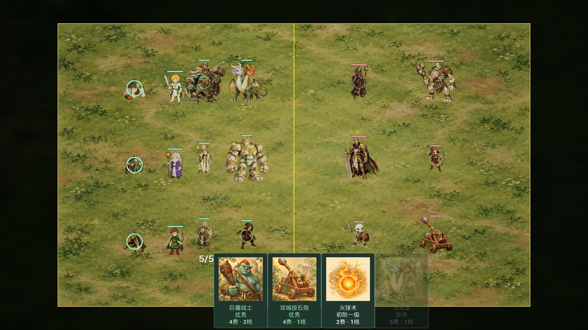
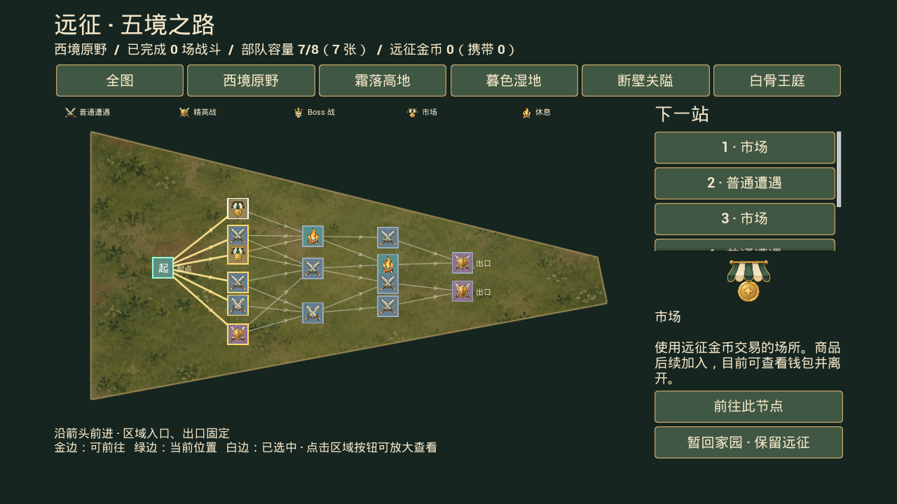
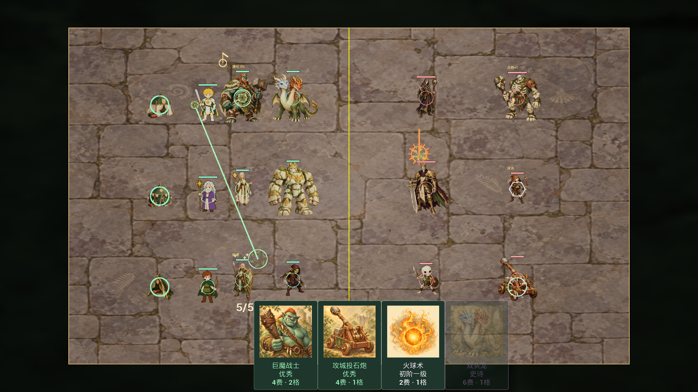
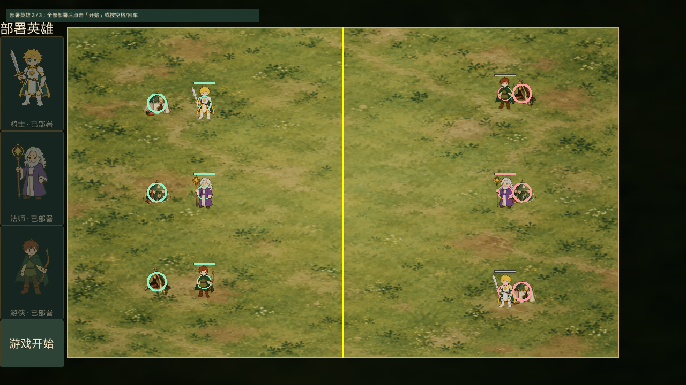
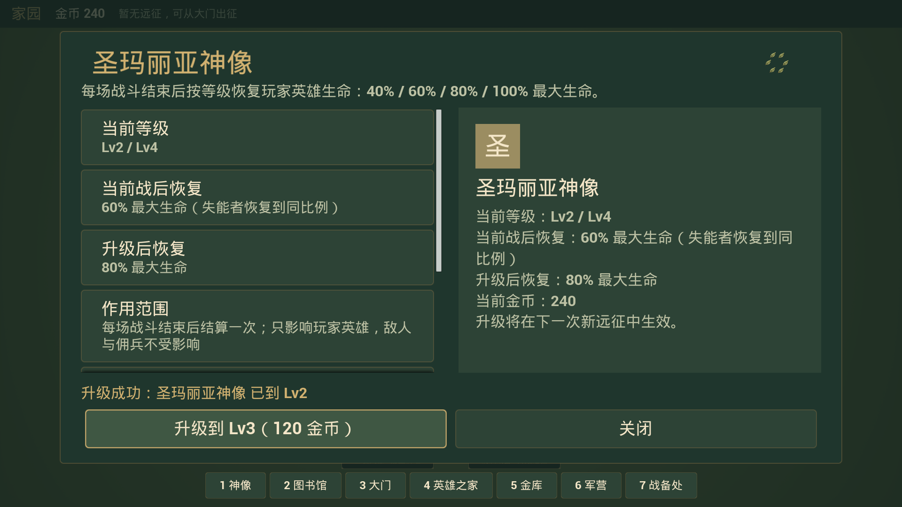

# C 批：世界、营地、节点与技能表现

交付日期：2026-09-21。延续 A/B 批的暖色水粉绘本风格，完成世界与技能表现的首版接入。协作者从本页了解新增文件、调用位置、实际验证和可调整项；全量需求见 [12](12-AssetRequest.md)。

## 1. 新增资源

| 分类 | 原文件 | 引擎资产 | 用途 |
| --- | ---: | ---: | --- |
| 区域地面 | 5 PNG | 5 Texture + 5 PaperSprite | 西境原野、霜落高地、暮色湿地、断壁关隘、白骨王庭；大地图与战场共用纹理 |
| 英雄营地 | 3 PNG | 3 Texture + 3 PaperSprite | 骑士盾徽帐篷、法师星徽帐篷、游侠叶徽帐篷 |
| 节点徽记 | 5 PNG | 5 Texture | 普通遭遇、精英、Boss、市场、休息 |
| 效果零件 | 3 PNG | 3 Texture | 火球爆点、治疗叶片、碎石尘点 |
| 专属声音 | 28 WAV | 28 SoundWave | 发射、技能、控制状态、银币、脚步、指令、节点与升级 |
| **合计** | **16 PNG + 28 WAV** | **52** | A/B/C 合计新增 136 个引擎资产 |

全部 PNG 为实际 1254×1254 RGBA 原图。五张地面不透明，其余具有真实透明通道；没有像素后处理。地面构建上限 1024，其余 512，原图完整保留。图片为内置 image_gen 文本生成，完整实际提示词见 [41](41-WorldArtPrompts.md)，来源、尺寸和 SHA-256 见 [图片清单](../ArtSource/StorybookV1/World/manifest.json)。

28 WAV 是项目原创程序合成，无外部录音/采样，也没有使用 AI 音频模型。格式为 48kHz、PCM16、单声道，时长 0.18～1.15 秒，峰值按用途为 -18～-28dBFS。制作说明、参数、随机种子与哈希见 [音频清单](../ArtSource/StorybookV1/World/Audio/manifest.json)；可通过 [PrepareWorldAudio.py](../Scripts/PrepareWorldAudio.py) 重现。新增素材无需用户手动下载。

## 2. 画面与操作结果

- **战场**：按远征当前 RegionId 选择地面，独立调试场景使用西境原野。精英、Boss 采用略暗的色调。场外使用暗色延伸底，保留清晰边框和黄色半场中线。地面没有碰撞，不改变布置、寻路和单位尺寸。运行时固定战场曝光、关闭泛光，避免深浅地面切换让角色过曝。
- **营地**：部署三位英雄时显示各自帐篷。保持现有不可攻击、有体积、无血条的规则；英雄失能时营地变灰，选择/指令圈和落点旗保留。当前代码规则是可指挥英雄到任意可达地点，C 批没有恢复早期移动范围限制；营地显示圈不代表新的移动限制。
- **地图**：五区多边形使用对应地面纹理，等比裁切；五类节点显示徽记，保留真实 DAG、箭头、可达金边、当前位置绿边、选择白边。区域放大显示入口/出口，右侧展示对应节点插画。没有新增路线或改变节点命中判定。
- **战斗 HUD**：部署按钮、面板、文字、进度条使用松绿/羊皮纸/旧金主题；部署按钮增加独立头像与“已部署”文字，避免旧头像随按钮底图换肤丢失，并清除开始按钮遗留的红色背景叠色；原蓝图事件和 B 批手牌品质色保留。
- **服务与升级**：节点操作成功后播放短声、状态文字强调和徽记轻微脉动。家园神像/金库升级成功出现短叶环；失败不播放成功反馈。市场仍只显示钱包及离开选项，没有虚构商品。

## 3. 技能与状态覆盖

| 行为 | 当前显示 | 声音键 |
| --- | --- | --- |
| 近战/远程/退场 | 短斩弧、箭矛拖线、魔法弹、受击点、尘点；原闪白保留 | 原 MeleeHit/HitTaken/UnitDied；BowShot/SpearShot/MagicShot |
| 火球卡、法师火球、模仿火球 | 爆点贴图、扩散环、短施法拖线，半径取实际技能/卡牌参数 | FireballCast / FireballImpact |
| 治疗、自疗、巨骨、共沐春色 | 实际产生治疗时出现叶片；共沐春色增加传递连线 | Heal（节流） |
| 亡灵召唤、献祭、复活 | 尘点、幽绿聚合环、献祭暗红环、复活扩散；既有计数文字保留 | Summon / Sacrifice / Revive |
| 背刺、战利品、模仿、冲刺 | 瞬移/冲刺路径、银币圈、施法符环；银币到上限不播虚假收益 | Backstab / Coin / Mimic / Dash |
| 巨魔强化、第六击、巨像 | 绿金叶环、重击短弧；巨像仅在真实移动时播放低频脚步 | Empower / HeavyHit / Footstep |
| 眩晕、冰冻、点燃 | 旋转星标、薄冰六边形、最多五个火点及真实层数文字 | Stun / Freeze / Burn |
| 双头龙、投石炮 | 冰火色弹、石弹菱形及尘圈 | IceBreath / FireBreath / SiegeShot / SiegeImpact |
| 嘲讽、集火、营地指令 | 盾标、目标圈/感叹号、落点小旗 | 嘲讽沿用 Empower；集火沿用 CampCommand；移动指令 CampCommand |
| 节点、休息、市场、家园升级 | 节点徽记/短脉动、状态反馈、升级叶环 | NodeEnter / Rest / Market / Upgrade |

这是三张透明效果零件配合原生几何与时间变化的首版 FX，不是角色逐帧动画，也不是完整 Niagara 套件。火球伤害依旧按原规则即时结算，画面拖线不新增飞行时间。只有原有火球释放路径产生小震动；失能、复活、重击、冰火吐息不会新增震动。

## 4. 代码入口与协作归属

| 文件 | 本批职责 |
| --- | --- |
| [LKWorldArt](../Source/little_king/LKWorldArt.cpp) | RegionId、HeroId、节点类型、FX 与声音 ID 到资产路径的集中映射；28 个声音节流间隔 |
| [ULKPresentationSubsystem](../Source/little_king/ULKPresentationSubsystem.cpp) | 世界内短时效果队列、音频节流、地面/曝光创建、HUD 绘制；不修改属性和战斗 RNG |
| [ALKBattleGameMode](../Source/little_king/ALKBattleGameMode.cpp)、[ULKGameplayLibrary](../Source/little_king/ULKGameplayLibrary.cpp) | 初始化场地；记录真实治疗/炮击事件；法师范围技能按实际中心发出效果；结算清理 |
| [ALKUnitBase](../Source/little_king/ALKUnitBase.cpp)、[ALKUnitHero](../Source/little_king/ALKUnitHero.cpp)、[ALKProjectile.h](../Source/little_king/ALKProjectile.h) | 普攻、退场、目标警告与弹道显示数据；法师震动与范围表现分开，避免重复爆点 |
| [Active](../Source/little_king/ULKUnitActiveComponent.cpp)、[Passive](../Source/little_king/ULKUnitPassiveComponent.cpp)、[Status](../Source/little_king/ULKUnitStatusComponent.cpp)、[Movement](../Source/little_king/ULKUnitMovementComponent.cpp) | 在实际生效处发出技能、控制、银币、脚步表现；数值规则不变 |
| [ALKHeroCamp](../Source/little_king/ALKHeroCamp.cpp)、[ALKPresentationHUD](../Source/little_king/ALKPresentationHUD.cpp) | 营地单帧、状态/弹道/范围与血条层级；血条在短时效果上方绘制 |
| [ULKBattleHUDWidget](../Source/little_king/ULKBattleHUDWidget.cpp) | 战斗蓝图控件运行时主题 |
| [ULKWorldMapWidget](../Source/little_king/ULKWorldMapWidget.cpp)、[ULKRunNodeSelectWidget](../Source/little_king/ULKRunNodeSelectWidget.cpp) | 地图纹理、徽记缓存、入口/出口标签、服务反馈 |
| [ULKHomeHUDWidget](../Source/little_king/ULKHomeHUDWidget.cpp)、[ALKHomeGameMode](../Source/little_king/ALKHomeGameMode.cpp) | 升级反馈；仅编辑器隔离预览的真实升级按钮检查 |
| [ULKGameData](../Source/little_king/ULKGameData.cpp) | 原 8 个声音键之外补充 28 个默认项；自定义/显式静音优先 |
| [ImportWorldArt.py](../Scripts/ImportWorldArt.py)、[AuditWorldArt.py](../Scripts/AuditWorldArt.py) | 幂等导入、原图/音频审计与提示词文档生成 |
| [LKWorldArtPreview](../Source/little_king/LKWorldArtPreview.cpp)、[测试](../Source/little_king/Tests/LKWorldArtTests.cpp) | 隔离视口、队列/音频预算、真实治疗与营地/地面回归；默认素材测试同时扩展至 36 个键 |

A/B 批未提交改动均保留。本批资源只写 `/Game/Art/StorybookV1/World`；没有重存地图、战斗 HUD 蓝图、GA、DA_GameData 或数据表。工作区 `DT_Units` 的修改仍只有 B 批旧兵营 `SpriteScale.Y: 1 → 0.5`。没有改存档 Schema、卡牌容量、攻击/治疗数值或发布标签；最近发布仍为 v0.7。

## 5. 表现预算与配置

短时队列最多 128 项；同类型、75ms 内、25cm 内的重复效果合并；斩击/命中 0.22 秒，一般效果 0.65 秒，复活 1.1 秒。结算和世界销毁清理短时表现。贴图随场景初始化加载，地图素材在刷新时缓存，不在每帧 Paint 中同步加载。

声音按 World 和稳定 ID 节流：治疗 0.30 秒、点燃 0.30 秒、脚步 0.55 秒；其余见 LKWorldArt。共用 A 批并发组：战斗 12、UI 3、系统 2，超额不新播。28 个 WAV 均禁用循环。

战斗声音仍经 `DA_GameData → SoundMap`：不存在的键补默认，已有路径优先，显式空值表示静音；`bUseDefaultSoundSet=false` 关闭补默认。家园 Upgrade 与 Slate 按钮声独立，不受战斗开关控制；全局音量菜单尚未开发。源 WAV 峰值校验不等于扬声器听感或最终混音验收。

## 6. UE 5.8 新手操作

**必需的手工接线或下载：无。** `.uasset`、源文件及绑定已完成。停止 Play、关闭编辑器，按 [13 的构建命令](13_Asset_Solutions.md) 完整编译，看到 `Result: Succeeded` 后打开项目。

1. 点击 Play，进入已有存档或新游戏。从大门出征，地图应显示五种地形和五类节点徽记；点区域按钮可放大查看，金线表示可前进路线。
2. 进入战斗，部署三位英雄，检查三座不同帐篷、头顶血条和黄色中线。营地应无血条；点击营地再点可达地面仍能下指令。
3. 使用火球、治疗，观察短爆点/叶片；失能与普通重击不应产生镜头震动。新声音已自动绑定，不需要逐条接蓝图。
4. 家园升级可在控制台输入 `show me the money 100` 后点击神像或金库升级。**该命令会给当前玩家档加金币**；只想看画面时可用下面的隔离预览。

协作者改过源文件才需要重新导入；先关编辑器，在 PowerShell 执行：

```powershell
& 'E:\epic\UE_5.8\Engine\Binaries\Win64\UnrealEditor-Cmd.exe' 'E:\little_hero\little_king\little_king.uproject' -run=pythonscript '-script=E:\little_hero\little_king\Scripts\ImportWorldArt.py' '-EnablePlugins=PythonScriptPlugin,EditorScriptingUtilities' -unattended -nop4 -nosplash -NullRHI
```

看到 `WORLD_ART_IMPORT_OK assets=52`，核对 `Saved/WorldArtImport.json` 有 52 项。如修改声音合成参数，先用带 numpy 的 Python 运行 `Scripts/PrepareWorldAudio.py`；WAV 写入仅用标准库 wave。审计脚本另需 Pillow，只读取图像验证 alpha，不编辑像素。

```powershell
# 编辑器构建下的隔离展示；自动退出，截图在 Saved/Screenshots/WorldArt
& 'E:\epic\UE_5.8\Engine\Binaries\Win64\UnrealEditor-Cmd.exe' 'E:\little_hero\little_king\little_king.uproject' '/Game/Maps/L_BattleTest' -game -WorldArtPreview -RenderOffscreen -windowed -forceres -ResX=1920 -ResY=1080 -unattended -nop4 -nosplash
# 家园升级实际按钮预览；使用独立临时档，结束删除临时档
& 'E:\epic\UE_5.8\Engine\Binaries\Win64\UnrealEditor-Cmd.exe' 'E:\little_hero\little_king\little_king.uproject' '/Game/Maps/L_Home' -game -HomeUIPreview -WorldArtHomePreview -RenderOffscreen -windowed -forceres -ResX=1920 -ResY=1080 -unattended -nop4 -nosplash
```

想调营地显示大小，修改 World/catalog.json 中对应 `worldHeight` 后重导入，不缩 Actor；想调地面明暗/曝光，改 PresentationSubsystem，不改单位材质；想换节点图标，保留原 ID 和透明 PNG 后重导入。修改源图后同步更新完整提示词/来源，再运行 AuditWorldArt。

## 7. 验证与后续

最终 `little_kingEditor / Win64 / Development` 编译成功；`LittleKing` 全量自动化 **79/79 通过**（36 项无警告、43 项带测试环境/预期边界警告，0 失败、0 未运行）。新增三项覆盖素材目录、队列预算/声音节流、真实治疗及营地/地面/结算清理。最终报告为 `Saved/Automation/WorldArtFinal02/index.json`。

52 个资产重复导入通过；16 个原图及 28 个 WAV 哈希/格式校验通过，声音没有削波，首尾采样为零。720p/1080p 各 11 张世界/战斗截图及一张家园升级截图，共 23 张归档；五个玩家存档哈希不变，临时预览档已删除。汇总、截图哈希、原始日志路径及检查过的文档链接数见 [验证摘要](validation/WorldArt-Validation.json)。

真实视口检查中已修正：GameMode 默认隐藏导致地面不可见、场外原棋盘露出、区域纹理拉伸、自动曝光使角色泛白、密集出口标签压住节点、换肤后部署按钮头像消失。截图来自真实引擎渲染的隔离展示，阵容与效果特意固定以便检查，不作为完整实战平衡验收。











上述是 C 批交付时的记录；角色多帧动画、循环 BGM、建筑等级外观、出征转场、正式字体现已在 [D 批](42-PolishArtIntegration.md) 完成。C 批没有进行打包、硬件性能测试或耳机/扬声器主观混音验收，按项目约定后置。
