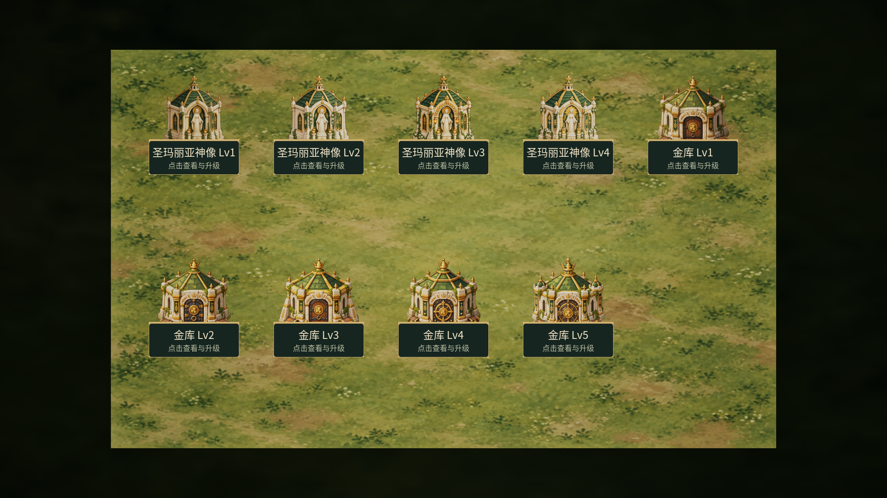
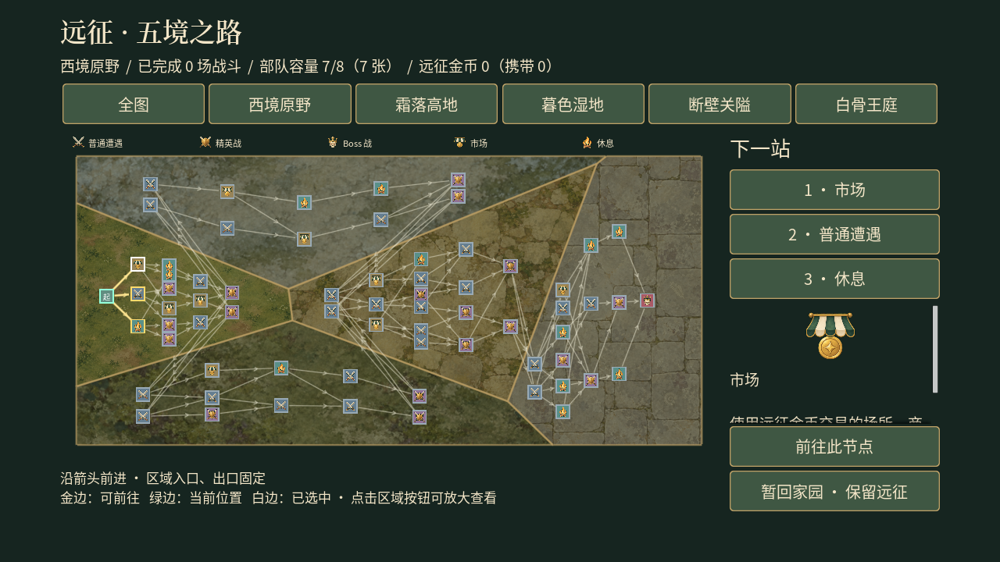
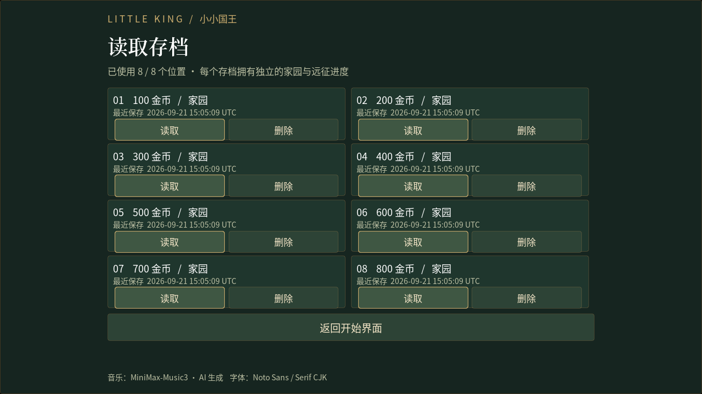

# D 批：动画、循环音乐、等级外观、转场与字体

更新：2026-09-22。D 批素材、接线和验证归档已完成，最终结果见文末。D 交付时保留了 A/B/C 批未提交内容；随后按用户要求统一纳入 [v0.8 发布](44-v0.8ReleaseNotes.md)。打包和硬件测试仍后置，不恢复 Sprint 6。

## 1. 实际交付

| 内容 | 结果 | 新增引擎资产 |
| --- | --- | --- |
| 战斗动画 | 28 实体，各 16 姿势、5 动作 | 28 Texture + 448 PaperSprite + 140 PaperFlipbook = 616 |
| 等级外观 | 神像 Lv2～4、金库 Lv2～5 | 7 Texture + 7 PaperSprite = 14 |
| 循环音乐 | 菜单/家园、远征、普通战斗、Boss | 4 SoundWave + 1 SoundConcurrency = 5 |
| 中文字体 | 正文/数字 Noto Sans CJK SC Regular；标题 Noto Serif CJK SC SemiBold | 2 FontFace + 2 Font = 4 |
| UI/换场 | 界面淡入、轻微上移、换场遮罩、音乐交接 | C++，无新增蓝图 |

**D 共 639 个 `.uasset`，A/B/C/D 总计 775 个。** 新资源位于 `/Game/Art/StorybookV1/Polish`，原始文件位于 `ArtSource/StorybookV1/Polish`。35 张 PNG 保留生成器原文件，未用 Python 修改像素；实际尺寸和哈希见 [manifest](../ArtSource/StorybookV1/Polish/manifest.json)，不能将提示词请求的 2048 当作实际尺寸。

图像以已有角色/建筑作身份参考，沿用松绿、羊皮纸、旧金与栗棕轮廓。旧八个角色保留简洁卡通身份，其余延续 B 批绘本风格。这是首版逐帧表现，不声称已完成人工逐像素修形。完整实际提示词及参考路径见 [43](43-PolishArtPrompts.md)，许可与来源见 [36](36-ArtAudioSources.md)。

## 2. 动画与战斗接口

图集 4×4：0～3 待机、4～7 移动、8～11 攻击、12～13 受击、14～15 退场。建筑的移动格为机械/旗帜动作素材，不会让建筑产生移动；兵营出兵时播门扉动作。

[ULKUnitAnimationComponent](../Source/little_king/ULKUnitAnimationComponent.cpp) 在既有 PaperSpriteComponent 上换图。优先级：退场 > 受击 > 攻击 > 移动 > 待机；待机 4fps，移动 8fps，攻击依据原前摇/命中事件取帧，受击约 0.16 秒，退场配合原 0.35 秒生命周期。主动技能成功时也触发攻击姿势。动画不参与伤害、攻击冷却、位移和战斗 RNG。

眩晕/冰冻时不显示移动或攻击，姿势时钟暂停。英雄失能保留末帧，战内复活/战后恢复重置表现；佣兵与建筑继续原有淡出销毁流程。火球释放仍是唯一小震动来源。

[LKPolishArt](../Source/little_king/LKPolishArt.cpp) 仅对 28 个已知 ID 的已知默认 Sprite 启用动画，兼容游侠旧路径 `Hero_Ranger_s`。自定义 Sprite 保留；缺少动作资源时回退单帧；营地跳过。新增实体需要登记 ID、默认 Sprite 和 `FB_<ID>_<State>` 五个动作。

[PreparePolishFrames.py](../Scripts/PreparePolishFrames.py) 只读取 alpha，记录各帧主体矩形和 PPU。**UE 5.8 的 CustomPivotPoint 使用整张纹理坐标，不是相对 SourceUV 的坐标。** 横向以主体 alpha 中位数对齐，脚底保持相同位置，避免图集换行导致角色飞离碰撞体。血条使用稳定待机边界，避免举武器时跳动。Actor 缩放、逻辑位置与实体半径不变。

## 3. 音乐、转场与字体

本地 Music3 实际安装在 `E:\minimax_music3\repo`，使用原有 `.venv`、`app/inference.py`，未改模型或依赖。四首提示词统一要求木笛、鲁特琴、竖琴、小编制弦乐与轻手鼓、无人声；这些是生成要求，不作为已经声学分析证实的属性。

| 场景 | 名称 | 原音 / 循环秒数 | seed |
| --- | --- | --- | --- |
| 菜单/家园 | 晨光小王国 | 34.795 / 32.300 | 210901 |
| 地图/服务/奖励 | 五境之路 | 28.502 / 25.350 | 210902 |
| 普通战斗 | 举盾前行 | 22.175 / 20.675 | 210903 |
| Boss | 王庭的挑战 | 48.054 / 46.554 | 210904 |

请求均为 48 秒、30 steps、low VRAM，但模型实际输出长度不同。原音、caption、lyrics、参数、耗时及哈希在 `Music/Originals`。循环处理去直流、裁近静音边缘、用 1.5 秒余弦重叠接尾，输出 44.1kHz/16bit/立体声；目标 RMS -22dBFS，峰值限制 -3dBFS，因此部分曲目 RMS 更低。没有用末尾静音淡出冒充无缝循环。格式/波形检查不等于主观试听。

[ULKJourneyPresentationSubsystem](../Source/little_king/ULKJourneyPresentationSubsystem.cpp) 随 GameInstance 存活：开始/家园为 Home，地图/服务/奖励/终态为 Expedition，战斗根据真实关卡或节点选择 Battle/Boss。默认音量 0.25，交叉淡化 1.2 秒，同时最多两声部，快速切换先销毁最旧声部，淡出继承当前权重。退出实例时停止音乐。

`SetMusicVolume(0～1)` 保留未来设置接口；原设置按钮仍为占位。换场先 0.2 秒遮住旧世界，加载后 0.3 秒揭开；遮罩挡鼠标、拒绝重复换场，异常等待超时清理遮罩。无视口时使用原直接加载路径。创建/读取存档、出征资金校验、回家结算先走原事务，转场不替代事务。

两种字体通过 GameInstance 强引用保留，避免 Slate 遮罩引用换场 GC 后的字体。应用范围：开始/读档、家园、建筑名牌、通用按钮、地图、奖励、恢复、战斗 UMG；Canvas 战场状态提示保留既有引擎字体兼容路径。新界面用 0.18 秒淡入和 8px 上移。远征列表动态刷新后补布局预计算，避免按钮文字重叠；读档页调整卡片区域高度，读取/删除按钮使用紧凑行，八个存档在 720p/1080p 均可完整显示。主菜单标注“音乐：MiniMax-Music3 · AI 生成”与 Noto 字体。

## 4. 家园与协作文件

神像逐级增加花环、种植箱与金色装饰；金库增加锁饰、拱券、檐顶与侧塔。`SetDisplayedLevel` 按真实升级状态换图，保留名称、点击半径、悬停与升级花费；Lv1 保留 A 图，超出现有级别时使用最高级素材。刷新不反复创建动态材质。

| 文件组 | 职责 |
| --- | --- |
| LKPolishArt.h/.cpp | 动作、等级图、字体稳定 ID 与路径 |
| ULKUnitAnimationComponent.h/.cpp | 五态采样、控制/复活清理、稳定血条边界 |
| ALKUnitBase / ALKUnitHero / ALKUnitBuilding / ULKUnitActiveComponent | 原普攻、命中、技能、出兵事件接表现 |
| ALKPresentationHUD / ALKHomeBuildingActor | 血条、等级图与悬停保留 |
| ULKJourneyPresentationSubsystem | 音乐、遮罩、淡入、字体跨图生命周期 |
| ALKBattleGameMode_Run / ALKHomeGameMode / ULKStartMenuWidget / ULKRunRewardWidget | 统一换场入口，保留业务校验 |
| LKPresentationStyle 与相关 Widget | 字体、开启表现、署名与列表布局 |
| GeneratePolishMusic / PreparePolishAudio | 本地生成、原音归档、循环处理 |
| PreparePolishFrames / ImportPolishAssets / ImportPolishFonts / AuditPolishArt | 切帧元数据、导入、来源/提示词审计 |
| LKPolishArtPreview / LKPolishTravelPreview / Tests/LKPolishArtTests | 隔离展示、跨图回归、四项自动化；BattleArtSpawnGeometry 追加 28 实体断言 |

D 没有重存地图、蓝图或数据表。工作区 DT_Units 修改仍只有 B 批兵营纵向比例修正；存档格式、卡牌规则、战斗公式及家园升级数值未改。

## 5. UE 5.8 新手教程

**必须手工制作、下载或接线：无。** 先停止 Play、关闭编辑器，在项目 PowerShell 执行：

```powershell
& 'E:\epic\UE_5.8\Engine\Build\BatchFiles\Build.bat' little_kingEditor Win64 Development 'E:\little_hero\little_king\little_king.uproject' -WaitMutex -NoHotReloadFromIDE -MaxParallelActions=4
```

看到 `Result: Succeeded` 后打开工程并 Play。开始页显示新标题字体并播放家园音乐；进入家园音乐继续，出征地图/战斗切换对应音乐。部署英雄观察待机、移动、攻击；失能不震动。升级神像/金库会自动更换外观。

只想看全部姿势和等级、不改玩家档，可执行隔离预览（自动截图后退出）：

```powershell
& 'E:\epic\UE_5.8\Engine\Binaries\Win64\UnrealEditor-Cmd.exe' 'E:\little_hero\little_king\little_king.uproject' '/Game/Maps/L_BattleTest' -game -PolishArtPreview -RenderOffscreen -windowed -forceres -ResX=1920 -ResY=1080 -unattended -nop4 -nosplash
& 'E:\epic\UE_5.8\Engine\Binaries\Win64\UnrealEditor-Cmd.exe' 'E:\little_hero\little_king\little_king.uproject' '/Game/Maps/L_StartMenu' -game -PolishTravelPreview -RenderOffscreen -windowed -forceres -ResX=1920 -ResY=1080 -unattended -nop4 -nosplash
```

前者展示 28 实体全部姿势与九个建筑等级，后者通过独立临时存档测试开始页 → 家园 → 战斗地图 → 家园，成功后删除临时档。截图在 `Saved/Screenshots/PolishArt`。阵列是强制取帧展示，退场姿势截图的满血条不代表真实死亡；实际失能/复活另有自动化覆盖。

### 修改源文件后的重导入（可选）

1. 用安装了 numpy/Pillow 的 Python 运行 `Scripts/PreparePolishFrames.py`、`Scripts/PreparePolishAudio.py`。前者只写 JSON，后者处理现有原音，不启动模型。
2. 关闭编辑器，运行：

```powershell
& 'E:\epic\UE_5.8\Engine\Binaries\Win64\UnrealEditor-Cmd.exe' 'E:\little_hero\little_king\little_king.uproject' -run=pythonscript '-script=E:\little_hero\little_king\Scripts\ImportPolishAssets.py' '-EnablePlugins=PythonScriptPlugin,EditorScriptingUtilities' -unattended -nop4 -nosplash -NullRHI
```

成功标志 `POLISH_ASSETS_OK count=635 partial=False`，报告 `Saved/PolishAssetsImport.json`。

3. **字体需要正常编辑器的 Slate，不能用 `-run=pythonscript`。** 打开编辑器 → Tools/工具 → Output Log/输出日志，输入类型切为 Python，执行：

```python
exec(open(r'E:\little_hero\little_king\Scripts\ImportPolishFonts.py', encoding='utf-8').read())
```

若没有 Python 选项，在编辑 → 插件启用 Python Editor Script Plugin 与 Editor Scripting Utilities，重启。成功标志 `POLISH_FONTS_OK`，四资产清单在 `Saved/PolishFontsImport.json`。组合字体与内嵌 FontFace 自动创建。

4. 运行 `Scripts/AuditPolishArt.py` 更新来源 manifest、43 完整提示词和格式检查。更换图片时同步保存新回执和实际参考，不用事后概括代替真实提示词。

### 可选：自己调整 Music3

四首已生成，平时不必重新等待。想手动生成，把 43 或 `Music/prompts.json` 的 Caption 填入描述，Lyrics 填三行 `[Instrumental]`，参数 48 秒、30 steps、low VRAM，seed 见上表。请求时长不保证等于输出时长。

命令行入口如下；脚本只跳过哈希、提示词、歌词、seed、时长、steps、显存模式及模型均匹配的已完成 WAV/回执，修改生成参数后会重新生成对应曲目：

```powershell
& 'E:\minimax_music3\repo\.venv\Scripts\python.exe' 'E:\little_hero\little_king\Scripts\GeneratePolishMusic.py'
```

改版时先保留原 WAV/JSON，再改脚本提示词和参数，依次生成、循环处理、导入、审计。其他安装位置用环境变量 `LK_MUSIC3_INSTALL` 指向含 `app/inference.py` 的目录。项目只使用生成音频，不包含模型权重。试听重点：接缝、短乐句重复、场景间音量、是否盖住按钮/火球；这是后续音乐与混音调整。

## 6. 验证

UE **5.8.1 / little_kingEditor / Win64 / Development** 最终编译成功。全量 `LittleKing` 自动化 **83/83 通过**：39 项无警告、44 项含测试世界无相机/视口、预期非法存档等警告，0 失败、0 未执行。最终报告为 `Saved/Automation/PolishArtFinal05/index.json`，不将较早迭代的失败报告混作最终结果。

新增四组测试覆盖全部动作/字体/音乐目录、动画与战斗状态隔离、等级图不改变几何、双声部交接和界面淡入生命周期；原战斗资源测试追加全部 28 实体默认动画初始化。635 个图像/音乐资产和四个字体资产重复导入成功，D 目录恰好 639 个资源。

720p/1080p 实际引擎共输出 **76 张截图**：32 张姿势阵列、2 张九级别建筑展示、10 张真实跨图过程、16 张家园界面、8 张远征地图/节点页、8 张菜单页。检查代表性动作和界面，并原样归档其中 **28 张**到 `docs/images/Polish*`；截图总数不表示已逐张进行人工审美验收。真实跨图测试完成开始页 → 家园 → 战斗地图 → 家园，两种分辨率均回到一个音乐声部、无残留遮罩，独立测试档已清理。

五个原有玩家存档与 D 开始前 SHA-256 一致，数据表与 D 前基线一致。已修复图集枢轴错位、游侠历史资源名、字体跨场景 GC、失能动画被透明度隐藏、节点列表及读档按钮布局。`git diff --check` 通过，10 份相关文档的本地链接全部有效。验证摘要、资产/截图哈希、日志路径及文档链接检查见 [PolishArt-Validation.json](validation/PolishArt-Validation.json)，源文件检查见 `Saved/PolishArtSourceAudit.json`。








格式、峰值、接缝及引擎播放生命周期验证不等于主观听感验收；打包、硬件测试仍按用户要求后置。
